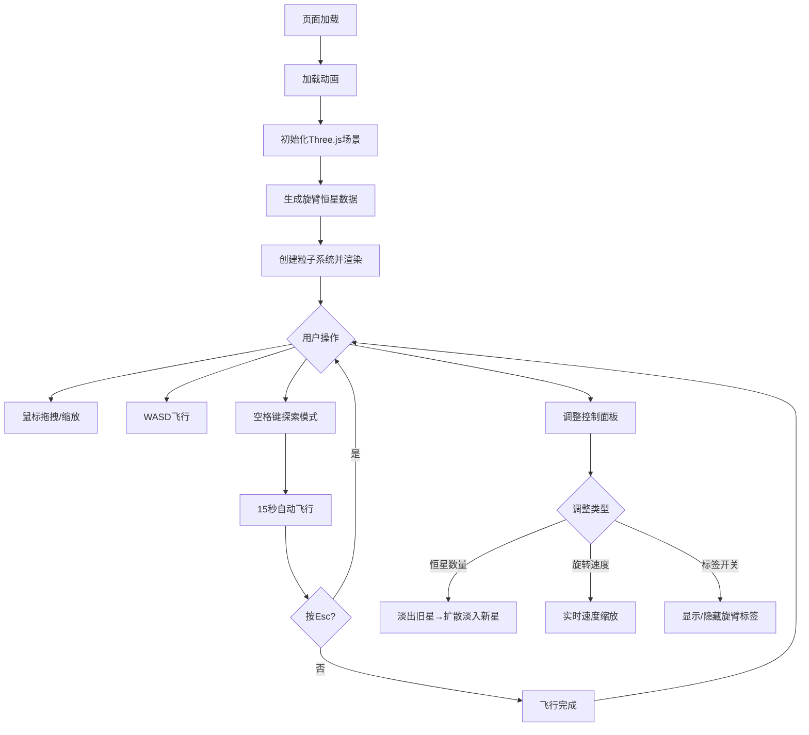

## 1. 产品概述

交互式银河系旋臂视觉化应用——面向天文科普展览和课堂教学的3D互动体验，让观者直观感受恒星在旋臂中的分布与差速旋转运动规律。

- 目标用户：天文教育工作者、科普展览访客、课堂学生
- 核心价值：将抽象的银河系结构知识转化为可触摸、可探索的沉浸式3D体验

## 2. 核心功能

### 2.1 功能模块

1. **银河系3D场景页**：对数螺线旋臂恒星分布、差速旋转动画、GPU着色器渲染
2. **交互控制层**：轨道相机控制、WASD飞行模式、探索模式自动飞行
3. **控制面板**：恒星数量滑块、旋转速度滑块、旋臂标签开关、响应式布局

### 2.2 页面详情

| 页面名称 | 模块名称 | 功能描述 |
|----------|----------|----------|
| 银河系3D场景 | 旋臂生成 | 4条对数螺线旋臂，每臂5000-8000颗恒星，银核200颗亮星 |
| 银河系3D场景 | 差速旋转 | 靠近银心旋转快、远处慢，动态流动螺旋效果 |
| 银河系3D场景 | GPU着色器 | 自定义Shader处理位置偏移和颜色渐变，保障性能 |
| 交互控制 | 轨道相机 | 鼠标拖拽旋转、滚轮缩放（阻尼惯性）、Shift+拖拽平移 |
| 交互控制 | 飞行模式 | WASD键穿行星系 |
| 交互控制 | 探索模式 | 空格键触发15秒螺旋飞入飞出动画，Esc中断 |
| 控制面板 | 恒星数量滑块 | 2000-10000，默认5000，重建时平滑过渡动画 |
| 控制面板 | 旋转速度滑块 | 0.1-2倍，默认1倍，实时缩放 |
| 控制面板 | 旋臂标签开关 | 开启后旋臂末端显示发光编号标签 |

## 3. 核心流程

1. 用户打开页面 → 加载动画（旋转星云图标）→ 3D场景就绪后淡入
2. 用户可自由拖拽/缩放/平移观察星系
3. 用户调整控制面板参数 → 星系即时响应重建或速度变化
4. 用户按空格 → 探索模式15秒自动飞行 → Esc中断恢复手动控制
5. 窄屏设备控制面板自动折叠为底部条



## 4. 界面设计

### 4.1 设计风格

- **主色调**：深空蓝黑渐变（#000510 → #0a0e27），银核暖黄辉光（#ffcc66）
- **恒星颜色**：中心黄白 → 中段蓝 → 外围红（光谱类型映射）
- **面板风格**：暗色磨砂玻璃（backdrop-filter: blur(10px)，rgba(10,14,39,0.85)），白色文字，圆角12px
- **高亮色**：淡蓝色（#4fc3f7）用于滑块和开关
- **字体**：Orbitron（标题/数字）+ Exo 2（正文），科技感太空风
- **布局**：全屏3D场景 + 右侧悬浮控制面板（宽屏）或底部折叠条（窄屏）

### 4.2 页面设计概览

| 页面名称 | 模块名称 | UI元素 |
|----------|----------|--------|
| 加载页 | 星云图标 | Three.js线框球体+粒子拖尾旋转，渐变太空色背景 |
| 3D场景 | 银河系 | 数千颗恒星粒子，中心暖黄辉光，深空背景 |
| 3D场景 | 旋臂标签 | 旋臂末端发光文字标签，淡蓝高亮 |
| 控制面板 | 滑块/开关 | 磨砂玻璃面板，淡蓝高亮滑块轨道，0.3s淡入淡出动画 |

### 4.3 响应式

- 宽屏（>1200px）：控制面板右侧固定，宽280px
- 中屏（768-1200px）：控制面板右侧固定，宽240px
- 窄屏（<768px）：控制面板折叠为底部半透明条，高60px，点击展开全高面板

### 4.4 3D场景指引

- **环境**：纯黑深空背景，无环境光；银心区域暖黄PointLight
- **相机**：PerspectiveCamera，初始位置(0, 80, 120)，看向原点
- **渲染**：WebGLRenderer + 自定义ShaderMaterial（Points），差速旋转在GPU中计算
- **交互**：OrbitControls（阻尼0.05）+ 自定义WASD飞行 + 探索模式路径动画
- **性能**：5000星60FPS+，10000星30FPS+；全部使用Points渲染，无独立Mesh

## 5. 技术架构

### 5.1 技术选型

- 前端框架：纯TypeScript + Three.js（无React/Vue）
- 构建工具：Vite
- 3D渲染：Three.js 0.160.0 + 自定义GLSL着色器
- 语言：TypeScript（严格模式，ES模块）

### 5.2 文件结构与调用关系

```
├── package.json          ← 依赖：three@0.160.0, @types/three, typescript, vite
├── vite.config.js        ← 构建配置
├── tsconfig.json         ← 严格模式，ES模块
├── index.html            ← 入口页面，全屏3D容器+控制面板UI
└── src/
    ├── main.ts           ← 应用入口：初始化场景/相机/渲染器 → 调用galaxy.ts → 创建stars.ts → 挂载controls.ts → 动画循环
    ├── galaxy.ts         ← 星系生成：接收参数 → 对数螺线计算 → 返回位置/颜色/大小数组
    ├── stars.ts          ← 恒星渲染：接收数组 → 自定义ShaderMaterial → Points对象 → 每帧GPU旋转
    └── controls.ts       ← 交互控制：OrbitControls + WASD + 探索模式 → 更新相机
```

**数据流向**：
- main.ts → galaxy.ts（传入恒星数量、旋臂数、半径参数）
- galaxy.ts → main.ts（返回位置数组、颜色数组、大小数组）
- main.ts → stars.ts（传入数组数据，创建粒子系统并挂载到场景）
- stars.ts → 渲染循环（每帧通过uniform更新旋转角度，GPU着色器计算偏移）
- controls.ts → main.ts（提供更新后的相机状态）

### 5.3 着色器设计

- **顶点着色器**：接收初始位置 + 旋转角度uniform + 距银心距离，计算差速旋转后的位置，输出点大小
- **片段着色器**：圆形粒子（discard方形角），根据颜色uniform输出，中心亮边缘淡（光晕效果）
