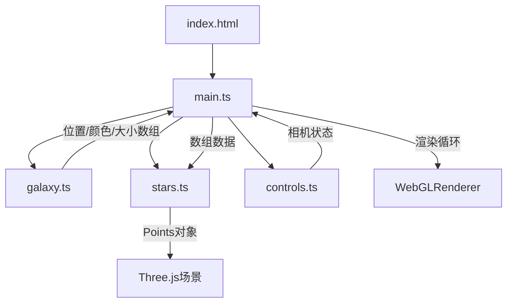

## 1. 架构设计



## 2. 技术说明

- 前端：TypeScript + Three.js@0.160.0 + Vite
- 初始化工具：Vite（vanilla-ts模板）
- 后端：无
- 数据库：无

## 3. 路由定义

| 路由 | 用途 |
|------|------|
| / | 单页应用，全屏3D银河系可视化 |

## 4. 模块依赖与接口

### 4.1 galaxy.ts 接口

```typescript
interface GalaxyParams {
  starCount: number;       // 每条旋臂的恒星数量
  armCount: number;        // 旋臂数量（默认4）
  radius: number;          // 星系半径
  armSpread: number;       // 旋臂扩散程度
  coreStarCount: number;   // 银核亮星数量
}

interface StarData {
  positions: Float32Array;  // 恒星位置 [x,y,z, x,y,z, ...]
  colors: Float32Array;     // 恒星颜色 [r,g,b, r,g,b, ...]
  sizes: Float32Array;      // 恒星大小
  distances: Float32Array;  // 距银心距离（用于差速旋转）
  armIndices: Float32Array; // 所属旋臂索引
  angles: Float32Array;     // 初始角度
}

function generateGalaxy(params: GalaxyParams): StarData;
```

### 4.2 stars.ts 接口

```typescript
interface StarSystem {
  mesh: THREE.Points;
  updateRotation(speedMultiplier: number, deltaTime: number): void;
  dispose(): void;
  fadeOut(duration: number): Promise<void>;
  fadeIn(duration: number): Promise<void>;
}

function createStarSystem(scene: THREE.Scene, data: StarData): StarSystem;
```

### 4.3 controls.ts 接口

```typescript
interface GalaxyControls {
  orbitControls: THREE.OrbitControls;
  update(deltaTime: number): void;
  startExploreMode(): void;
  stopExploreMode(): void;
  isExploring: boolean;
  dispose(): void;
}
```

## 5. 着色器架构

### 5.1 顶点着色器

```glsl
uniform float uTime;
uniform float uSpeedMultiplier;
uniform float uPointSize;

attribute float aDistance;
attribute float aAngle;
attribute vec3 aColor;
attribute float aArmIndex;

varying vec3 vColor;
varying float vAlpha;

void main() {
  vColor = aColor;
  // 差速旋转：距中心越近旋转越快
  float angularSpeed = uSpeedMultiplier / (aDistance + 0.5);
  float angle = aAngle + uTime * angularSpeed;
  // 保持旋臂形状
  float x = aDistance * cos(angle);
  float z = aDistance * sin(angle);
  vec3 pos = vec3(x, position.y, z);
  vec4 mvPosition = modelViewMatrix * vec4(pos, 1.0);
  gl_PointSize = uPointSize * (300.0 / -mvPosition.z);
  gl_Position = projectionMatrix * mvPosition;
  vAlpha = smoothstep(0.0, 0.5, 1.0 - aDistance / 50.0);
}
```

### 5.2 片段着色器

```glsl
varying vec3 vColor;
varying float vAlpha;

void main() {
  float d = length(gl_PointCoord - vec2(0.5));
  if (d > 0.5) discard;
  float alpha = 1.0 - smoothstep(0.0, 0.5, d);
  alpha *= vAlpha;
  gl_FragColor = vec4(vColor, alpha);
}
```

## 6. 性能策略

- 所有恒星使用单个Points对象渲染，1个Draw Call
- 旋转计算在GPU着色器中完成，CPU仅更新uniform
- 星系重建时复用BufferGeometry，仅更新attribute数据
- 使用requestAnimationFrame + deltaTime确保帧率无关动画
- 控制512px以上屏幕启用大粒子，以下屏幕减小粒子尺寸

## 7. 探索模式路径

- 飞入路径：从(0, 100, 200)沿螺旋线逐渐靠近(0, 10, 0)，相机始终看向原点
- 飞出路径：从(0, 10, 0)沿另一螺旋线飞向(200, 80, 0)
- 使用Three.js CatmullRomCurve3定义路径，getPointAt获取均匀采样点
- 总时长15秒，使用缓动函数(t) => t * t * (3 - 2 * t)实现平滑过渡
