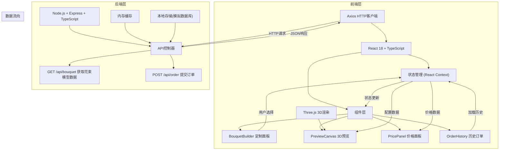
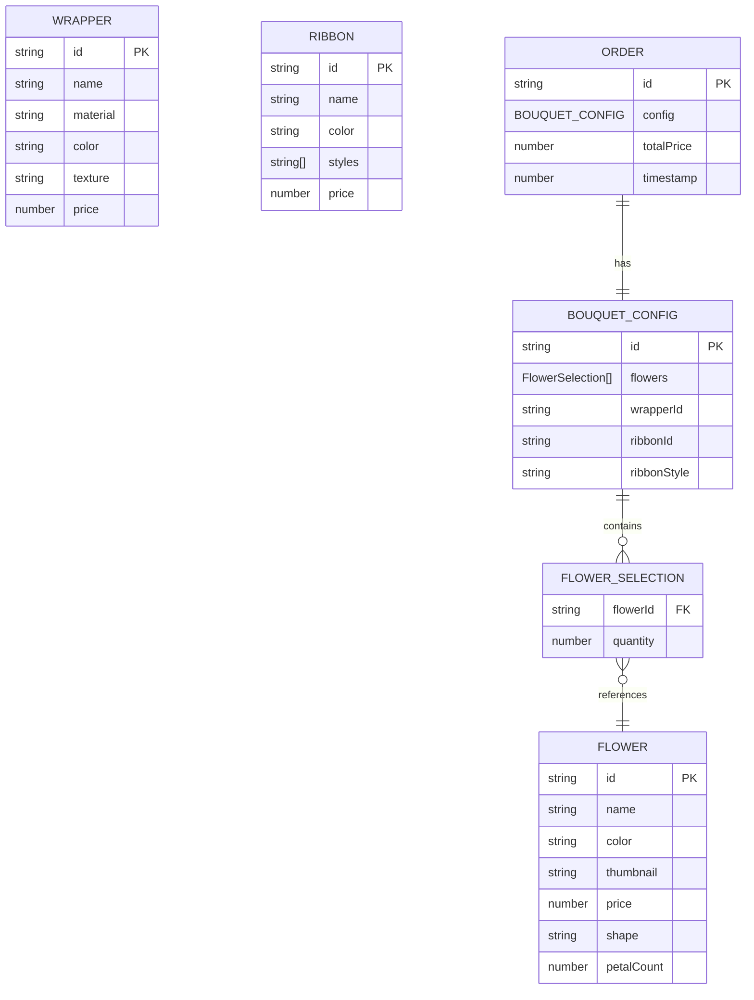

## 1. 架构设计



## 2. 技术描述

- **前端框架**：React@18 + TypeScript + Vite
- **状态管理**：React Context API（按用户要求）
- **3D渲染**：Three.js + @types/three
- **HTTP客户端**：Axios
- **样式方案**：TailwindCSS 3 + CSS动画
- **后端框架**：Express@4 + TypeScript + ts-node-dev
- **跨域处理**：CORS中间件
- **数据缓存**：内存Map缓存花束模型数据
- **数据持久化**：LocalStorage存储历史订单
- **构建工具**：Vite（前端）+ ts-node-dev（后端热重载）
- **并发启动**：concurrently同时启动前后端

## 3. 项目文件结构与调用关系

```
e:\solo\VersionFast\tasks\auto47\
├── package.json              # 项目依赖和脚本配置
├── vite.config.ts            # Vite构建配置，代理/api到后端3001端口
├── tsconfig.json             # 前端TypeScript配置（严格模式）
├── tsconfig.server.json      # 后端TypeScript配置
├── index.html                # 入口HTML，花束图标淡入动画
├── src/
│   ├── frontend/
│   │   ├── App.tsx           # 应用入口，初始化Context Provider和路由
│   │   │   ├── 调用: BouquetContext.Provider
│   │   │   ├── 调用: BouquetBuilder
│   │   │   ├── 调用: PreviewCanvas
│   │   │   ├── 调用: PricePanel
│   │   │   └── 调用: OrderHistory
│   │   ├── context/
│   │   │   └── BouquetContext.tsx  # 全局状态管理
│   │   │       ├── 提供: 花材、包装、丝带选择状态
│   │   │       ├── 提供: 价格计算逻辑
│   │   │       └── 提供: 订单管理方法
│   │   ├── components/
│   │   │   ├── BouquetBuilder.tsx  # 花束定制面板
│   │   │   │   ├── 调用: BouquetContext (选择状态更新)
│   │   │   │   ├── 调用: axios (/api/bouquet 获取预览数据)
│   │   │   │   └── 子组件: FlowerSelector, WrapperSelector, RibbonSelector
│   │   │   ├── PreviewCanvas.tsx   # 3D预览组件
│   │   │   │   ├── 调用: BouquetContext (订阅配置变化)
│   │   │   │   └── 依赖: Three.js (渲染3D场景)
│   │   │   ├── PricePanel.tsx      # 价格计算面板
│   │   │   │   ├── 调用: BouquetContext (获取总价)
│   │   │   │   └── 调用: axios (/api/order 提交订单)
│   │   │   └── OrderHistory.tsx    # 历史订单展示
│   │   │       ├── 调用: BouquetContext (加载历史配置)
│   │   │       └── 读取: LocalStorage (订单数据)
│   │   ├── types/
│   │   │   └── index.ts      # 类型定义(Flower, Wrapper, Ribbon, BouquetConfig, Order)
│   │   ├── data/
│   │   │   └── catalog.ts    # 花材、包装、丝带的静态数据
│   │   └── utils/
│   │       └── api.ts        # Axios实例封装
│   └── backend/
│       ├── server.ts         # Express服务器入口
│       │   ├── 注册: CORS中间件
│       │   ├── 注册: JSON解析中间件
│       │   ├── 路由: GET /api/bouquet
│       │   └── 路由: POST /api/order
│       ├── controllers/
│       │   ├── bouquetController.ts  # 花束API控制器
│       │   │   ├── 调用: bouquetService.generateModelData()
│       │   │   └── 调用: cacheService.get/set()
│       │   └── orderController.ts    # 订单API控制器
│       │       └── 调用: orderService.saveOrder()
│       ├── services/
│       │   ├── bouquetService.ts     # 花束模型数据生成逻辑
│       │   ├── cacheService.ts       # 内存缓存服务
│       │   └── orderService.ts       # 订单处理逻辑
│       └── types/
│           └── index.ts      # 后端类型定义
```

**数据流向说明**：
1. 用户在 `BouquetBuilder` 选择花材 → 更新 `BouquetContext` 状态
2. `BouquetContext` 状态变化 → 触发 `PreviewCanvas` 重新渲染3D场景
3. `BouquetContext` 状态变化 → 触发 `PricePanel` 价格重新计算
4. 选择花材时 → `BouquetBuilder` 调用 `GET /api/bouquet` 获取3D模型数据
5. 点击下单 → `PricePanel` 调用 `POST /api/order` 提交订单
6. 订单提交后 → 存入 `LocalStorage`，`OrderHistory` 自动更新显示

## 4. 路由定义

| 路由 | 方法 | 用途 |
|------|------|------|
| / | GET | 前端单页应用入口 |
| /api/bouquet | GET | 根据花材组合获取花束3D模型数据 |
| /api/order | POST | 提交订单 |

## 5. API 定义

### 5.1 GET /api/bouquet

**请求参数**：
```typescript
interface BouquetRequest {
  flowers: Array<{
    id: string;
    quantity: number;
  }>;
  wrapperId: string;
  ribbonId: string;
  ribbonStyle: 'bow' | 'knot';
}
```

**响应数据**：
```typescript
interface BouquetResponse {
  modelData: {
    flowers: Array<{
      type: string;
      position: [number, number, number];
      rotation: [number, number, number];
      scale: [number, number, number];
      color: string;
      petalCount: number;
    }>;
    wrapper: {
      type: string;
      color: string;
      texture: string;
      folds: number;
    };
    ribbon: {
      type: string;
      color: string;
      style: 'bow' | 'knot';
      position: [number, number, number];
    };
  };
  price: {
    flowersTotal: number;
    wrapperPrice: number;
    ribbonPrice: number;
    total: number;
  };
}
```

### 5.2 POST /api/order

**请求体**：
```typescript
interface OrderRequest {
  config: BouquetConfig;
  totalPrice: number;
  timestamp: number;
}
```

**响应数据**：
```typescript
interface OrderResponse {
  success: boolean;
  orderId: string;
  message: string;
}
```

## 6. 数据模型

### 6.1 数据模型定义



### 6.2 TypeScript 类型定义

```typescript
// 共享类型定义
export interface Flower {
  id: string;
  name: string;
  color: string;
  thumbnail: string;
  price: number;
  shape: 'rose' | 'tulip' | 'lily' | 'sunflower' | 'carnation' | 'daisy' | 'orchid' | 'hydrangea' | 'peony' | 'lavender';
  petalCount: number;
}

export interface Wrapper {
  id: string;
  name: string;
  material: 'matte' | 'kraft' | 'crinkle' | 'tulle' | 'cellophane' | 'linen' | 'velvet' | 'lace';
  color: string;
  texture: string;
  price: number;
}

export interface Ribbon {
  id: string;
  name: string;
  color: string;
  price: number;
}

export interface FlowerSelection {
  flowerId: string;
  quantity: number;
}

export interface BouquetConfig {
  flowers: FlowerSelection[];
  wrapperId: string;
  ribbonId: string;
  ribbonStyle: 'bow' | 'knot';
}

export interface Order {
  id: string;
  config: BouquetConfig;
  totalPrice: number;
  timestamp: number;
}

export interface BouquetModelData {
  flowers: Array<{
    type: string;
    position: [number, number, number];
    rotation: [number, number, number];
    scale: [number, number, number];
    color: string;
    petalCount: number;
  }>;
  wrapper: {
    type: string;
    color: string;
    texture: string;
    folds: number;
  };
  ribbon: {
    type: string;
    color: string;
    style: 'bow' | 'knot';
    position: [number, number, number];
  };
}
```
