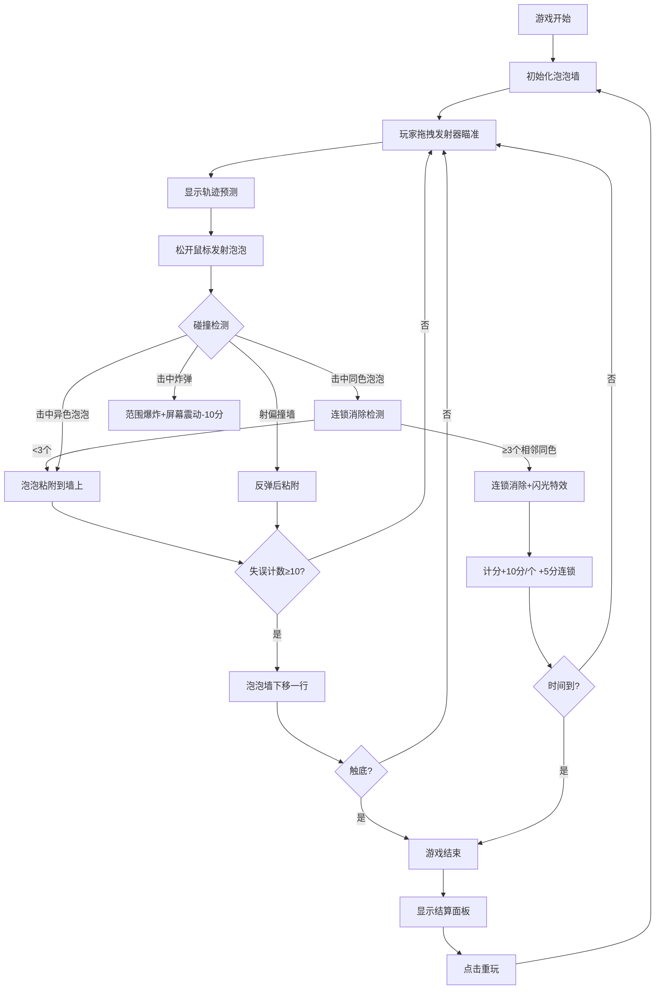

## 1. 产品概述

"弹射泡泡"是一款基于 HTML5 Canvas 的物理益智休闲游戏，玩家通过弹弓式拖拽发射彩色泡泡，击落屏幕上方的泡泡墙并躲避炸弹泡泡。

- 面向玩家群体：休闲游戏爱好者，适合各年龄段
- 市场价值：轻量级网页游戏，无需安装即可游玩，具有成瘾性的消除玩法和精美的视觉效果

## 2. 核心功能

### 2.1 用户角色

| 角色 | 注册方式 | 核心权限 |
|------|----------|----------|
| 玩家 | 无需注册 | 游戏游玩、分数记录 |

### 2.2 功能模块

1. **游戏主界面**：游戏画布、状态栏、控制按钮
2. **泡泡发射系统**：拖拽瞄准、轨迹预测、抛物线发射
3. **泡泡墙系统**：蜂窝状排列、碰撞检测、连锁消除
4. **物理引擎系统**：碰撞反弹、重力模拟、位置粘附
5. **特效系统**：分裂碎片、连锁闪光、爆炸动画、屏幕震动
6. **计分计时系统**：实时分数、失误计数、60秒倒计时、最佳记录
7. **炸弹泡泡系统**：随机生成、垂直下落、范围爆炸

### 2.3 页面详情

| 页面名称 | 模块名称 | 功能描述 |
|----------|----------|----------|
| 游戏主页面 | 星空背景 | 午夜蓝到靛蓝渐变，随机闪烁星星粒子 |
| 游戏主页面 | 泡泡墙区域 | 5行8列蜂窝状彩色泡泡，带云层雾气效果 |
| 游戏主页面 | 发射器 | 半透明圆形瞄准镜，跟随鼠标阻尼移动 |
| 游戏主页面 | 状态栏 | 深灰半透明渐变背景，显示分数、失误数、倒计时 |
| 游戏主页面 | 控制按钮 | 开始、重玩、暂停按钮，圆角矩形带微光效果 |
| 游戏主页面 | 结算面板 | 磨砂玻璃质感，显示最终分数、最佳记录、鼓励语 |

## 3. 核心流程

## 4. 用户界面设计

### 4.1 设计风格

- **主色调**：午夜蓝(#0a0a2a) → 靛蓝色(#1a1a4a) 星空渐变背景
- **泡泡配色**：宝石红(#e63946)、钴蓝(#4361ee)、柠檬黄(#ffd60a)、翡翠绿(#2ecc71)、丁香紫(#9b5de5)、珊瑚橙(#fb8500)
- **按钮样式**：圆角矩形，微光效果，点击缩放0.95倍
- **字体**：圆体字体，数字带彩色阴影
- **布局风格**：全屏Canvas，顶部状态栏，底部发射器，中间游戏区

### 4.2 页面设计概述

| 页面名称 | 模块名称 | UI 元素 |
|----------|----------|----------|
| 游戏主页面 | 加载动画 | "弹射泡泡"标题淡入，彩虹渐变文字 |
| 游戏主页面 | 星空背景 | 渐变色 + 随机闪烁星星粒子 |
| 游戏主页面 | 泡泡墙 | 蜂窝状排列，高光渐变，呼吸动画(2秒缩放1.02倍) |
| 游戏主页面 | 发射器 | 半透明圆形瞄准镜，拖拽时白色虚线轨迹 + 预测落点圆圈 |
| 游戏主页面 | 状态栏 | 左侧分数(白色带彩色阴影)，右侧失误数+倒计时 |
| 游戏主页面 | 控制按钮 | 开始/重玩/暂停，圆角矩形，微光，点击缩放动画 |
| 游戏主页面 | 特效层 | 碎片飞散、连锁闪光、爆炸光圈、屏幕震动 |
| 游戏主页面 | 结算面板 | 磨砂玻璃质感，背景模糊，暗色遮罩，显示分数和鼓励语 |

### 4.3 响应式

- 桌面端优先，Canvas 默认 800x600
- 支持鼠标操作，拖拽发射

### 4.4 动效设计

- **泡泡呼吸**：每2秒缩放1.02倍的呼吸动画
- **发射轨迹**：白色虚线轨迹，预测落点小圆圈
- **碰撞碎片**：击中泡泡炸成3片彩色碎片，飞散渐隐0.4秒
- **连锁闪光**：消除时有闪光特效
- **爆炸效果**：半径60px圈内泡泡消失，屏幕震动0.2秒
- **按钮动效**：按下缩放0.95倍，松开弹回
- **加载动画**：标题淡入，彩虹渐变文字
- **云层雾气**：半透明白色渐变上下浮动

### 4.5 性能要求

- 画布稳定 60FPS 运行
- 物理碰撞检测延迟低于 2ms
