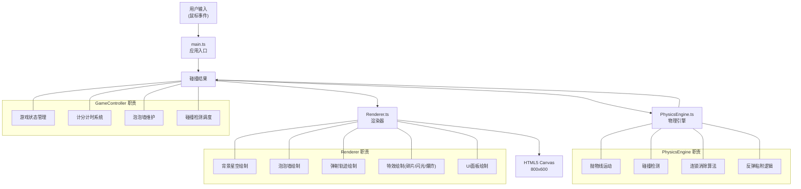

## 1. 架构设计



## 2. 技术描述

### 2.1 技术栈选型

- **前端核心**：TypeScript + HTML5 Canvas 2D
- **构建工具**：Vite 5.x
- **语言版本**：ES2020，严格模式
- **无外部UI框架**：纯 Canvas 绘制所有 UI 元素

### 2.2 依赖说明

| 依赖 | 版本 | 用途 |
|------|------|------|
| typescript | ^5.4.0 | TypeScript 编译支持 |
| vite | ^5.2.0 | 构建工具和开发服务器 |

### 2.3 核心设计原则

1. **关注点分离**：GameController 管理状态，PhysicsEngine 处理物理，Renderer 负责绘制
2. **高性能**：60FPS 游戏循环，碰撞检测优化到 <2ms
3. **类型安全**：全 TypeScript 严格模式
4. **可维护性**：模块职责清晰，代码结构规范

## 3. 数据结构定义

### 3.1 核心类型定义

```typescript
// 泡泡颜色枚举
enum BubbleColor {
  RED = '#e63946',      // 宝石红
  BLUE = '#4361ee',     // 钴蓝
  YELLOW = '#ffd60a',   // 柠檬黄
  GREEN = '#2ecc71',    // 翡翠绿
  PURPLE = '#9b5de5',   // 丁香紫
  ORANGE = '#fb8500',   // 珊瑚橙
}

// 泡泡接口
interface Bubble {
  id: number;
  row: number;
  col: number;
  x: number;
  y: number;
  color: BubbleColor;
  radius: number;
  scale: number;        // 呼吸动画缩放
  isBomb: boolean;      // 是否炸弹泡泡
}

// 发射中的泡泡
interface Projectile {
  x: number;
  y: number;
  vx: number;
  vy: number;
  color: BubbleColor;
  radius: number;
}

// 碎片特效
interface Particle {
  x: number;
  y: number;
  vx: number;
  vy: number;
  color: string;
  alpha: number;
  size: number;
  life: number;
}

// 闪光特效
interface FlashEffect {
  x: number;
  y: number;
  radius: number;
  alpha: number;
  life: number;
}

// 爆炸特效
interface ExplosionEffect {
  x: number;
  y: number;
  radius: number;
  maxRadius: number;
  alpha: number;
  life: number;
}

// 星星粒子
interface Star {
  x: number;
  y: number;
  size: number;
  alpha: number;
  twinkleSpeed: number;
}

// 游戏状态
enum GameState {
  MENU = 'menu',
  PLAYING = 'playing',
  PAUSED = 'paused',
  GAME_OVER = 'game_over',
}

// 碰撞结果
interface CollisionResult {
  hit: boolean;
  hitBubble?: Bubble;
  isBomb?: boolean;
  chainBubbles?: Bubble[];
  attachPosition?: { x: number; y: number; row: number; col: number };
  bounced?: boolean;
}

// 按钮接口
interface UIButton {
  x: number;
  y: number;
  width: number;
  height: number;
  text: string;
  isPressed: boolean;
  scale: number;
}
```

### 3.2 游戏常量

| 常量名 | 值 | 说明 |
|--------|----|------|
| CANVAS_WIDTH | 800 | 画布宽度 |
| CANVAS_HEIGHT | 600 | 画布高度 |
| BUBBLE_RADIUS | 20 | 泡泡半径(直径40px) |
| GRID_ROWS | 5 | 初始泡泡墙行数 |
| GRID_COLS | 8 | 泡泡墙列数 |
| GRAVITY | 0.15 | 重力加速度 |
| LAUNCH_POWER | 0.15 | 发射力度系数 |
| MISS_THRESHOLD | 10 | 触发下移的失误数 |
| BOMB_SPAWN_INTERVAL | 4000 | 炸弹生成间隔(ms) |
| BOMB_FALL_SPEED | 1.5 | 炸弹下落速度 |
| GAME_DURATION | 60 | 游戏时长(秒) |
| DAMPING_FACTOR | 0.85 | 发射器阻尼系数 |
| BREATH_PERIOD | 2000 | 呼吸动画周期(ms) |
| BREATH_SCALE | 1.02 | 呼吸动画最大缩放 |

## 4. 核心算法说明

### 4.1 蜂窝状网格布局

```
行0: ● ● ● ● ● ● ● ●
行1:  ● ● ● ● ● ● ● ●
行2: ● ● ● ● ● ● ● ●
行3:  ● ● ● ● ● ● ● ●
行4: ● ● ● ● ● ● ● ●
```

- 奇数行水平偏移半个泡泡直径
- 垂直间距 = radius * sqrt(3) ≈ 34.64px
- 水平间距 = radius * 2 = 40px

### 4.2 抛物线运动计算

```
vx = (launcherX - mouseX) * LAUNCH_POWER
vy = (launcherY - mouseY) * LAUNCH_POWER
每帧更新:
  vy += GRAVITY
  x += vx
  y += vy
```

### 4.3 碰撞检测算法

1. **圆形碰撞检测**：两圆心距离 < 2 * radius 即碰撞
2. **墙壁反弹**：x < radius 或 x > width - radius 时 vx *= -1
3. **六边形相邻检测**：蜂窝网格的6个相邻位置

### 4.4 连锁消除算法 (BFS)

```
1. 从击中的泡泡开始，使用广度优先搜索
2. 检查6个相邻泡泡是否同色
3. 如果同色且数量 >= 3，全部消除
4. 返回消除的泡泡列表
```

### 4.5 泡泡粘附逻辑

```
1. 找到碰撞点最近的网格位置
2. 检查该位置是否已被占用
3. 沿6个方向寻找最近的空闲位置
4. 粘附到空闲位置并加入泡泡墙
```

## 5. 文件结构

```
project-root/
├── package.json              # 项目配置和依赖
├── index.html                # 入口HTML页面
├── tsconfig.json             # TypeScript配置
├── vite.config.js            # Vite构建配置
└── src/
    ├── main.ts               # 应用入口
    ├── GameController.ts     # 游戏控制器
    ├── Renderer.ts           # 渲染模块
    └── PhysicsEngine.ts      # 物理引擎模块
```

## 6. 性能优化策略

### 6.1 碰撞检测优化

- 使用空间网格划分，只检查相邻网格的泡泡
- 预计算泡泡位置，避免每帧遍历所有泡泡

### 6.2 渲染优化

- 离屏 Canvas 预绘制静态元素(背景星空)
- 对象池复用 Particle 对象，避免频繁 GC
- requestAnimationFrame 驱动 60FPS 循环

### 6.3 内存管理

- 及时清理过期的特效对象
- 泡泡对象复用，避免频繁创建销毁

## 7. 游戏循环时序

```
每帧 (16.67ms @ 60FPS):
├─ 输入处理 (1ms)
├─ 物理更新 (2ms max)
│  ├─ 发射泡泡运动
│  ├─ 炸弹下落
│  ├─ 碰撞检测
│  └─ 连锁消除计算
├─ 特效更新 (1ms)
│  ├─ 粒子运动
│  ├─ 闪光/爆炸动画
│  └─ 呼吸动画
└─ 渲染 (10ms)
   ├─ 背景星空
   ├─ 云层雾气
   ├─ 泡泡墙
   ├─ 发射轨迹
   ├─ 特效层
   └─ UI层
```
