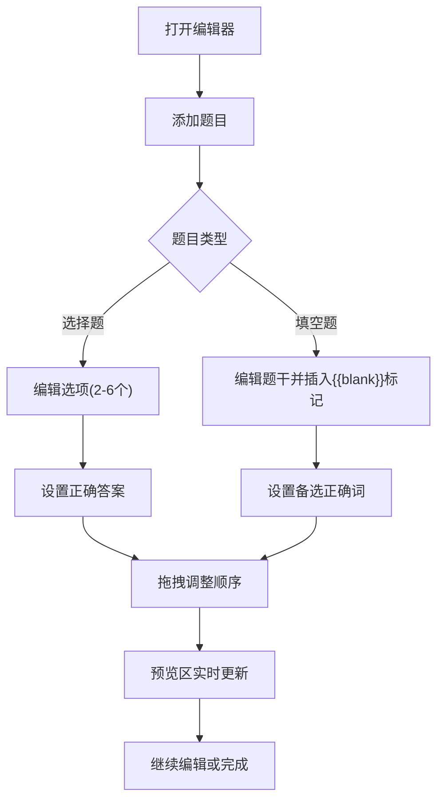

## 1. 产品概述

练习卷编辑器是一款面向在线教育机构教师的内部工具，用于创建包含选择题（单选/多选）和填空题的试卷，并实时预览A4纸张排版效果。

- 解决教师手工排版试卷效率低、格式不统一的问题
- 目标用户为在线教育机构的教师和教研人员

## 2. 核心功能

### 2.1 用户角色

| 角色 | 使用方式 | 核心权限 |
|------|----------|----------|
| 教师 | 内部系统登录 | 创建、编辑、预览试卷 |

### 2.2 功能模块

1. **编辑页面**：题目列表管理、添加/删除/排序题目、选项编辑、填空位标记
2. **预览页面**：A4纸张排版实时预览、衬线字体渲染、纸张纹理效果

### 2.3 页面详情

| 页面名称 | 模块名称 | 功能描述 |
|----------|----------|----------|
| 编辑页面 | 左侧编辑区 | 题目列表展示、拖拽排序、添加选择题/填空题、选项增删编辑、正确答案设置 |
| 编辑页面 | 右侧预览区 | A4纸张比例排版、Georgia衬线字体、深蓝标题、圆括号选项编号、下划线填空位、纸张纹理背景 |
| 编辑页面 | 响应式切换 | 窗口宽度<900px时自动转为上下布局 |

## 3. 核心流程

教师打开编辑器 → 选择添加选择题或填空题 → 编辑题目内容和选项/空位 → 拖拽调整题目顺序 → 右侧实时预览排版效果 → 完成编辑

## 4. 用户界面设计

### 4.1 设计风格

- 主色调：深蓝#1a365d，辅助色：白色，高亮色：金色#d69e2e
- 按钮样式：圆角卡片式，选中时金色高亮
- 字体：题目内容使用Georgia衬线字体，编辑区UI使用系统无衬线字体
- 布局风格：左右分栏（40%/60%），编辑区卡片式区块
- 图标风格：简洁线性图标

### 4.2 页面设计概览

| 页面名称 | 模块名称 | UI元素 |
|----------|----------|--------|
| 编辑页面 | 编辑区题目卡片 | 圆角8px、轻微阴影、浅灰#f7f7f7背景、拖拽手柄 |
| 编辑页面 | 添加题目按钮 | 深蓝底色、弹性缩放悬停效果(scale 1.05, 200ms ease) |
| 编辑页面 | 删除动画 | 滑动淡出(translateX -50px + opacity 0) |
| 编辑页面 | 预览区A4排版 | 宽高比1:1.414、Georgia字体、深蓝#1a365d标题、圆括号选项、下划线填空位 |
| 编辑页面 | 预览区纸张效果 | 轻微纸张纹理背景、100ms淡入动画更新 |

### 4.3 响应式设计

- 桌面优先设计，左右分栏布局
- 窗口宽度<900px时自动转为上下布局（编辑区在上，预览区在下）
- 所有过渡动画使用CSS ease-out缓动函数

### 4.4 性能约束

- 编辑操作后预览区重新渲染在20ms内完成
- 拖拽排序时动画帧率稳定在60fps
