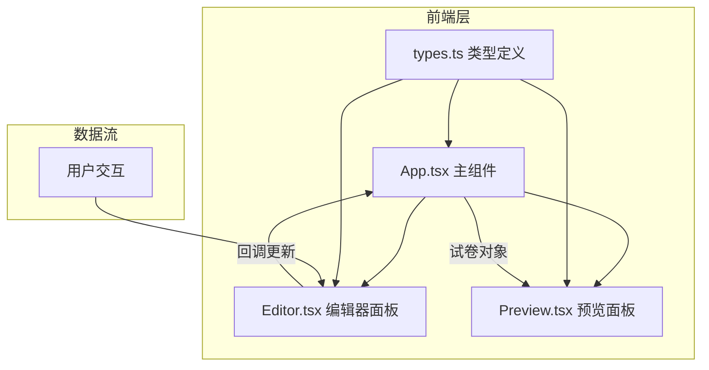

## 1. 架构设计



## 2. 技术说明

- 前端：React@18 + TypeScript + Vite
- 初始化工具：vite-init (react-ts模板)
- 样式方案：CSS Modules + CSS变量（无Tailwind，根据用户指定文件结构）
- 状态管理：React useState/useCallback（组件内状态，无需全局状态库）
- 拖拽排序：@dnd-kit/core + @dnd-kit/sortable（轻量高性能拖拽库）
- 后端：无
- 数据库：无（纯前端应用）

## 3. 路由定义

| 路由 | 用途 |
|------|------|
| / | 唯一页面，包含编辑区和预览区 |

## 4. 数据模型

### 4.1 核心类型定义

```typescript
interface ExamPaper {
  title: string;
  questions: Question[];
}

interface ChoiceOption {
  id: string;
  text: string;
  isCorrect: boolean;
}

interface BlankAnswer {
  id: string;
  alternatives: string[];
}

interface ChoiceQuestion {
  type: 'single' | 'multiple';
  question: string;
  options: ChoiceOption[];
}

interface FillBlankQuestion {
  type: 'fillBlank';
  question: string;
  blanks: BlankAnswer[];
}

type Question = (ChoiceQuestion | FillBlankQuestion) & {
  id: string;
  order: number;
};
```

## 5. 文件结构

```
├── package.json
├── vite.config.js
├── tsconfig.json
├── index.html
├── src/
│   ├── main.tsx          → ReactDOM渲染入口
│   ├── App.tsx           → 主组件，管理试卷状态
│   ├── App.css           → 主组件样式
│   ├── components/
│   │   ├── Editor.tsx    → 编辑器面板
│   │   ├── Editor.css    → 编辑器样式
│   │   ├── Preview.tsx   → 预览面板
│   │   └── Preview.css   → 预览样式
│   └── data/
│       └── types.ts      → 类型定义
```

### 5.1 文件间调用关系

- `main.tsx` → 引入并渲染 `App.tsx`
- `App.tsx` → 引入 `types.ts`、`Editor.tsx`、`Preview.tsx`
- `Editor.tsx` → 引入 `types.ts`，通过回调向 `App.tsx` 传递数据变更
- `Preview.tsx` → 引入 `types.ts`，从 `App.tsx` 接收试卷数据进行纯展示渲染

### 5.2 数据流向

用户交互(Editor) → 触发回调 → App更新试卷状态 → 传递试卷对象 → Preview重新渲染
