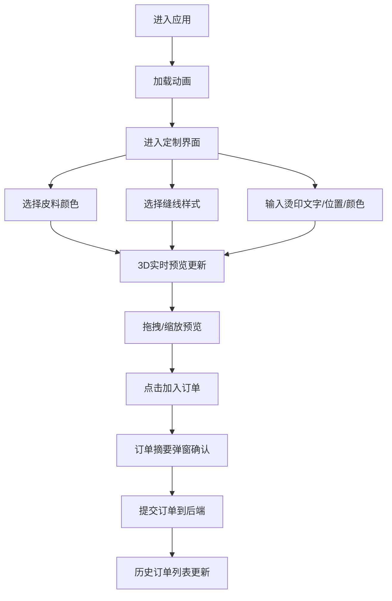
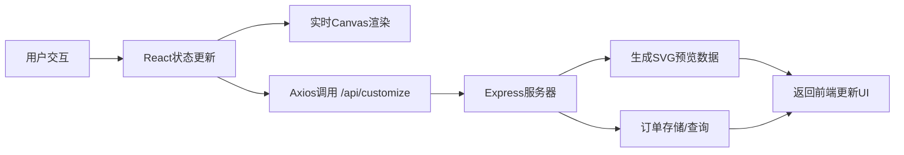

## 1. 产品概述

"革意定制"是一款面向手工皮具爱好者的在线钱包定制与实时预览应用。用户可自由选择皮料颜色、缝线样式和烫印文字，通过实时3D预览定制效果，最终完成个性化定制下单。

- **核心目标**：解决传统皮具定制无法实时预览效果的痛点，提升用户定制体验和转化率
- **目标用户**：手工皮具爱好者、追求个性化礼品的消费者
- **市场价值**：将线下定制体验线上化，通过实时可视化降低决策成本

---

## 2. 核心功能

### 2.1 用户角色

| 角色 | 注册方式 | 核心权限 |
|------|----------|----------|
| 普通用户 | 无需注册，直接使用 | 钱包定制、实时预览、提交订单、查看历史订单 |

### 2.2 功能模块

1. **定制面板**：皮料颜色选择器、缝线样式选项、烫印文字输入与位置选择
2. **实时3D预览**：Canvas绘制钱包模型、拖拽旋转、滚轮缩放、实时更新
3. **订单管理**：加入订单、订单摘要弹窗、提交订单、历史订单列表

### 2.3 页面详情

| 页面名称 | 模块名称 | 功能描述 |
|---------|---------|----------|
| 主页面 | 定制面板 | 6种植鞣革颜色选择（原色、深棕、酒红、墨绿、藏蓝、焦茶色），圆形色块带皮革纹理质感 |
| 主页面 | 定制面板 | 3种缝线样式（平缝、马鞍缝、双针锁边），缩略图展示线迹走向 |
| 主页面 | 定制面板 | 烫印文字输入（最多10字符）、位置选择（左下、右下、正中央）、颜色选择（金、银、古铜） |
| 主页面 | 3D预览区 | 45度视角展示，鼠标拖拽360度旋转（Y轴）、垂直旋转±30度（X轴）、滚轮缩放0.7x-1.5x |
| 主页面 | 订单功能 | 金属铆钉样式"加入订单"按钮，磨砂玻璃弹窗显示订单摘要，侧边栏历史订单倒序展示 |
| 加载页 | 加载动画 | 缝纫机针上下穿梭动画，深色皮革纹理背景 |

---

## 3. 核心流程

### 3.1 用户定制流程

用户进入应用后，首先看到加载动画，然后进入定制界面。用户依次选择皮料颜色、缝线样式、烫印文字，期间3D预览实时更新。满意后点击"加入订单"，确认摘要后提交，订单保存到历史列表。

### 3.2 数据流

---

## 4. 用户界面设计

### 4.1 设计风格

- **主色调**：暖棕色系 #8B5A2B、#CD853F
- **强调色**：金色 #DAA520、古铜色 #B87333
- **背景**：深色皮革纹理，重复平铺浅浮雕凹凸纹理
- **按钮风格**：金属铆钉样式，按压下沉3px，弹性动画0.15秒
- **字体**：复古衬线体（烫印文字），现代无衬线体（界面文字）
- **布局风格**：左侧320px半透明毛玻璃定制面板，右侧3D预览区，磨砂金属边框，缝线分割线
- **动画**：缝纫机针加载动画、缝线收尾打结动画、按压弹性动画、淡入淡出过渡0.2秒

### 4.2 页面设计概述

| 页面名称 | 模块名称 | UI元素 |
|---------|---------|--------|
| 主页面 | 定制面板 | 320px宽度，半透明毛玻璃效果，磨砂金属边框，虚线缝线分割线，圆形色块选择器，缝线缩略图，烫印输入框 |
| 主页面 | 3D预览区 | 45度视角钱包模型，柔和投影，十字准星鼠标，实时渲染≥30FPS |
| 主页面 | 订单按钮 | 金属铆钉样式，按压下沉微沉反馈，弹性动画 |
| 主页面 | 订单弹窗 | 半透明磨砂玻璃背景，定制参数摘要，总价计算 |
| 主页面 | 历史订单 | 侧边栏列表，时间倒序，日期/颜色/缝线摘要 |
| 加载页 | 加载动画 | 缝纫机针上下穿梭，深色皮革纹理背景 |

### 4.3 响应式

- **桌面端（≥768px）**：左侧320px定制面板，右侧预览区
- **移动端（<768px）**：定制面板折叠到底部横向滚动条，预览区全宽显示，触控优化

### 4.4 3D场景指导

- **视角**：默认45度俯视，相机距离适中
- **光照**：柔和环境光 + 主光源45度角，模拟工作室灯光效果
- **阴影**：钱包下方柔和投影，增强立体感
- **交互**：Y轴360度旋转，X轴±30度限制，缩放0.7x-1.5x
- **性能**：Canvas 2D绘制，requestAnimationFrame，目标≥30FPS，更新延迟≤100ms

---

## 5. 性能约束

- 实时预览帧率 ≥ 30FPS
- 拖拽旋转/参数修改更新延迟 ≤ 100ms
- 订单提交响应时间 ≤ 500ms
