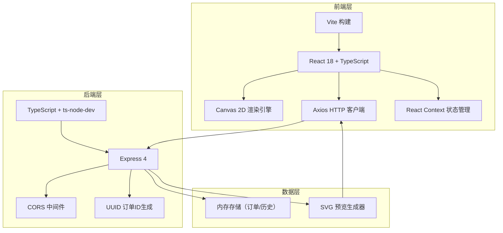
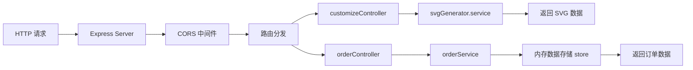
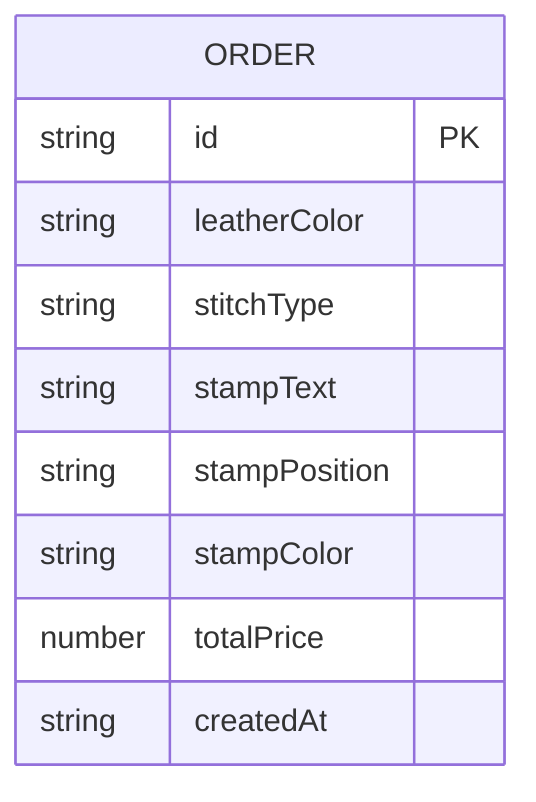

## 1. 架构设计



---

## 2. 技术描述

### 2.1 技术栈

| 层级 | 技术选择 | 版本 | 用途 |
|------|---------|------|------|
| 前端框架 | React | 18.x | UI组件开发 |
| 前端语言 | TypeScript | 5.x | 类型安全 |
| 构建工具 | Vite | 5.x | 快速构建与HMR |
| HTTP客户端 | Axios | 1.x | 后端API调用 |
| 后端框架 | Express | 4.x | API服务 |
| 后端语言 | TypeScript | 5.x | 类型安全 |
| 后端运行 | ts-node-dev | 2.x | 开发热重载 |
| 工具库 | uuid | 9.x | 订单ID生成 |
| 中间件 | cors | 2.x | 跨域支持 |

### 2.2 项目初始化

使用 Vite 初始化 React + TypeScript 项目，手动添加后端目录结构。

---

## 3. 文件结构与调用关系

```
auto60/
├── package.json              # 项目依赖配置
├── vite.config.js            # Vite配置，代理/api到3001端口
├── tsconfig.json             # 前端TS配置
├── tsconfig.backend.json     # 后端TS配置
├── index.html                # 入口页面
└── src/
    ├── frontend/
    │   ├── main.tsx          # React入口，路由+全局状态
    │   ├── types/
    │   │   └── index.ts      # 类型定义
    │   ├── context/
    │   │   └── CustomizerContext.tsx  # 全局状态管理
    │   ├── components/
    │   │   ├── Customizer.tsx        # 定制面板组件
    │   │   ├── WalletPreview.tsx     # 3D预览组件
    │   │   ├── OrderModal.tsx        # 订单弹窗
    │   │   ├── OrderHistory.tsx      # 历史订单列表
    │   │   └── LoadingScreen.tsx     # 加载动画
    │   ├── hooks/
    │   │   └── useWalletRenderer.ts  # Canvas渲染Hook
    │   ├── services/
    │   │   └── api.ts                # API服务封装
    │   └── styles/
    │       └── index.css             # 全局样式
    └── backend/
        ├── server.ts                 # Express服务器入口
        ├── types/
        │   └── index.ts              # 后端类型定义
        ├── controllers/
        │   ├── customizeController.ts  # 定制预览控制器
        │   └── orderController.ts      # 订单控制器
        ├── services/
        │   ├── svgGenerator.ts       # SVG生成服务
        │   └── orderService.ts       # 订单服务
        ├── models/
        │   └── Order.ts              # 订单模型
        └── data/
            └── store.ts              # 内存数据存储
```

### 调用关系说明

1. **main.tsx** → 挂载 App，注入 CustomizerContext
2. **Customizer.tsx** → 使用 Context 状态，调用 api.sendCustomize()，触发预览更新
3. **WalletPreview.tsx** → 使用 useWalletRenderer Hook，Canvas 实时渲染
4. **api.ts** → 封装 Axios，调用 /api/customize、/api/orders、/api/orders/:id
5. **server.ts** → 路由分发到 customizeController 和 orderController
6. **svgGenerator.ts** → 根据参数生成钱包预览 SVG
7. **orderService.ts** → 订单增删查操作，使用 store.ts 内存存储

---

## 4. 数据流向

```
用户交互 (Customizer.tsx)
    ↓
更新 Context 状态 (CustomizerContext.tsx)
    ├─→ 实时 Canvas 渲染 (WalletPreview.tsx)
    └─→ 防抖 API 调用 (api.ts)
            ↓
POST /api/customize (server.ts)
    ↓
customizeController.generatePreview()
    ↓
svgGenerator.generateWalletSVG()
    ↓
返回 SVG 数据
    ↓
更新 UI 预览
```

---

## 5. 路由定义

### 前端路由

| 路由 | 组件 | 用途 |
|------|------|------|
| / | App | 主页面，包含定制面板和预览区 |

### 后端 API 路由

| 方法 | 路由 | 用途 |
|------|------|------|
| POST | /api/customize | 生成定制预览 SVG |
| POST | /api/orders | 提交订单 |
| GET | /api/orders | 查询历史订单列表 |
| GET | /api/orders/:id | 查询单个订单详情 |

---

## 6. API 定义

### 6.1 类型定义

```typescript
// src/frontend/types/index.ts
export type LeatherColor = 'natural' | 'darkBrown' | 'wine' | 'darkGreen' | 'navy' | 'tan';
export type StitchType = 'flat' | 'saddle' | 'doubleLock';
export type StampPosition = 'bottomLeft' | 'bottomRight' | 'center';
export type StampColor = 'gold' | 'silver' | 'bronze';

export interface CustomizationParams {
  leatherColor: LeatherColor;
  stitchType: StitchType;
  stampText: string;
  stampPosition: StampPosition;
  stampColor: StampColor;
}

export interface Order {
  id: string;
  customization: CustomizationParams;
  totalPrice: number;
  createdAt: string;
}

export interface PreviewResponse {
  svg: string;
  price: {
    base: number;
    customization: number;
    total: number;
  };
}
```

### 6.2 POST /api/customize

**请求体：**
```typescript
{
  leatherColor: LeatherColor;
  stitchType: StitchType;
  stampText: string;
  stampPosition: StampPosition;
  stampColor: StampColor;
}
```

**响应体：**
```typescript
{
  svg: string;           // SVG字符串
  price: {
    base: number;        // 基础价 299
    customization: number; // 定制费 50-100
    total: number;       // 总价
  }
}
```

### 6.3 POST /api/orders

**请求体：**
```typescript
{
  customization: CustomizationParams;
  totalPrice: number;
}
```

**响应体：**
```typescript
{
  id: string;
  customization: CustomizationParams;
  totalPrice: number;
  createdAt: string;
}
```

### 6.4 GET /api/orders

**响应体：**
```typescript
Order[]; // 按时间倒序
```

---

## 7. 服务端架构图



---

## 8. 数据模型

### 8.1 实体关系



### 8.2 常量数据

```typescript
// 皮料颜色配置
export const LEATHER_COLORS = {
  natural: { name: '原色', hex: '#D2B48C', contrast: '#4A3728' },
  darkBrown: { name: '深棕', hex: '#5D4037', contrast: '#E8DCC8' },
  wine: { name: '酒红', hex: '#722F37', contrast: '#F5E6D3' },
  darkGreen: { name: '墨绿', hex: '#2C4A3E', contrast: '#E8DCC8' },
  navy: { name: '藏蓝', hex: '#1E3A5F', contrast: '#F5E6D3' },
  tan: { name: '焦茶色', hex: '#8B5A2B', contrast: '#F5E6D3' },
};

// 缝线样式配置
export const STITCH_TYPES = {
  flat: { name: '平缝', price: 50 },
  saddle: { name: '马鞍缝', price: 80 },
  doubleLock: { name: '双针锁边', price: 100 },
};

// 烫印颜色配置
export const STAMP_COLORS = {
  gold: { name: '金色', hex: '#DAA520' },
  silver: { name: '银色', hex: '#C0C0C0' },
  bronze: { name: '古铜色', hex: '#B87333' },
};
```

---

## 9. 性能优化策略

1. **Canvas 渲染优化**：requestAnimationFrame 循环，脏检查只在参数变化时重绘
2. **API 防抖**：定制参数变化后 100ms 防抖调用后端，避免频繁请求
3. **本地缓存**：相同参数的预览结果缓存，减少后端计算
4. **内存存储**：订单数据使用内存 Map 存储，O(1) 读写
5. **惰性初始化**：Canvas 上下文按需创建，避免资源浪费

---

## 10. 启动脚本

- `npm run dev`： concurrently 同时启动前后端
  - 前端：`vite` (端口 5173)
  - 后端：`ts-node-dev src/backend/server.ts` (端口 3001)
