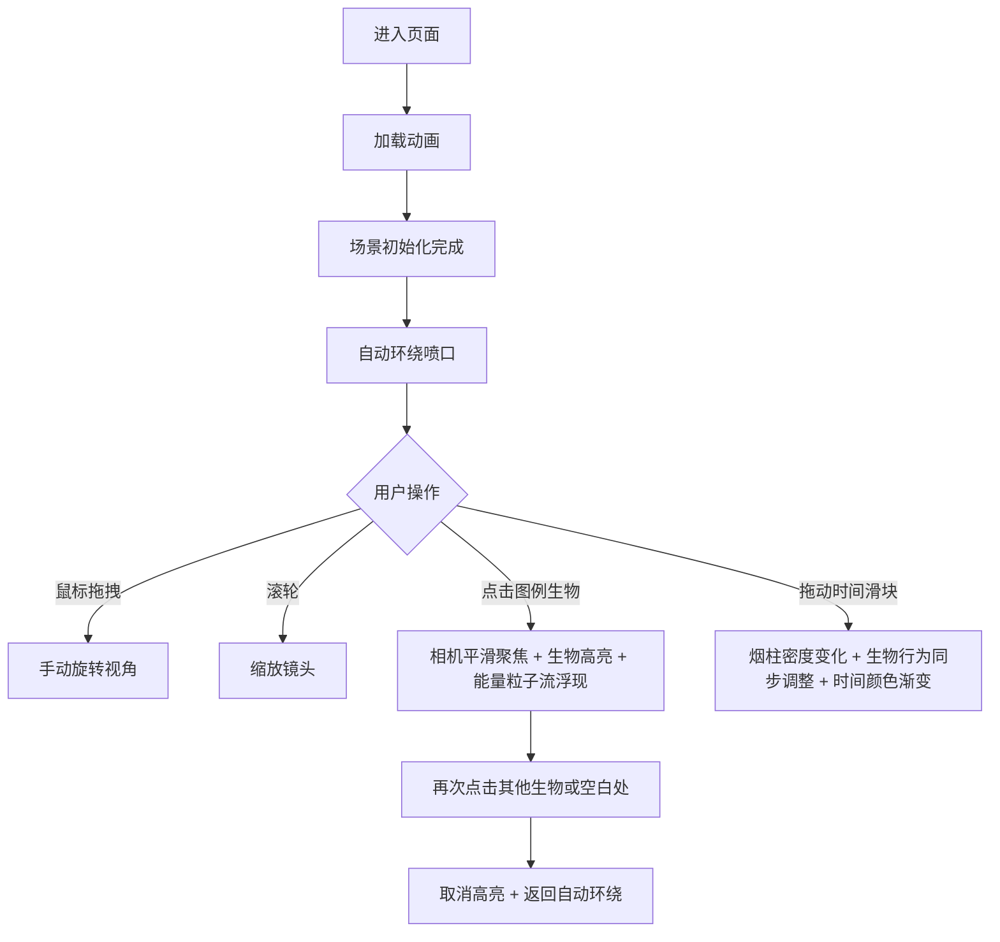

## 1. 产品概述

深海热液喷口生态系统3D可视化应用，通过沉浸式3D场景直观展示深海化能合成食物网的能量流动与生物交互过程，解决海洋生物学教学和科普中难以直观呈现深海生态动态的问题。

- **目标用户**：海洋生物学教师、学生、科普爱好者
- **核心价值**：将抽象的化能合成生态链转化为可交互的3D可视化体验，支持时间维度模拟和聚焦观察

## 2. 核心功能

### 2.1 用户角色
无需注册，直接访问即可使用全部功能。

### 2.2 功能模块
1. **3D场景渲染模块**：深海峡谷地形、黑烟囱热液喷口、烟柱粒子系统
2. **生物生态模块**：管虫、贻贝、虾群、蜗牛四种生物的模型与行为动画
3. **UI交互模块**：图例面板、时间进度条、相机控制、生物聚焦与高亮
4. **能量流动可视化模块**：粒子链展示化能合成食物网的能量传递
5. **时间周期模拟模块**：24小时热液活动周期，驱动烟柱密度和生物行为变化

### 2.3 页面详情
| 页面名称 | 模块名称 | 功能描述 |
|-----------|-------------|---------------------|
| 主页面 | 3D场景 | 全景展示深海热液喷口生态系统，支持鼠标旋转、滚轮缩放、自动环绕 |
| 主页面 | 图例面板 | 左侧悬浮半透明面板，展示4种生物的3D小图标、名称、能量层级 |
| 主页面 | 时间进度条 | 底部24小时时间轴，拖动滑块控制热液活动强度，时间值发光显示 |
| 主页面 | 能量粒子流 | 生物高亮时浮现能量流向粒子链，渐变色尾迹 |
| 主页面 | 加载动画 | 旋转的热液喷口图标，场景初始化前显示 |

## 3. 核心流程

用户进入页面 → 加载动画展示 → 3D场景初始化完成（自动环绕喷口） → 用户操作分支：

## 4. 用户界面设计

### 4.1 设计风格
- **主色调**：深蓝#0a0f2e、深紫#1a0a2e、黑色#000510
- **强调色动态变化**：烟柱密度高时橙红#ff6b35，密度低时青蓝#00d4ff
- **UI材质**：半透明磨砂玻璃效果（backdrop-filter: blur(8px)），边缘荧光描边
- **字体风格**：时间显示采用发光电子字体，其他文字采用现代无衬线字体
- **动画曲线**：所有过渡使用ease-in-out，持续0.8-1.5秒

### 4.2 页面设计概述
| 页面名称 | 模块名称 | UI元素 |
|-----------|-------------|-------------|
| 主页面 | 3D场景 | 深蓝色渐变背景、光线衰减雾效、玄武岩地形、橙灰色硫化物喷口、半透明黑灰色烟柱粒子 |
| 主页面 | 图例面板 | 左上悬浮、4行生物条目（3D小图标+名称+能量标签）、点击态高亮、磨砂玻璃+辉光边缘 |
| 主页面 | 时间进度条 | 底部横贯、4个时间标记点（6h/12h/18h/24h）、发光滑块、右侧动态彩色时间数字 |
| 主页面 | 生物高亮 | 渐变光晕环（颜色匹配能量层级）、粒子链（硫化物微粒/短虚线/长虚线） |
| 主页面 | 加载界面 | 全屏暗色、中心旋转喷口图标、加载进度文字 |

### 4.3 响应性
- 桌面端优先，适配1920x1080和1366x768分辨率
- 画布自适应窗口尺寸，UI元素使用百分比定位+最小边距
- 触控设备支持手势旋转和捏合缩放

### 4.4 3D场景指引
- **环境**：深度雾效（颜色#0a0f2e，随距离指数衰减），点光源模拟热液发光
- **光照**：主方向光模拟上层微弱海水光，喷口处橙红色点光源
- **相机**：PerspectiveCamera（fov 60°），OrbitControls阻尼控制，默认距离喷口5单位
- **构图**：喷口居中偏下，生物环绕分布在喷口周围0.5-2单位半径内
- **交互**：鼠标左键旋转、右键平移、滚轮缩放；图例点击触发相机聚焦缓动动画
- **后期**：轻微Bloom效果增强辉光，对比度微调增强深海沉浸感
- **性能预算**：烟柱粒子≤800，总顶点数≤5万，目标60FPS
