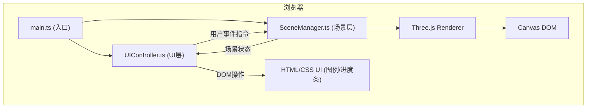

## 1. 架构设计



## 2. 技术描述
- **前端框架**：Three.js@0.160.0 + TypeScript@5.x + Vite@5.x
- **构建工具**：Vite（ESM HMR热更新）
- **UI实现**：原生HTML/CSS（半透明磨砂玻璃、CSS动画）
- **状态管理**：UIController内部状态机，无额外状态库
- **数学工具**：Three.js内置Perlin噪声（SimplexNoise）实现烟柱扰动
- **无后端**：纯前端静态应用，数据全部硬编码模拟

## 3. 模块职责定义

### 3.1 文件结构
| 文件 | 职责 |
|------|------|
| package.json | 依赖声明（three, @types/three, typescript, vite）及启动脚本 |
| vite.config.js | Vite构建配置，server端口及build输出 |
| tsconfig.json | TypeScript严格模式配置，ESNext目标 |
| index.html | 入口HTML：全屏容器、加载动画、图例DOM、进度条DOM |
| src/main.ts | 应用入口：创建Three核心对象（scene/camera/renderer），实例化SceneManager和UIController，启动requestAnimationFrame循环 |
| src/SceneManager.ts | 场景管理：创建地形/喷口/生物模型/粒子系统；update()驱动烟柱、生物动画、能量粒子流；暴露focusOrganism()/setTime()等API |
| src/UIController.ts | UI控制：图例点击/进度条拖动事件监听；相机聚焦缓动动画；根据烟柱密度更新UI描边颜色 |

### 3.2 数据流向
```
用户输入 (鼠标/触摸)
    ↓
UIController 事件监听
    ↓ 解析指令
SceneManager 方法调用 (setSmokeDensity / highlightOrganism / ...)
    ↓ 更新3D对象
Three.js Scene Graph 状态变更
    ↓
main.ts 动画循环 render()
    ↓
屏幕输出
```

## 4. 关键数据结构

### 4.1 生物类型定义
```typescript
type TrophicLevel = 'primary_producer' | 'primary_consumer' | 'secondary_consumer';

interface Organism {
  id: 'tubeworm' | 'mussel' | 'shrimp' | 'snail';
  name: string;
  trophicLevel: TrophicLevel;
  glowColor: number;       // 高亮光晕颜色
  mesh: THREE.Group;       // 3D模型根节点
  position: THREE.Vector3; // 场景中位置
  baseAnimSpeed: number;   // 基础动画速率系数
}
```

### 4.2 时间-烟柱映射
```typescript
// 烟柱密度函数（以24小时为周期，12h达到峰值）
// density(t) = 0.3 + 0.7 * sin²(π * (t-6)/12)   当 6≤t≤18
//            = 0.3                               其他时段
```

### 4.3 Perlin噪声烟柱粒子
每个粒子持有：seed、age、lifetime、baseRadius、verticalSpeed
每帧更新：pos.y += verticalSpeed * Δt；pos.xz += noise(seed, age) * density * 0.02

## 5. 性能优化策略

1. **粒子复用**：烟柱粒子采用对象池，age超过lifetime重置到喷口
2. **BufferGeometry**：所有粒子使用BufferGeometry + PointsMaterial，单次draw call
3. **LOD控制**：生物模型使用低面数几何体（Cylinder/Sphere分段数8-12）
4. **矩阵自动更新**：静态地形设置matrixAutoUpdate=false
5. **像素比限制**：renderer.setPixelRatio(Math.min(window.devicePixelRatio, 2))
6. **动画节流**：时间滑块拖动使用requestAnimationFrame合并更新
