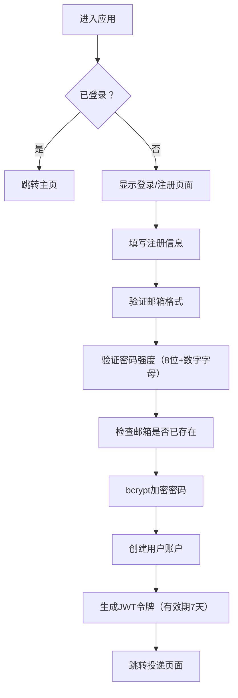
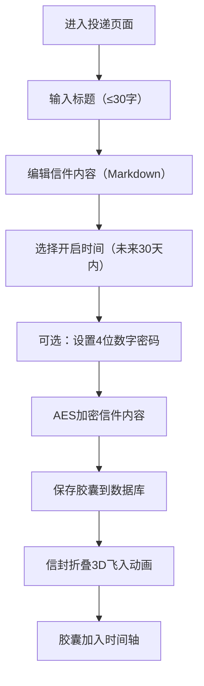
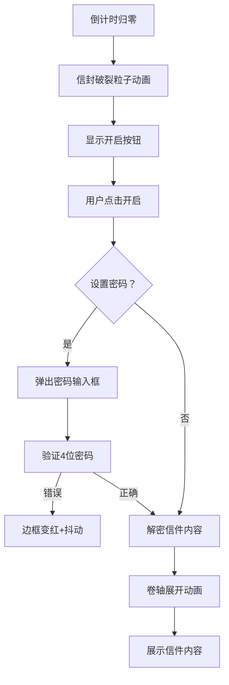
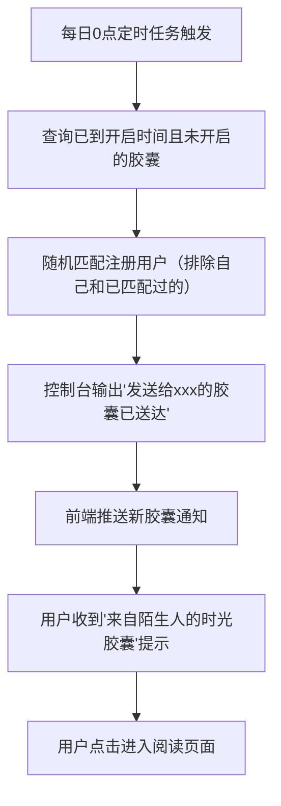

## 1. 产品概述

时光胶囊是一款匿名时间胶囊投递与开启应用，用户可以撰写加密信件，设定未来解锁时间，由系统在指定日期自动发送给随机匹配的另一位用户。应用以复古信件为主题，营造温暖、怀旧的情感体验，让用户在快节奏的现代生活中感受时间的沉淀与陌生人之间的善意连接。

- 核心价值：通过时间延迟与匿名匹配，创造有温度的情感交流体验
- 目标用户：喜欢记录生活、期待惊喜、愿意与陌生人分享情感的年轻群体

## 2. 核心功能

### 2.1 用户角色

| 角色 | 注册方式 | 核心权限 |
|------|----------|----------|
| 普通用户 | 邮箱注册 | 注册登录、创建胶囊、查看时间轴、阅读胶囊、接收陌生人胶囊 |

### 2.2 功能模块

1. **认证模块**：邮箱注册、密码登录、JWT令牌管理、密码加密存储
2. **胶囊编辑器**：标题输入、富文本内容编辑、Markdown预览、开启时间选择、密码锁定设置
3. **时间轴展示**：横向滚动胶囊列表、实时倒计时、胶囊破裂动画、开启按钮
4. **胶囊阅读**：密码验证、卷轴展开动画、信件内容展示
5. **系统匹配发送**：每日定时任务、随机用户匹配、模拟邮件发送、新胶囊通知

### 2.3 页面详情

| 页面名称 | 模块名称 | 功能描述 |
|----------|----------|----------|
| 注册页面 | 注册表单 | 邮箱格式验证、密码强度校验、重复邮箱检测、注册成功跳转 |
| 登录页面 | 登录表单 | 邮箱密码登录、登录失败抖动提示、登录成功跳转投递页 |
| 投递页面 | 胶囊编辑器 | 标题输入（30字限制）、富文本编辑（Markdown支持）、日期选择（未来30天）、密码锁定（4位数字）、信封折叠动画 |
| 主页 | 胶囊时间轴 | 横向滚动列表、实时倒计时、胶囊破裂粒子动画、开启按钮、新胶囊通知 |
| 阅读页面 | 信件展示 | 密码验证、卷轴展开动画、信件内容渲染 |

## 3. 核心流程

### 3.1 用户注册登录流程

### 3.2 胶囊创建流程

### 3.3 胶囊开启流程

### 3.4 系统自动匹配流程

## 4. 用户界面设计

### 4.1 设计风格

- **主色调**：羊皮纸色 `#F5E6CA`、深棕色 `#3E2723`、金色 `#D4A017`
- **背景**：轻微噪点纹理的暖色调渐变（羊皮纸色→浅褐色）
- **按钮风格**：凹陷/凸起质感，按压动画（外发光→内阴影），悬停时浅金色背景
- **字体**：标题使用复古衬线字体，正文使用优雅的无衬线字体，营造复古信件氛围
- **动画缓动**：`cubic-bezier(0.25, 0.1, 0.25, 1)`，持续0.3秒
- **视觉元素**：信封图标、沙漏动画、卷轴展开、纸屑粒子、墨水渐隐效果

### 4.2 页面设计概览

| 页面名称 | 模块名称 | UI元素 |
|----------|----------|--------|
| 加载页面 | 沙漏动画 | 两个三角体交替填充沙子，循环2秒，背景暖色调渐变 |
| 登录页面 | 登录表单 | 羊皮纸质感卡片，输入框聚焦深棕色描边+内阴影，登录失败抖动0.3秒 |
| 注册页面 | 注册表单 | 邮箱格式实时验证，密码强度指示器，错误提示红色文字 |
| 投递页面 | 胶囊编辑器 | 复古打字机风格，光标闪烁+墨水渐隐特效，文字入场动画（从右向左位移0.2秒），日期闪烁金色光晕，信封折叠3D飞入动画 |
| 主页 | 胶囊时间轴 | 横向滚动，磨砂玻璃质感信封（60x80px，圆角，悬浮阴影），实时倒计时，信封悬停放大1.05倍，倒计时归零纸屑粒子动画（20片，1.5秒），右上角新胶囊通知（淡入动画，金色封印信封） |
| 阅读页面 | 信件展示 | 磨砂玻璃密码输入框，卷轴展开动画（1秒），信件内容优雅排版 |

### 4.3 响应式设计

- **桌面端（≥768px）**：时间轴横向滚动，编辑器左右分栏（编辑区+预览区）
- **移动端（<768px）**：时间轴纵向滚动列表，编辑器全宽显示，上下分栏布局
- **触摸优化**：按钮最小尺寸44x44px，点击区域扩大，滚动惯性优化

### 4.4 动画效果规范

| 动画名称 | 持续时间 | 缓动曲线 | 触发时机 |
|----------|----------|----------|----------|
| 沙漏翻转 | 2秒 | linear | 页面加载 |
| 输入框抖动 | 0.3秒 | ease-in-out | 登录/密码错误 |
| 文字入场 | 0.2秒 | cubic-bezier(0.25, 0.1, 0.25, 1) | 编辑器输入新行 |
| 信封悬停 | 0.3秒 | cubic-bezier(0.25, 0.1, 0.25, 1) | 鼠标悬停信封 |
| 信封破裂 | 1.5秒 | cubic-bezier(0.25, 0.1, 0.25, 1) | 倒计时归零 |
| 纸屑飘散 | 1.5秒 | cubic-bezier(0.25, 0.1, 0.25, 1) | 信封破裂后 |
| 卷轴展开 | 1秒 | cubic-bezier(0.25, 0.1, 0.25, 1) | 密码验证通过后 |
| 按钮按压 | 0.1秒 | ease-out | 按钮点击 |
| 通知淡入 | 0.3秒 | cubic-bezier(0.25, 0.1, 0.25, 1) | 收到新胶囊 |
| 信封飞入 | 0.8秒 | cubic-bezier(0.25, 0.1, 0.25, 1) | 胶囊创建成功 |
