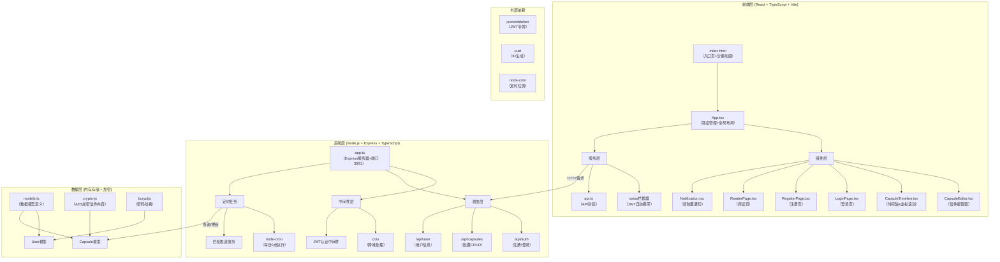
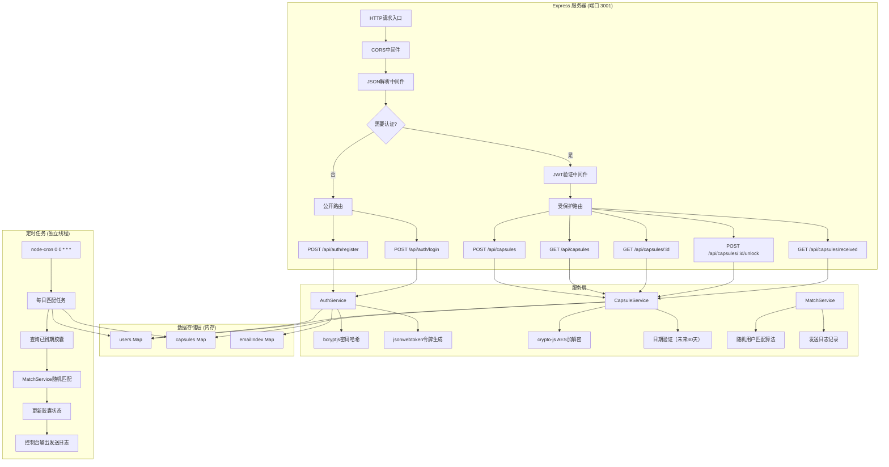
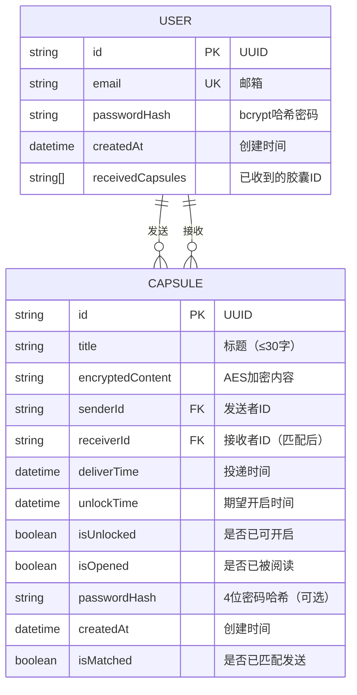

## 1. 架构设计



## 2. 技术描述

### 2.1 技术栈选型

| 层级 | 技术 | 版本 | 用途 |
|------|------|------|------|
| 前端构建 | Vite | 5.x | 快速构建工具，代码分割，热更新 |
| 前端框架 | React | 18.x | UI框架，Hooks，Suspense懒加载 |
| 前端语言 | TypeScript | 5.x | 类型安全，开发体验优化 |
| 路由 | react-router-dom | 6.x | 单页路由管理 |
| HTTP客户端 | axios | 1.x | 请求拦截，自动携带JWT |
| JWT解析 | jwt-decode | 4.x | 前端解析JWT令牌 |
| 后端框架 | Express | 4.x | RESTful API服务器 |
| 后端语言 | TypeScript | 5.x | 类型安全 |
| 后端运行 | ts-node-dev | 2.x | 开发环境热重载 |
| 跨域 | cors | 2.x | 处理跨域请求 |
| ID生成 | uuid | 9.x | 生成唯一ID |
| 加密 | crypto-js | 4.x | AES加密信件内容 |
| 定时任务 | node-cron | 3.x | 每日定时检查胶囊 |
| 密码哈希 | bcryptjs | 2.x | 用户密码加密存储 |
| JWT | jsonwebtoken | 9.x | 生成/验证认证令牌 |

### 2.2 性能优化方案

1. **前端首屏优化（≤2秒）**
   - Vite代码分割，按路由懒加载非首屏组件
   - React.lazy + Suspense实现组件级懒加载
   - 关键CSS内联，非关键CSS异步加载
   - 图片资源优化，使用WebP格式

2. **时间轴60fps滚动**
   - 虚拟滚动技术（react-window），仅渲染可见区域
   - CSS transform硬件加速
   - 防抖处理滚动事件
   - requestAnimationFrame优化动画

3. **后端API响应（≤200ms）**
   - 内存数据结构索引优化
   - 异步处理非关键路径
   - 定时任务独立于请求线程

## 3. 路由定义

| 路由路径 | 页面组件 | 权限 | 说明 |
|----------|----------|------|------|
| `/` | CapsuleTimeline | 需要登录 | 主页，胶囊时间轴 |
| `/login` | LoginPage | 公开 | 登录页面 |
| `/register` | RegisterPage | 公开 | 注册页面 |
| `/deliver` | CapsuleEditor | 需要登录 | 投递页面，创建胶囊 |
| `/read/:id` | ReaderPage | 需要登录 | 阅读页面，查看胶囊内容 |
| `*` | 404 Page | 公开 | 未找到页面重定向到登录 |

## 4. API定义

### 4.1 TypeScript类型定义

```typescript
// 用户类型
interface User {
  id: string;
  email: string;
  passwordHash: string;
  createdAt: string;
  receivedCapsules: string[]; // 已收到的胶囊ID列表（避免重复匹配）
}

// 胶囊类型
interface Capsule {
  id: string;
  title: string;
  encryptedContent: string; // AES加密的内容
  senderId: string;
  receiverId?: string; // 匹配后的接收者ID
  deliverTime: string; // 投递时间
  unlockTime: string; // 期望开启时间
  isUnlocked: boolean; // 是否已开启
  isOpened: boolean; // 是否已被阅读
  passwordHash?: string; // 4位数字密码哈希（可选）
  createdAt: string;
  isMatched: boolean; // 是否已匹配发送
}

// 认证响应
interface AuthResponse {
  token: string;
  user: {
    id: string;
    email: string;
  };
}

// API响应包装
interface ApiResponse<T> {
  success: boolean;
  data?: T;
  error?: string;
}
```

### 4.2 认证接口

#### POST /api/auth/register
- 描述：用户注册
- 请求体：
  ```typescript
  { email: string; password: string }
  ```
- 响应：`ApiResponse<AuthResponse>`
- 验证：邮箱格式、密码强度（≥8位，含数字字母）、邮箱唯一性
- 错误码：400（参数错误）、409（邮箱已存在）

#### POST /api/auth/login
- 描述：用户登录
- 请求体：
  ```typescript
  { email: string; password: string }
  ```
- 响应：`ApiResponse<AuthResponse>`
- JWT：有效期7天，payload包含userId
- 错误码：401（认证失败）

### 4.3 胶囊接口

#### POST /api/capsules
- 描述：创建新胶囊
- 认证：需要Bearer Token
- 请求体：
  ```typescript
  {
    title: string;        // 标题，≤30字
    content: string;      // 原始内容
    unlockTime: string;   // ISO日期，未来30天内
    password?: string;    // 可选，4位数字
  }
  ```
- 响应：`ApiResponse<Capsule>`
- 处理：AES加密内容，bcrypt加密密码（如果有）

#### GET /api/capsules
- 描述：获取当前用户的所有胶囊
- 认证：需要Bearer Token
- 响应：`ApiResponse<Capsule[]>`

#### GET /api/capsules/:id
- 描述：获取单个胶囊详情
- 认证：需要Bearer Token
- 响应：`ApiResponse<Capsule>`

#### POST /api/capsules/:id/unlock
- 描述：开启胶囊（验证密码+解密）
- 认证：需要Bearer Token
- 请求体：
  ```typescript
  { password?: string }
  ```
- 响应：`ApiResponse<{ content: string; title: string }>`
- 错误码：403（密码错误）、400（未到开启时间）

#### GET /api/capsules/received
- 描述：获取用户收到的陌生人胶囊
- 认证：需要Bearer Token
- 响应：`ApiResponse<Capsule[]>`

## 5. 服务器架构图



## 6. 数据模型

### 6.1 实体关系图



### 6.2 数据结构定义（内存存储）

```typescript
// 内存数据存储
export interface DataStore {
  users: Map<string, User>;
  capsules: Map<string, Capsule>;
  emailToUserId: Map<string, string>;
}

// 索引优化
export interface Indexes {
  capsulesBySender: Map<string, string[]>;    // senderId -> capsuleIds
  capsulesByReceiver: Map<string, string[]>;  // receiverId -> capsuleIds
  capsulesByUnlockTime: Map<string, string[]>; // date -> capsuleIds
  pendingCapsules: string[];                   // 待匹配的胶囊ID
}
```

### 6.3 加密配置

```typescript
// 加密密钥（环境变量）
const ENCRYPTION_KEY = process.env.ENCRYPTION_KEY || 'time-capsule-secret-key-2024';

// AES加密配置
const AES_CONFIG = {
  mode: CryptoJS.mode.CBC,
  padding: CryptoJS.pad.Pkcs7,
  keySize: 256
};

// bcrypt配置
const BCRYPT_SALT_ROUNDS = 10;

// JWT配置
const JWT_CONFIG = {
  secret: process.env.JWT_SECRET || 'jwt-secret-key-2024',
  expiresIn: '7d'
};
```
