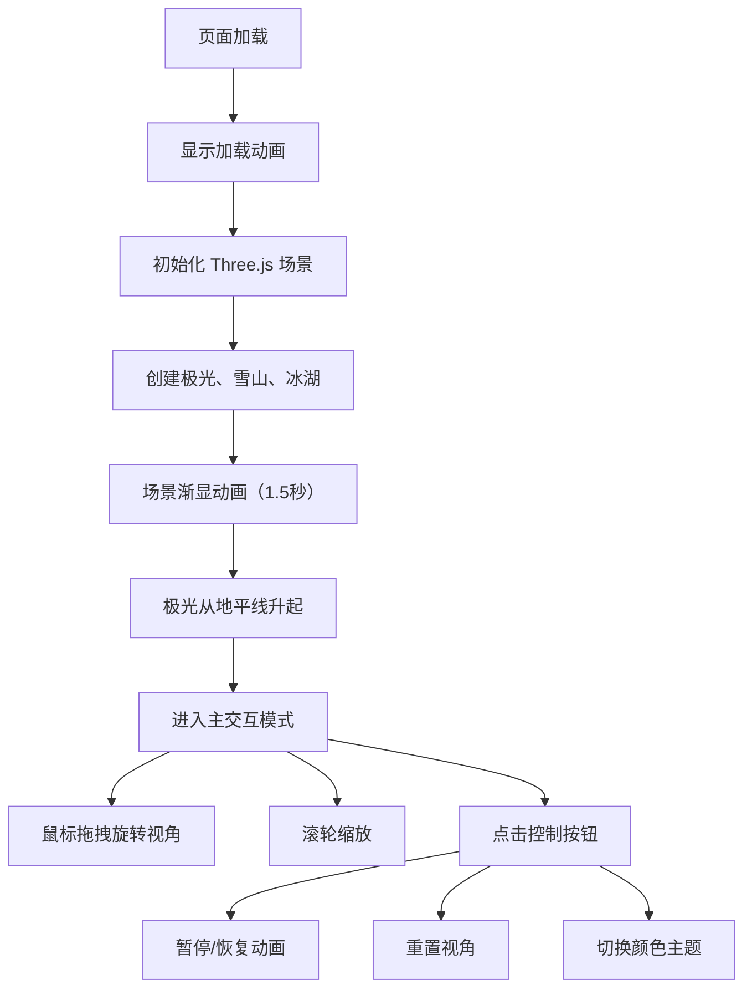

## 1. 产品概述

"极光幻境"是一个基于 WebGL 的 3D 交互可视化项目，在浏览器中呈现动态变化的极光天空与冰湖雪山景观。用户可通过鼠标交互从不同角度欣赏极光在湖面的倒影，获得沉浸式的视觉体验。

- 主要目的：创建具有艺术感的 3D 交互可视化作品，展示极光的动态美感
- 目标用户：喜欢自然景观、3D 艺术和交互体验的用户
- 产品价值：在浏览器中实现高质量的实时渲染效果，提供沉浸式的北极光观赏体验

## 2. 核心特性

### 2.1 用户角色
| 角色 | 注册方式 | 核心权限 |
|------|----------|----------|
| 访客 | 无需注册 | 浏览 3D 场景、交互控制、切换主题 |

### 2.2 功能模块
1. **3D 主场景**：极光天空、冰湖镜面、雪山地形
2. **极光系统**：多条动态带状曲面、波浪纹理、颜色渐变、透明度脉动、飘移动画
3. **交互控制**：鼠标拖拽旋转视角、滚轮缩放、阻尼缓动效果
4. **UI 控制面板**：帧率显示、暂停/恢复、重置视角、切换颜色主题
5. **加载动画**：渐显效果、极光从地平线升起

### 2.3 页面详情
| 页面名称 | 模块名称 | 功能描述 |
|----------|----------|----------|
| 主页面 | 3D 场景渲染 | 全屏 Canvas 渲染极光、冰湖、雪山 |
| 主页面 | 交互控制系统 | 鼠标拖拽旋转、滚轮缩放、阻尼缓动 |
| 主页面 | UI 控制面板 | 帧率计数器、控制按钮组 |
| 主页面 | 加载动画 | 图标旋转、场景渐显、极光升起 |

## 3. 核心流程

用户打开页面后，首先看到加载动画（极光图标旋转），随后 3D 场景从透明渐变为不透明，极光从地平线缓慢升起。用户可以通过鼠标拖拽旋转视角，滚轮缩放观看距离。右上角的控制按钮可以暂停/恢复极光动画、重置视角、切换颜色主题。左上角实时显示帧率。

## 4. 用户界面设计

### 4.1 设计风格
- **主色调**：深蓝色到墨黑色的渐变背景（天空）
- **极光色**：翠绿渐变到紫罗兰（主题1），蓝色渐变到粉色（主题2）
- **雪山**：纯白色低多边形
- **冰湖**：半透明镜面，反射率约 60%
- **按钮样式**：半透明圆角矩形，悬停时背景变为半透明白色
- **字体**：等宽字体用于帧率显示，无衬线字体用于按钮文字
- **整体风格**：沉浸式、极简主义、自然梦幻

### 4.2 页面设计概述
| 页面名称 | 模块名称 | UI 元素 |
|----------|----------|----------|
| 主页面 | 3D 场景 | 极光带（3条扭曲曲面）、雪山剪影、冰湖反射、渐变天空背景 |
| 主页面 | 左上角 | 帧率计数器（绿色字体） |
| 主页面 | 右上角 | 控制按钮组（暂停/恢复、重置视角、切换主题） |
| 主页面 | 加载层 | 极光图标旋转动画、全屏黑色背景 |

### 4.3 响应式
- 桌面端优先，全屏 Canvas 自适应窗口大小
- 支持鼠标交互（拖拽旋转、滚轮缩放）
- 触摸设备支持触摸拖拽和双指缩放

### 4.4 3D 场景指引
- **环境**：深蓝色到墨黑色的渐变天空背景，营造夜晚氛围
- **光照**：环境光提供基础照明，极光自身使用 Additive Blending 发光效果
- **相机设置**：PerspectiveCamera，初始距离 3 个单位，阻尼系数 0.85
- **相机运动**：绕 Y 轴 360 度旋转，绕 X 轴 -30 度到 30 度，缩放范围 1-5 个单位
- **构图**：地平线位于画面下方 1/3 处，极光占据天空区域，冰湖占据前景，雪山作为中景
- **交互**：鼠标拖拽旋转带阻尼缓动，极光每秒 0.3 单位从东向西飘移
- **动画**：波浪纹理（正弦波叠加噪声）、透明度脉动（0.5-0.9）、颜色渐变
- **后处理**：无额外后处理，使用材质 blending 实现发光效果
- **性能**：帧率稳定 45FPS 以上，极光顶点数控制在 20000 以内，使用 BufferGeometry
