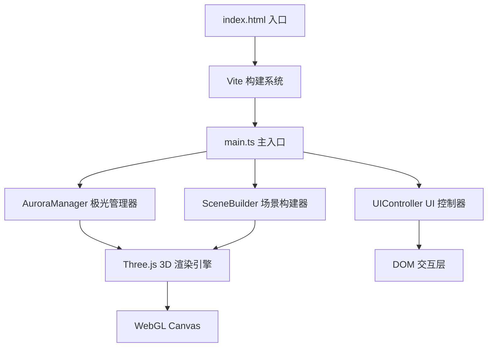

## 1. 架构设计



## 2. 技术描述

- **前端框架**：TypeScript 5.x + Three.js 0.160.0 + Vite 5.x
- **构建工具**：Vite 5.x，支持热更新、TypeScript 编译
- **3D 引擎**：Three.js 0.160.0，使用 BufferGeometry 优化性能
- **无后端**：纯前端项目，无需服务器
- **无数据库**：所有数据在前端生成和管理

## 3. 目录结构

```
auto68/
├── index.html              # 入口页面
├── package.json            # 项目依赖
├── vite.config.js          # Vite 配置
├── tsconfig.json           # TypeScript 配置
└── src/
    ├── main.ts             # 应用主入口
    ├── aurora.ts           # 极光生成与管理模块
    ├── scene.ts            # 场景构建模块
    └── ui.ts               # UI 控制模块
```

## 4. 模块职责

### 4.1 aurora.ts - 极光管理器
- **类名**：`AuroraManager`
- **职责**：
  - 创建 3 条扭曲的带状曲面，每条宽度 80-150 像素
  - 实现波浪纹理动画（正弦波叠加噪声）
  - 控制颜色渐变（翠绿→紫罗兰，蓝→粉）
  - 透明度脉动（0.5-0.9）
  - 飘移动画（每秒 0.3 单位从东向西）
  - 顶点数控制在 20000 以内
  - 使用 `BufferGeometry` 减少内存开销
  - 支持暂停/恢复动画
  - 支持切换颜色主题

### 4.2 scene.ts - 场景构建器
- **类名**：`SceneBuilder`
- **职责**：
  - 生成雪山地形（低多边形几何体，高度随机）
  - 创建冰湖镜面平面（半透明、60% 反射率、波浪扭曲）
  - 设置环境光和渐变天空背景
  - 初始化相机（PerspectiveCamera）
  - 实现相机控制与阻尼缓动（阻尼系数 0.85）
  - 相机旋转限制（Y 轴 360 度，X 轴 -30° 到 30°）
  - 滚轮缩放（1-5 个单位）
  - 处理鼠标/触摸交互事件
  - 场景渐显动画（1.5 秒）

### 4.3 ui.ts - UI 控制器
- **类名**：`UIController`
- **职责**：
  - 创建帧率计数器（左上角，绿色字体）
  - 创建控制按钮组（右上角）
    - 暂停/恢复极光动画
    - 重置视角
    - 切换颜色主题
  - 按钮样式（半透明圆角矩形，悬停效果）
  - 加载动画（极光图标旋转）
  - 与 main.ts 和 aurora.ts 交互

### 4.4 main.ts - 主入口
- **职责**：
  - 初始化 Three.js 场景、相机、渲染器
  - 创建 AuroraManager、SceneBuilder、UIController 实例
  - 处理窗口大小变化
  - 启动动画循环（requestAnimationFrame）
  - 协调各模块之间的交互

## 5. 关键技术点

### 5.1 极光实现
- 使用 `BufferGeometry` 创建带状网格，`Float32BufferAttribute` 存储顶点数据
- 顶点着色器实现波浪动画：多个正弦波叠加 Simplex 噪声
- 片元着色器实现颜色渐变、透明度脉动、发光效果
- 使用 `AdditiveBlending` 叠加混合模式
- 3 条极光带，每条顶点数约 6000，总计 ≤ 20000

### 5.2 冰湖反射
- 使用 `MeshStandardMaterial` 或自定义 ShaderMaterial
- 反射率 60%，结合环境贴图或平面反射
- 轻微波浪扰动实现倒影扭曲效果
- 半透明效果（opacity < 1）

### 5.3 相机控制
- 自定义轨道控制器，不依赖 OrbitControls
- 阻尼缓动：`current += (target - current) * (1 - damping)`
- 旋转角度限制：使用 `MathUtils.clamp`
- 缩放范围：`distance = MathUtils.clamp(distance, 1, 5)`

### 5.4 性能优化
- 使用 `BufferGeometry` 替代 `Geometry`
- 尽量减少 draw call，合并几何体
- 限制顶点数 ≤ 20000
- 合理设置像素比 `renderer.setPixelRatio(Math.min(window.devicePixelRatio, 2))`
- 帧率监测，必要时降低渲染质量

## 6. 关键常量定义

```typescript
// 极光配置
const AURORA_CONFIG = {
  bandCount: 3,
  minWidth: 80,
  maxWidth: 150,
  driftSpeed: 0.3,
  minOpacity: 0.5,
  maxOpacity: 0.9,
  maxVertices: 20000,
};

// 相机配置
const CAMERA_CONFIG = {
  fov: 60,
  near: 0.1,
  far: 100,
  initialDistance: 3,
  minDistance: 1,
  maxDistance: 5,
  damping: 0.85,
  minPolarAngle: -Math.PI / 6,  // -30度
  maxPolarAngle: Math.PI / 6,   // 30度
};

// 颜色主题
const COLOR_THEMES = {
  greenPurple: {
    bottom: 0x00ff88,  // 翠绿
    top: 0x8a2be2,     // 紫罗兰
  },
  bluePink: {
    bottom: 0x00bfff,  // 深天蓝
    top: 0xff69b4,     // 粉红
  },
};
```
