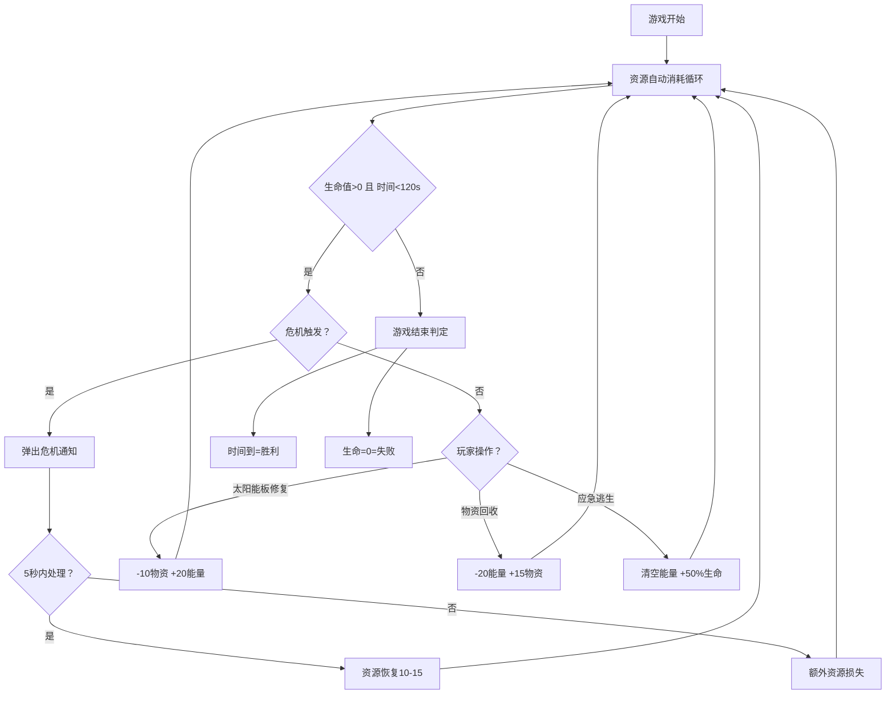

## 1. 产品概述

空间站管理策略型资源调度小游戏，玩家在有限能源和物资下指挥空间站完成日常任务并应对突发危机。
- 目标用户：休闲策略游戏玩家
- 产品价值：在2分钟内体验资源管理的紧张感和决策乐趣

## 2. 核心功能

### 2.1 功能模块
1. **空间站核心系统**：生命值、能源、物资三大资源管理
2. **操作按钮系统**：太阳能板修复、物资回收、应急逃生三种操作
3. **危机事件系统**：随机触发陨石撞击、氧气泄漏、火灾等事件
4. **UI仪表盘系统**：环形资源条、倒计时、事件通知、操作按钮
5. **游戏状态系统**：胜利/失败判定与结果展示

### 2.2 页面详情
| 页面名称 | 模块名称 | 功能描述 |
|---------|---------|----------|
| 游戏主界面 | 空间站主体 | Canvas中央绘制空间站，环绕三条渐变色资源条 |
| 游戏主界面 | 倒计时 | 顶部显示120秒倒计时，带放大缩小抖动动画 |
| 游戏主界面 | 操作按钮区 | 下方三个垂直排列的圆角按钮，带冷却和悬停效果 |
| 游戏主界面 | 危机通知 | 屏幕中央弹出毛玻璃通知框，带"处理"按钮 |
| 游戏主界面 | 结果遮罩 | 胜利/失败时全屏半透明遮罩，淡入动画 |

## 3. 核心流程

游戏开始 → 资源自动消耗（每5秒-1能量-1物资）→ 玩家执行操作/等待危机 → 危机随机触发（15-30秒）→ 玩家5秒内处理或超时损失 → 循环直至120秒（胜利）或生命归零（失败）

## 4. 用户界面设计

### 4.1 设计风格
- **主色调**：深空蓝（#0a1628）为主，白色（#ffffff）和金属银（#c0c0d0）点缀
- **按钮风格**：圆角矩形，悬停上浮5px，点击下压闪烁
- **字体**：无衬线字体（系统sans-serif）
- **资源条**：能量蓝色渐变、物资橙色渐变、生命红色渐变的圆环
- **通知框**：毛玻璃半透明背景，红色（危险）/黄色（警告）背景色

### 4.2 页面设计概览
| 页面名称 | 模块名称 | UI元素 |
|---------|---------|--------|
| 游戏主界面 | 空间站 | Canvas中央，圆环资源条环绕 |
| 游戏主界面 | 倒计时 | 顶部居中，大号字体，抖动动画 |
| 游戏主界面 | 操作按钮 | 底部垂直排列，圆角矩形，冷却灰显 |
| 游戏主界面 | 危机通知 | 屏幕中央，毛玻璃，放大缩小动画 |
| 游戏主界面 | 结果遮罩 | 全屏半透明，淡入动画 |

### 4.3 响应式
- 桌面端优先，Canvas固定尺寸
- 按钮区域适配不同分辨率
