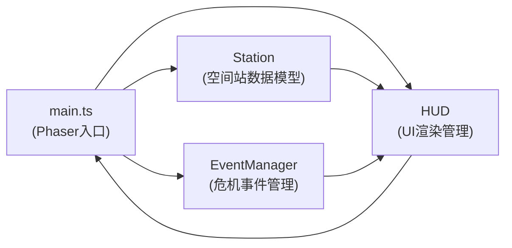

## 1. 架构设计



## 2. 技术描述
- **前端框架**：Phaser@3.60.0 + TypeScript
- **构建工具**：Vite
- **渲染方式**：HTML5 Canvas（Phaser内置）
- **语言**：TypeScript（严格模式，ES模块）

## 3. 文件结构
| 文件 | 职责 |
|------|------|
| package.json | 项目依赖与启动脚本 |
| vite.config.js | Vite配置 |
| tsconfig.json | TypeScript配置（严格模式） |
| index.html | 入口页面，Canvas容器 + 加载动画 |
| src/main.ts | Phaser游戏主配置，场景初始化与启动 |
| src/station.ts | 空间站类：生命值、能源、物资属性及增减方法 |
| src/eventManager.ts | 事件管理器：随机危机生成与触发 |
| src/hud.ts | UI管理器：仪表盘、资源条、按钮绘制与交互 |

## 4. 核心类定义

### 4.1 Station 空间站类
```typescript
class Station {
  energy: number      // 能量值 0-100
  supplies: number    // 物资值 0-100
  health: number      // 生命值 0-100
  energyDisplay: number  // 插值显示值
  suppliesDisplay: number
  healthDisplay: number
  
  addEnergy(amount: number): void
  addSupplies(amount: number): void
  addHealth(amount: number): void
  updateInterpolation(delta: number): void  // 每秒平滑插值
  isGameOver(): boolean
  isVictory(elapsed: number): boolean
}
```

### 4.2 EventManager 事件管理器
```typescript
class EventManager {
  activeEvent: CrisisEvent | null
  eventTimer: number
  responseTimer: number
  
  update(delta: number): void  // 定时触发危机
  triggerRandomEvent(): CrisisEvent
  handleEvent(): { energy: number, supplies: number, health: number }  // 处理成功奖励
  timeoutPenalty(): { energy: number, supplies: number, health: number }  // 超时惩罚
}

interface CrisisEvent {
  type: 'meteor' | 'leak' | 'fire'
  title: string
  description: string
  severity: 'danger' | 'warning'
  energyLoss: number
  suppliesLoss: number
  healthLoss: number
}
```

### 4.3 HUD UI管理器
```typescript
class HUD {
  scene: Phaser.Scene
  station: Station
  eventManager: EventManager
  
  drawStation(): void
  drawResourceRings(): void  // 三条圆环资源条
  drawCountdown(time: number): void
  drawActionButtons(): void
  drawEventNotification(): void
  drawResultOverlay(victory: boolean): void
  updateCooldown(buttonId: string, remaining: number): void
}
```

## 5. 游戏循环与数据流

1. **Phaser Scene preload()**：加载必要资源（无外部图片，纯Canvas绘制）
2. **Phaser Scene create()**：初始化Station、EventManager、HUD；设置定时器
3. **Phaser Scene update(time, delta)**：
   - 更新Station资源插值
   - 每5秒消耗1能量+1物资
   - 检查能量/物资归零 → 生命每秒-5
   - EventManager检查是否触发危机
   - 检查胜负条件
   - HUD更新绘制
4. **按钮交互**：Phaser GameObjects setInteractive() + pointer事件
5. **冷却系统**：每个按钮独立冷却计时，HUD更新灰显与倒计时
