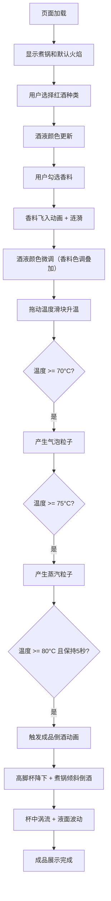

## 1. 产品概述

香料热红酒交互式模拟应用，通过 Canvas 动画直观展示不同香料和温度参数对热红酒感官特征的影响，用于烹饪教学和酒类文化展示。

- **核心价值**：将抽象的烹饪过程可视化，让用户直观理解配料组合和温度对饮品颜色、气泡、香气释放的影响
- **目标用户**：烹饪爱好者、酒吧从业者、酒类文化教育者
- **使用场景**：烹饪教学演示、酒类展览互动、酒吧菜单展示

## 2. 核心功能

### 2.1 用户角色
| 角色 | 访问方式 | 核心权限 |
|------|---------|---------|
| 访客用户 | 浏览器直接访问 | 完整使用所有交互功能 |

### 2.2 功能模块
1. **主画布区域**：玻璃煮锅、火焰动画、酒液渲染、气泡/蒸汽粒子系统
2. **左侧配料面板**：红酒种类选择、香料组合勾选、飞入动画
3. **右侧温度控制面板**：温度滑块、实时温度显示、阈值触发效果
4. **成品倒酒动画**：高脚杯降下、煮锅倾斜倒酒、杯中涡流效果

### 2.3 页面详情
| 页面名称 | 模块名称 | 功能描述 |
|---------|---------|---------|
| 主页面 | 玻璃煮锅渲染 | 带折射效果的透明锅体、金属光泽锅沿、锅形酒液 |
| 主页面 | 火焰动画 | 锅底蓝橙渐变火焰、高度20-50px动态波动 |
| 主页面 | 酒液动态着色 | 根据酒种和香料组合实时变化酒液颜色 |
| 主页面 | 气泡粒子系统 | 70度以上产生气泡，直径2-6px，速度随温度加快 |
| 主页面 | 蒸汽粒子系统 | 75度以上产生白色蒸汽，50个粒子冉冉升起 |
| 左侧面板 | 红酒选择 | 梅洛/赤霞珠/西拉三种，对应深红/宝石红/紫红 |
| 左侧面板 | 香料勾选 | 肉桂棒、八角、丁香、橙皮，带图标和勾选按钮 |
| 左侧面板 | 飞入动画 | 香料从屏幕边缘飞入锅中，伴随溅起涟漪 |
| 右侧面板 | 温度滑块 | 60-85度范围，缓动拖曳，实时读数显示 |
| 右侧面板 | 数字翻转动画 | 温度数值变化时类似电子钟表翻转效果 |
| 成品阶段 | 高脚杯降下 | 80度保持5秒后，透明高脚杯从上方降下 |
| 成品阶段 | 倒酒动画 | 煮锅倾斜，液柱抛物线，杯中旋转涡流 |

## 3. 核心流程

用户进入页面 → 看到默认状态的煮锅和火焰
→ 从左侧面板选择红酒种类（酒液颜色变化）
→ 勾选香料（香料飞入锅中，酒液颜色微调）
→ 拖动右侧温度滑块升温
→ 70度产生气泡 → 75度产生蒸汽
→ 80度保持5秒 → 触发成品倒酒动画
→ 高脚杯装满，展示最终成品效果

## 4. 用户界面设计

### 4.1 设计风格
- **主色调**：深棕色木纹背景 + 复古铜色面板边框 + 暖橙色高亮
- **辅助色**：酒红色系（深红、宝石红、紫红）、香料色（肉桂棕、橙皮金、丁香紫）
- **按钮风格**：圆角矩形，铜色边框，悬停时发出对应香料色的光晕
- **字体**：标题使用衬线字体（营造复古温馨感），正文使用清晰易读的无衬线字体
- **布局风格**：三栏式布局，左右面板固定320px，中央画布自适应
- **图标风格**：线性简约图标，配合温暖色调

### 4.2 页面设计概述
| 页面名称 | 模块名称 | UI元素 |
|---------|---------|-------|
| 主页面 | 整体布局 | 三栏布局、深木纹背景、左上角斜射灯光效果 |
| 主页面 | 中央画布 | 玻璃煮锅居中、底部留出火焰空间、锅体带折射高光 |
| 主页面 | 左侧面板 | 铜色边框卡片、分组标题、勾选按钮带光晕悬停效果 |
| 主页面 | 右侧面板 | 铜色边框卡片、垂直温度滑块、数字翻转显示 |
| 主页面 | 加载状态 | 煮锅图标旋转动画、淡入淡出过渡 |

### 4.3 响应式
- **桌面优先**：1440px 以上屏幕完美适配
- **布局策略**：左右面板固定宽度320px，中央区域自适应
- **最小宽度**：1280px 以下水平滚动
- **触摸优化**：滑块支持触摸拖动

### 4.4 Canvas 场景指引
- **环境氛围**：深棕色木纹桌面，左上角斜射暖光，营造冬日温馨感
- **光照设置**：主光源从左上45度角照射，锅体和液面产生高光反射
- **构图**：煮锅位于画布中央偏下，底部留出火焰动画空间
- **交互反馈**：香料选中有飞入动画，温度变化有气泡/蒸汽粒子反馈
- **后处理效果**：锅体玻璃折射、金属边框光泽、液面反光
- **性能预算**：粒子总数不超过150个，帧率不低于55fps
