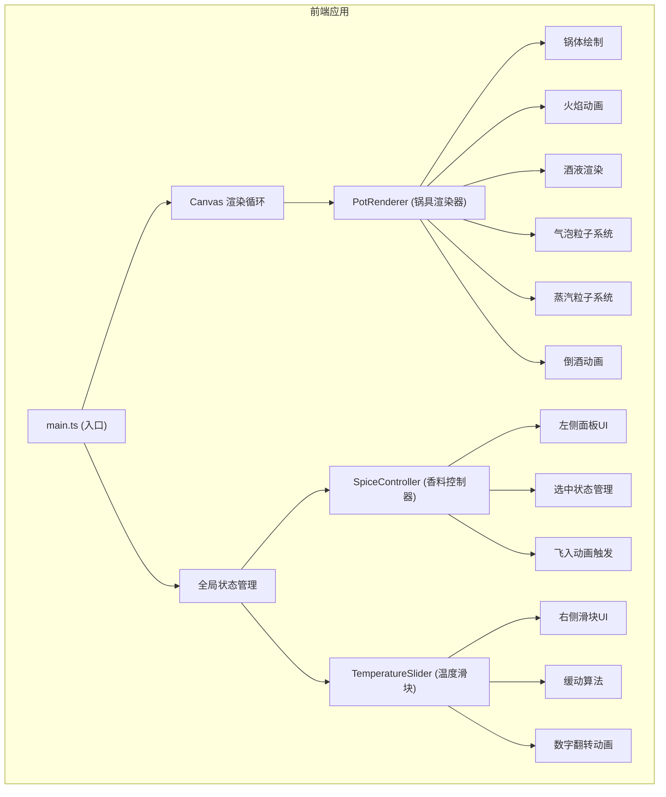

## 1. 架构设计

本项目为纯前端 Canvas 动画应用，采用 TypeScript + Vite 构建，无后端依赖。



## 2. 技术选型

- **前端框架**：无（原生 TypeScript + HTML5 Canvas）
- **构建工具**：Vite 5.x
- **语言**：TypeScript 5.x（严格模式）
- **模块系统**：ES Module
- **渲染技术**：HTML5 Canvas 2D API
- **动画系统**：requestAnimationFrame + 粒子系统

## 3. 文件结构

```
.
├── package.json
├── index.html
├── tsconfig.json
├── vite.config.js
└── src/
    ├── main.ts              # 应用入口，初始化Canvas和全局状态
    ├── PotRenderer.ts       # 锅具、火焰、酒液、气泡、倒酒渲染
    ├── SpiceController.ts   # 左侧配料面板交互逻辑
    ├── TemperatureSlider.ts # 右侧温度滑块渲染和交互
    └── types.ts             # 共享类型定义（可选）
```

## 4. 核心模块说明

### 4.1 PotRenderer
- **职责**：负责 Canvas 上所有视觉元素的绘制和动画
- **输入**：温度值、红酒种类、香料选中状态、倒酒阶段
- **子系统**：
  - 锅体渲染：玻璃折射效果、金属边框
  - 火焰动画：多层渐变火焰、高度波动
  - 酒液渲染：动态颜色混合、液面波纹
  - 气泡粒子：对象池管理、随机生成、物理上升
  - 蒸汽粒子：半透明粒子、上升消散
  - 倒酒动画：锅体旋转、液柱抛物线、杯中涡流

### 4.2 SpiceController
- **职责**：管理左侧配料面板的交互和状态
- **功能**：
  - 红酒种类单选（梅洛/赤霞珠/西拉）
  - 香料多选（肉桂棒、八角、丁香、橙皮）
  - 选中状态管理
  - 飞入动画触发（与 PotRenderer 协作）

### 4.3 TemperatureSlider
- **职责**：右侧温度滑块的渲染和交互
- **功能**：
  - 60-85度范围滑块
  - 拖曳缓动效果
  - 实时温度读数显示（数字翻转动画）
  - 温度阈值事件派发

### 4.4 main.ts
- **职责**：应用入口，协调各模块
- **功能**：
  - Canvas 初始化和尺寸管理
  - 全局状态 Store
  - 事件总线/状态同步
  - 动画循环驱动
  - Loading 动画

## 5. 性能优化策略

| 优化项 | 策略 |
|--------|------|
| 帧率控制 | requestAnimationFrame，目标60fps，最低55fps |
| 粒子数量 | 气泡+蒸汽总数不超过150个，对象池复用 |
| 温度计算 | 节流更新，不超过60次/秒 |
| Canvas 分层 | 静态元素预渲染到离屏Canvas |
| 重绘区域 | 尽量只重绘变化区域（全屏重绘时优化绘制指令） |
| 垃圾回收 | 粒子对象池复用，避免频繁GC |

## 6. 颜色系统

| 用途 | 色值 | 说明 |
|------|------|------|
| 木纹背景 | #3d2817 / #5c3d22 | 深棕色木纹渐变 |
| 铜色边框 | #b87333 / #8b5a2b | 复古铜色 |
| 梅洛红酒 | #722f37 | 深红色 |
| 赤霞珠 | #900020 | 宝石红 |
| 西拉 | #5c005c | 紫红色 |
| 肉桂色调 | #d2691e | 暖橙红色调 |
| 橙皮色调 | #ffa500 | 金橙色光斑 |
| 火焰底部 | #4169e1 | 蓝色 |
| 火焰顶部 | #ff4500 | 橙红色 |
