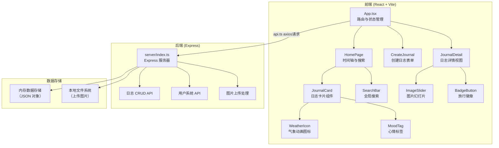
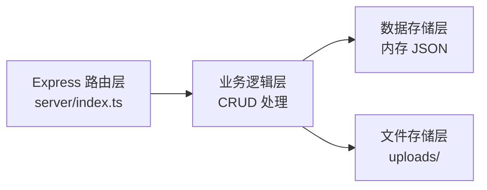
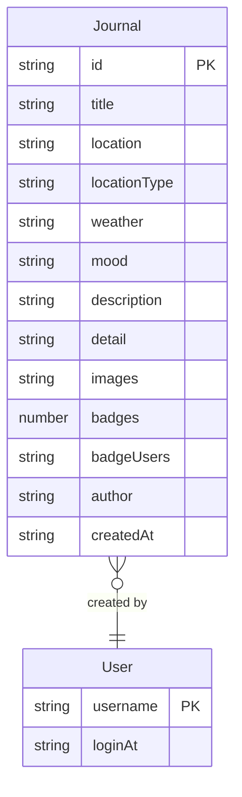

## 1. 架构设计



## 2. 技术说明
- **前端**：React@18 + TypeScript + Vite + SCSS + react-router-dom + zustand + axios
- **初始化工具**：vite-init (react-express-ts 模板)
- **后端**：Express + cors + uuid + ts-node
- **数据库**：内存数据存储（JSON 对象），无需外部数据库
- **图片处理**：浏览器端 Canvas API 压缩至 200KB 以内

## 3. 路由定义
| 路由 | 用途 |
|------|------|
| `/` | 首页 - 旅行日志时间轴 |
| `/create` | 创建日志页面 |
| `/journal/:id` | 日志详情页 |

## 4. API 定义

### 4.1 TypeScript 类型定义

```typescript
interface Journal {
  id: string;
  title: string;
  location: string;
  locationType: 'city' | 'mountain' | 'coast' | 'forest' | 'desert';
  weather: 'sunny' | 'cloudy' | 'rainy' | 'snowy';
  mood: 'happy' | 'calm' | 'thoughtful' | 'nostalgic' | 'surprised' | 'lonely';
  description: string;
  detail: string;
  images: string[];
  badges: number;
  badgeUsers: string[];
  author: string;
  createdAt: string;
}

interface User {
  username: string;
  loginAt: string;
}
```

### 4.2 API 端点

| 方法 | 路径 | 请求体 | 响应 | 说明 |
|------|------|--------|------|------|
| GET | `/api/journals` | - | `Journal[]` | 获取所有日志（按时间降序） |
| GET | `/api/journals/:id` | - | `Journal` | 获取单篇日志详情 |
| POST | `/api/journals` | `{ title, location, locationType, weather, mood, description, detail, images, author }` | `Journal` | 创建新日志 |
| POST | `/api/journals/:id/badge` | `{ username }` | `{ badges: number }` | 点亮旅行徽章 |
| POST | `/api/upload` | `FormData (image file)` | `{ url: string }` | 上传图片 |
| POST | `/api/login` | `{ username }` | `{ username, loginAt }` | 用户登录 |
| GET | `/api/user` | - | `User | null` | 获取当前登录用户 |

## 5. 服务器架构图



## 6. 数据模型

### 6.1 数据模型定义



### 6.2 数据流向说明
- **客户端 → 服务器**：用户在创建日志页面填写表单 → api.ts 封装请求 → Express 服务器处理 → 存入内存/文件系统
- **服务器 → 客户端**：首页加载 → api.ts 请求日志列表 → 服务器返回数据 → zustand store 更新 → 组件渲染
- **徽章交互**：用户点击徽章 → api.ts 发送 POST → 服务器检查是否已点过 → 更新徽章数 → 返回新数据 → 组件更新
