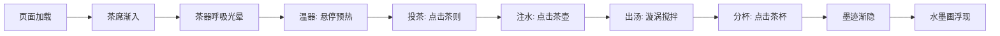

## 1. 产品概述

"茶境·墨影"是一款沉浸式浏览器茶道体验应用，通过水墨风格的视觉效果和流畅的交互动画，让用户在数字空间中感受传统茶道的静谧之美。

- 核心价值：将传统茶道文化与现代交互艺术结合，创造治愈系的数字体验
- 目标用户：茶道爱好者、艺术欣赏者、追求静心体验的互联网用户

## 2. 核心功能

### 2.1 功能模块

1. **茶席展示模块**：深色木质茶席渐变纹理，中央放置四个茶器
2. **茶器交互模块**：茶壶、茶杯、茶则、茶筅的SVG绘制与交互动画
3. **茶叶粒子模块**：飘落的茶叶粒子系统，支持漩涡聚散效果
4. **墨迹绘制模块**：茶汤表面鼠标轨迹记录，水墨山水画浮现
5. **泡茶步骤模块**：温器→投茶→注水→出汤→分杯五步骤推进，背景渐变

### 2.2 交互详情

| 页面名称 | 模块名称 | 功能描述 |
|---------|---------|---------|
| 主页面 | 茶器悬停 | 鼠标悬停茶器时高光移动，缩放0.9-1.05倍，过渡0.4秒 |
| 主页面 | 茶壶点击 | 从壶嘴流出半透明水流，触杯后形成同心圆涟漪，淡出2秒 |
| 主页面 | 茶筅点击 | 茶叶粒子加速旋转聚成漩涡，持续3秒后散开 |
| 主页面 | 茶汤绘画 | 鼠标拖拽记录轨迹，叠加形成水墨山水轮廓 |
| 主页面 | 步骤推进 | 完成分杯后墨迹缓动渐隐5秒，露出固定水墨画 |

## 3. 核心流程

用户进入页面后，茶席渐入展示，茶器呈现呼吸光晕。用户依次与茶器交互推进泡茶步骤，同时在茶汤表面绘制墨迹。完成分杯步骤后，墨迹渐隐浮现水墨山水画。

## 4. 用户界面设计

### 4.1 设计风格

- **主色调**：深木色(栗褐→黑檀渐变)、墨色(深灰→墨黑)、米白背景→浅灰蓝渐变
- **辅助色**：琥珀色(光晕)、墨绿→棕黄(茶叶粒子)
- **字体**：使用宋体/楷体类衬线字体，体现东方美学
- **动画**：所有动画使用easeInOut缓动函数，周期2秒呼吸效果

### 4.2 页面设计概述

| 页面名称 | 模块名称 | UI元素 |
|---------|---------|--------|
| 主页面 | 茶席区域 | 深色木质纹理矩形，细腻渐变，中央茶汤椭圆区 |
| 主页面 | 茶器布局 | 茶壶(左上)、茶杯(右上)、茶则(左下)、茶筅(右下) |
| 主页面 | 背景层 | 米白→浅灰蓝渐变，随步骤从晨雾到暮色变化 |
| 主页面 | 粒子层 | 100以内茶叶粒子，正弦波飘落路径 |
| 主页面 | 墨迹层 | 茶汤椭圆区内半透明墨色线条叠加 |

### 4.3 性能要求

- 帧率：保持50fps以上流畅交互
- 粒子数量：控制在100以内
- 过渡效果：全部使用easeInOut缓动函数

### 4.4 响应式设计

- 桌面端优先，Canvas自适应窗口大小
- 茶器位置按比例居中布局
- 支持触控设备点击交互
