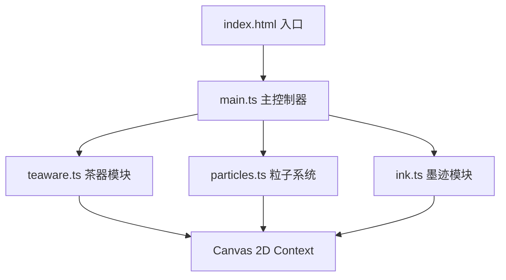

## 1. 架构设计

本项目采用纯前端Canvas渲染架构，无后端服务，通过模块化设计分离渲染、交互、粒子系统等关注点。



**层级说明：**
- **渲染层**：Canvas 2D API，负责所有像素绘制
- **逻辑层**：各功能模块独立管理状态与更新
- **控制层**：main.ts协调各模块，处理事件与主循环

## 2. 技术描述

- **前端框架**：无框架，原生TypeScript + HTML5 Canvas
- **构建工具**：Vite 5.x
- **语言**：TypeScript 5.x (严格模式)
- **模块系统**：ES Modules
- **渲染技术**：Canvas 2D Context，离屏Canvas优化
- **动画系统**：requestAnimationFrame主循环，easeInOut缓动函数

## 3. 文件结构

| 文件 | 职责 |
|------|------|
| `package.json` | 项目依赖与脚本配置 |
| `vite.config.js` | Vite构建配置 |
| `tsconfig.json` | TypeScript编译配置(严格模式) |
| `index.html` | 入口页面，Canvas容器 |
| `src/main.ts` | 初始化、事件绑定、主循环调度 |
| `src/teaware.ts` | 茶器SVG绘制、悬停/点击交互、水流涟漪动画 |
| `src/particles.ts` | 茶叶粒子生成、飘落运动、漩涡聚散 |
| `src/ink.ts` | 鼠标轨迹记录、墨迹绘制、水墨画浮现 |

## 4. 核心数据结构

### 4.1 茶器类型定义
```typescript
interface Teaware {
  id: 'teapot' | 'teacup' | 'chasen' | 'hecha';
  x: number;
  y: number;
  width: number;
  height: number;
  scale: number;
  hover: boolean;
  highlightPos: number;
  glowPhase: number;
}
```

### 4.2 粒子类型定义
```typescript
interface TeaParticle {
  x: number;
  y: number;
  size: number;
  speed: number;
  angle: number;
  wobble: number;
  wobbleSpeed: number;
  color: string;
  vortexX: number;
  vortexY: number;
  inVortex: boolean;
}
```

### 4.3 墨迹类型定义
```typescript
interface InkStroke {
  points: { x: number; y: number }[];
  opacity: number;
  width: number;
  color: string;
}
```

## 5. 核心算法

### 5.1 缓动函数
```typescript
function easeInOut(t: number): number {
  return t < 0.5 ? 2 * t * t : 1 - Math.pow(-2 * t + 2, 2) / 2;
}
```

### 5.2 粒子正弦波运动
```typescript
particle.x += Math.sin(particle.wobble) * 0.5;
particle.y += particle.speed;
particle.wobble += particle.wobbleSpeed;
```

### 5.3 漩涡吸引算法
```typescript
const dx = vortexX - particle.x;
const dy = vortexY - particle.y;
const dist = Math.sqrt(dx * dx + dy * dy);
const angle = Math.atan2(dy, dx) + 0.1;
particle.x += Math.cos(angle) * 3;
particle.y += Math.sin(angle) * 3;
```

### 5.4 颜色插值
```typescript
function lerpColor(color1: string, color2: string, t: number): string {
  // RGB通道线性插值
}
```

## 6. 性能优化策略

1. **离屏Canvas**：静态茶席背景预渲染到离屏Canvas，每帧直接贴图
2. **粒子池**：对象池复用粒子，避免频繁GC
3. **脏区域渲染**：仅重绘变化区域（如涟漪、水流）
4. **帧率控制**：requestAnimationFrame配合deltaTime计算，保持稳定50fps
5. **粒子上限**：严格控制粒子数量≤100
6. **简化路径**：墨迹点数量超过阈值时进行道格拉斯-普克简化

## 7. 事件处理

| 事件 | 处理模块 | 行为 |
|------|---------|------|
| mousemove | main.ts | 检测茶器悬停，更新高亮位置 |
| click | main.ts → teaware.ts | 检测点击茶器，触发对应动画 |
| mousedown | main.ts → ink.ts | 开始记录墨迹轨迹 |
| mousemove(dragging) | main.ts → ink.ts | 添加轨迹点 |
| mouseup | main.ts → ink.ts | 结束轨迹记录 |
| resize | main.ts | 重新计算茶器布局位置 |
