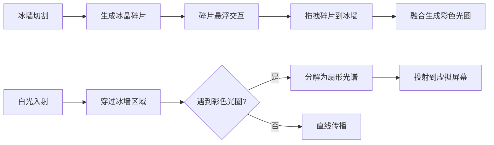

## 1. 产品概述

交互式冰晶光学模拟应用，通过在浏览器中切割冰墙生成冰晶碎片，观察光线穿过冰晶后的色散与偏振效应。主要解决物理教学或数字艺术中难以直观展示冰晶结构对光的色散与偏振效应的问题。

- **核心目标**：提供沉浸式的光学实验环境，让用户通过直观的交互理解光的色散原理
- **目标用户**：物理教师、学生、数字艺术家
- **产品价值**：将抽象的光学原理转化为可视化、可交互的沉浸式体验

## 2. 核心功能

### 2.1 用户角色

| 角色 | 注册方式 | 核心权限 |
|------|----------|----------|
| 访客用户 | 无需注册 | 完整使用所有交互功能 |

### 2.2 功能模块

1. **冰墙交互系统**：冰墙渲染、鼠标切割、碎片生成与管理
2. **冰晶碎片系统**：碎片悬浮动画、旋转交互、拖拽融合
3. **光束光谱系统**：光束路径计算、彩色光圈、光谱分解与投射
4. **控制面板**：参数调节滑块、重置功能

### 2.3 页面详情

| 页面名称 | 模块名称 | 功能描述 |
|----------|----------|----------|
| 主页面 | 冰墙交互区 | 4:3比例半透明冰墙，支持鼠标点击拖拽切割，切割线带荧光尾迹 |
| 主页面 | 冰晶碎片系统 | 切割生成不规则多边形冰晶，悬浮动画，悬停发光，点击旋转 |
| 主页面 | 拖拽融合系统 | 拖拽碎片到冰墙融合，生成永久性彩色光圈 |
| 主页面 | 光束光谱系统 | 右上角入射白光，遇光圈分解为扇形光谱投射到虚拟屏幕 |
| 主页面 | 控制面板 | 四个滑块控制光束角度、亮度、冰墙透明度、碎片生成速度；重置按钮 |

## 3. 核心流程

### 3.1 切割冰晶流程
用户在冰墙上按下鼠标 → 拖拽产生切割轨迹 → 释放鼠标生成冰晶碎片 → 碎片悬浮并可交互

### 3.2 碎片融合流程
用户拖拽冰晶碎片 → 移动到冰墙其他位置 → 释放鼠标 → 碎片融合并生成彩色光圈

### 3.3 光束色散流程
白光从右上角射入 → 穿过冰墙 → 遇到彩色光圈 → 分解为七色光谱 → 投射到虚拟屏幕

## 4. 用户界面设计

### 4.1 设计风格
- **主色调**：深蓝、深紫、银白的暗冷色系
- **视觉风格**：半透明冰质感，光亮与发光效果
- **动画风格**：平滑缓动（cubic-bezier(0.4,0,0.2,1)），响应延迟≤50ms
- **字体**：现代无衬线字体，清晰易读

### 4.2 页面设计概述

| 页面名称 | 模块名称 | UI 元素 |
|----------|----------|----------|
| 主页面 | 冰墙区域 | 4:3比例居中，深蓝到深紫渐变背景，0.5px白边，0.8透明度，随机气泡和裂纹纹理 |
| 主页面 | 切割效果 | 3px白色荧光切割线，20px缓动尾迹，0.3秒消失 |
| 主页面 | 冰晶碎片 | 不规则多边形，锯齿边缘，半透明冰质感，边缘高光，内部气泡粒子，±5px悬浮动画，2-3秒周期 |
| 主页面 | 碎片交互 | 悬停边缘发光（淡蓝→淡紫），点击旋转45度 |
| 主页面 | 融合效果 | 拖拽透明度0.6，0.5秒融合动画，40px七色渐变光圈，0.02rad/s旋转 |
| 主页面 | 光束效果 | 8px宽白光，光晕效果，遇光圈分解为15度扇形光谱，2px色宽，共30px |
| 主页面 | 虚拟屏幕 | 16:9半透明白色矩形，居中显示光谱投射 |
| 主页面 | 控制面板 | 底部半透明深灰圆角矩形，四个带数值显示的滑块，深红到橙红渐变圆形重置按钮 |

### 4.3 性能要求
- 帧率稳定≥30fps
- 最多同时存在15个冰晶碎片，超出时最早生成的自动消散（0.5秒淡出）
- 所有动画平滑流畅

### 4.4 响应式设计
- 桌面端优先设计
- Canvas自适应窗口大小
- 控制面板保持在底部中央
