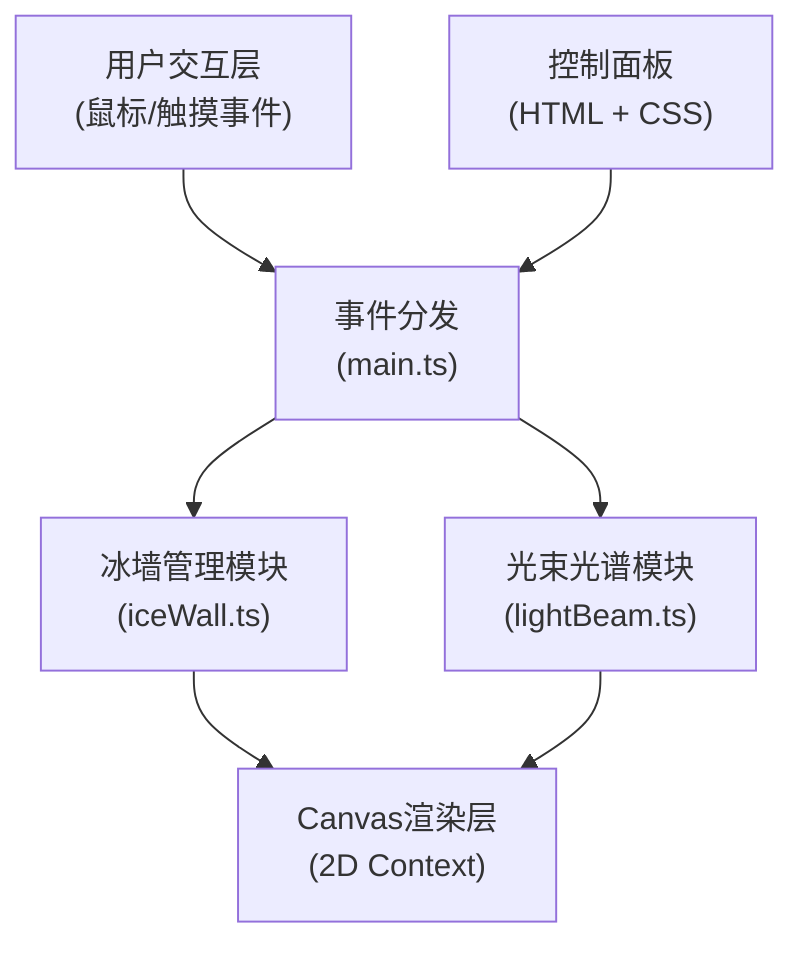

## 1. 架构设计

本项目为纯前端交互式Canvas应用，采用模块化架构，分离渲染逻辑与业务逻辑。



## 2. 技术描述

### 2.1 技术栈
- **前端框架**：原生 TypeScript + HTML5 Canvas API（无React/Vue框架，按用户需求使用Canvas直接绘制）
- **构建工具**：Vite 5.x
- **语言**：TypeScript 5.x（严格模式）
- **渲染引擎**：HTML5 Canvas 2D API

### 2.2 项目初始化
由于用户明确指定使用 TypeScript、HTML5 Canvas 和 Vite 的组合，不使用 React/Vue 框架，项目将采用 vanilla-ts 模板手动配置，而非使用 web-dev 提供的 React/Vue 模板。

### 2.3 性能优化策略
- 使用 `requestAnimationFrame` 实现 60fps 渲染循环
- 离屏 Canvas 预渲染冰墙静态纹理
- 对象池管理冰晶碎片和气泡粒子
- 空间分区优化碰撞检测
- 最大碎片数量限制（15个）防止性能下降

## 3. 核心模块设计

### 3.1 文件结构

| 文件路径 | 模块职责 |
|----------|----------|
| `src/main.ts` | 应用入口，Canvas初始化，事件监听，渲染循环调度 |
| `src/iceWall.ts` | 冰墙管理：冰墙绘制、切割处理、碎片生成/融合/悬浮/交互 |
| `src/lightBeam.ts` | 光束管理：光束路径、光谱分解、光圈检测、光谱投射 |
| `index.html` | 入口HTML，DOM结构，样式定义，控制面板UI |
| `vite.config.js` | Vite构建配置 |
| `tsconfig.json` | TypeScript严格模式配置 |
| `package.json` | 项目依赖与脚本 |

### 3.2 数据模型定义

#### IceWall 冰墙类
```typescript
interface IceWallConfig {
  x: number;
  y: number;
  width: number;
  height: number;
  opacity: number;
}

interface Bubble {
  x: number;
  y: number;
  radius: number;
  opacity: number;
}

interface Crack {
  startX: number;
  startY: number;
  endX: number;
  endY: number;
}
```

#### IceShard 冰晶碎片类
```typescript
interface IceShard {
  id: number;
  x: number;
  y: number;
  baseY: number;
  rotation: number;
  targetRotation: number;
  vertices: Point[];
  opacity: number;
  targetOpacity: number;
  thickness: number;
  floatOffset: number;
  floatSpeed: number;
  floatPhase: number;
  isDragging: boolean;
  isHovering: boolean;
  isFading: boolean;
  fadeStartTime: number;
  particles: Bubble[];
  createdAt: number;
}
```

#### ColorAperture 彩色光圈类
```typescript
interface ColorAperture {
  id: number;
  x: number;
  y: number;
  radius: number;
  rotation: number;
  rotationSpeed: number;
  opacity: number;
}
```

#### LightBeam 光束类
```typescript
interface LightBeamConfig {
  startX: number;
  startY: number;
  angle: number;
  width: number;
  brightness: number;
}

interface Spectrum {
  colors: string[];
  angles: number[];
  intensities: number[];
}
```

### 3.3 核心算法

#### 切割算法
- 鼠标拖拽轨迹点采样（每2px采样一个点）
- 道格拉斯-普克算法简化轨迹点
- 基于轨迹生成闭合不规则多边形（偏移轨迹两侧生成边缘顶点）
- 顶点随机偏移生成锯齿效果

#### 碰撞检测
- 点与多边形：射线法判断点是否在多边形内
- 线段与矩形：参数化线段求交
- 光束与光圈：距离检测 + 角度范围判断

#### 光谱计算
- 可见光波长范围：380nm（紫）~ 780nm（红）
- 折射角计算：斯涅尔定律 n1*sin(θ1) = n2*sin(θ2)
- 冰的折射率：随波长变化（柯西公式）
- 颜色映射：波长转RGB

## 4. 交互事件定义

| 事件类型 | 触发条件 | 处理逻辑 |
|----------|----------|----------|
| `mousedown` | 鼠标在冰墙上按下 | 开始切割记录轨迹 |
| `mousemove` | 鼠标移动 | 更新切割轨迹/拖拽碎片 |
| `mouseup` | 鼠标释放 | 结束切割生成碎片/释放碎片融合 |
| `mouseover` | 鼠标悬停碎片 | 碎片边缘发光效果 |
| `mouseout` | 鼠标离开碎片 | 取消发光效果 |
| `click` | 点击碎片 | 碎片旋转45度 |
| `input` | 滑块拖动 | 实时更新配置参数 |

## 5. 动画系统

### 5.1 缓动函数
统一使用 `cubic-bezier(0.4, 0, 0.2, 1)` 作为动画缓动函数。

### 5.2 动画列表

| 动画名称 | 持续时间 | 应用对象 |
|----------|----------|----------|
| 页面加载冰墙淡入 | 1s | 冰墙整体 |
| 切割尾迹消失 | 0.3s | 切割轨迹线 |
| 碎片悬浮 | 2-3s循环 | 冰晶碎片Y轴 |
| 碎片旋转 | 0.3s | 冰晶碎片角度 |
| 碎片融合 | 0.5s | 冰晶碎片透明度/颜色 |
| 碎片消散 | 0.5s | 超量碎片淡出 |
| 光圈旋转 | 永久 | 彩色光圈 |
| 重置按钮按下 | 0.2s | 按钮缩放动画 |

## 6. 配置参数

| 参数名称 | 范围 | 默认值 | 步长 | 控制对象 |
|----------|------|--------|------|----------|
| 光束入射角度 | 0-90° | 45° | 1° | 光束发射角度 |
| 光束亮度 | 0.2-2.0 | 1.0 | 0.1 | 光束强度 |
| 冰墙透明度 | 0.3-1.0 | 0.8 | 0.1 | 冰墙整体透明度 |
| 碎片生成速度 | 1-5s | 2s | 0.5s | 碎片生成动画速度 |
