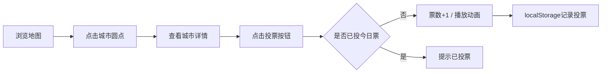
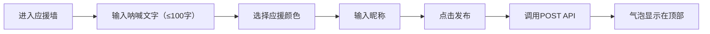
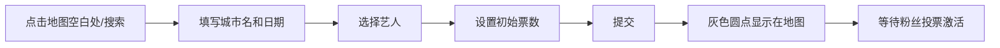

## 1. 产品概述

"声浪·轨迹"是一个互动式巡演路线规划与粉丝应援墙平台，让独立音乐厂牌的艺人和粉丝共同决定每场演出的城市和曲目，形成动态巡演地图。

- 目标用户：独立音乐厂牌、签约艺人、音乐粉丝
- 核心价值：通过粉丝投票和互动，共同参与巡演规划，增强粉丝粘性与参与感
- 市场定位：粉丝经济与音乐演出的创新结合，打造互动式音乐社区

## 2. 核心功能

### 2.1 用户角色

| 角色 | 注册方式 | 核心权限 |
|------|----------|----------|
| 粉丝用户 | 无需注册（基于localStorage/IP识别） | 浏览地图、投票支持城市、发布应援呐喊、点赞互动 |
| 艺人/管理员 | 预置账号 | 创建巡演、管理演出城市、查看数据统计 |

### 2.2 功能模块

1. **首页巡演地图**：世界地图展示、城市搜索、已规划城市标注、路线连线
2. **城市演出详情页**：投票按钮、实时票数、演出信息、应援墙
3. **艺人专属页**：艺人信息、巡演城市列表、投票进度统计
4. **粉丝应援墙**：发布呐喊消息、彩色气泡展示、点赞互动

### 2.3 页面详情

| 页面名称 | 模块名称 | 功能描述 |
|----------|----------|----------|
| 首页地图 | 地图渲染模块 | 世界地图渲染、城市圆点标注（大小对应票数、颜色对应大洲）、路线连线绘制 |
| 首页地图 | 搜索模块 | 城市名称搜索、地图自动平移缩放、添加新城市 |
| 首页地图 | 城市弹出层 | 显示城市名、票数、日期、状态、跳转详情链接 |
| 城市详情页 | 投票模块 | 金色圆形投票按钮、弹跳动画、每日限投1票、票数动画 |
| 城市详情页 | 应援墙模块 | 瀑布流气泡布局、发布表单、色盘选色、点赞互动 |
| 艺人页面 | 巡演列表模块 | 城市卡片展示、日期排序、投票进度条、FLIP动画 |
| 通用组件 | 加载动画 | 金色旋转音符图标 |

## 3. 核心流程

### 3.1 粉丝投票流程

### 3.2 发布应援流程

### 3.3 添加新城市流程

## 4. 用户界面设计

### 4.1 设计风格

- **主色调**：深蓝到暗紫渐变背景（#1a0a2e → #2d1b4e）
- **强调色**：暖金色（#ffd700 → #ff8c00）用于按钮、高亮、进度条
- **辅助色**：大洲配色（亚洲红#e74c3c、欧洲橙#e67e22、北美蓝#3498db、南美绿#2ecc71、非洲黄#f1c40f、大洋洲紫#9b59b6）
- **毛玻璃效果**：backdrop-filter: blur(10px)，背景rgba(0,0,0,0.5)，边框1px rgba(255,255,255,0.2)
- **按钮风格**：圆形金色按钮，带脉动光环动画
- **字体**：标题使用展示字体，正文使用现代无衬线字体
- **动画风格**：流畅缓动（ease-out）、弹性弹跳、流动虚线

### 4.2 页面设计概述

| 页面名称 | 模块名称 | UI元素 |
|----------|----------|--------|
| 首页 | 地图区域 | 占屏宽65%，深蓝暗紫渐变地图，彩色圆点，发光曲线连线 |
| 首页 | 信息面板 | 占屏宽35%，毛玻璃卡片，巡演列表，搜索框 |
| 首页 | 搜索框 | 中央悬浮，毛玻璃效果，金色边框聚焦 |
| 城市详情 | 投票按钮 | 金色圆形Φ80px，中心数字，脉动光环，弹跳动画 |
| 城市详情 | 应援气泡 | 圆角矩形，随机旋转-3°~3°，上下浮动动画 |
| 艺人页面 | 进度条 | 灰色渐变到金色，实时更新动画 |
| 通用 | 加载图标 | 金色音符旋转，Φ40px，周期1秒 |

### 4.3 响应式

- **桌面端**（≥768px）：左右布局，地图65% / 面板35%
- **移动端**（<768px）：上下布局，地图60%高度 / 面板40%高度
- 触控优化：按钮最小44px×44px，触摸反馈动画

### 4.4 交互细节

- **圆点悬停**：缩放1.2倍，阴影增强，显示tooltip
- **连线悬停**：线宽加粗，显示城市名和里程
- **票数变化**：数字缓动动画0.5秒
- **列表重排**：FLIP动画平滑过渡
- **气泡动画**：随机3-5秒浮动周期，位移4px
