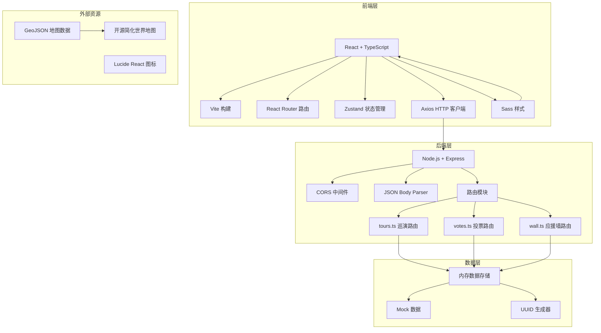
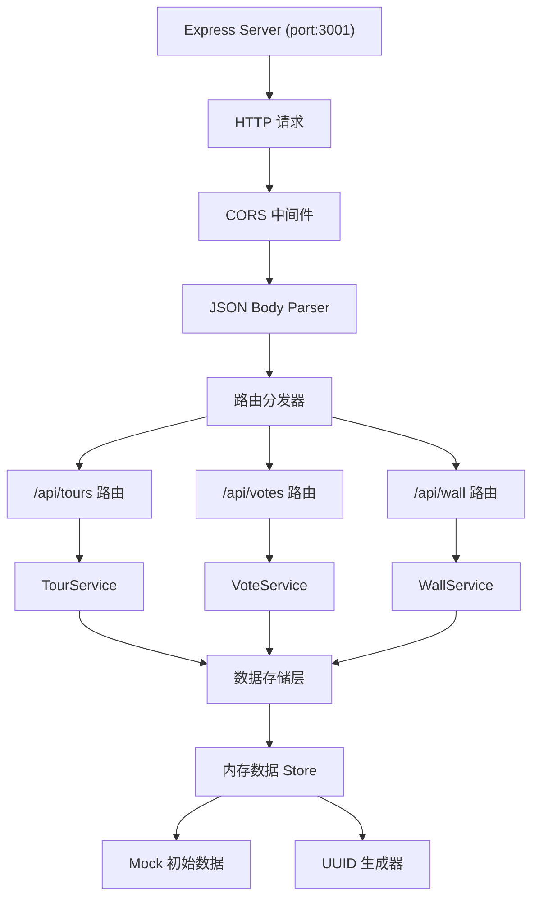
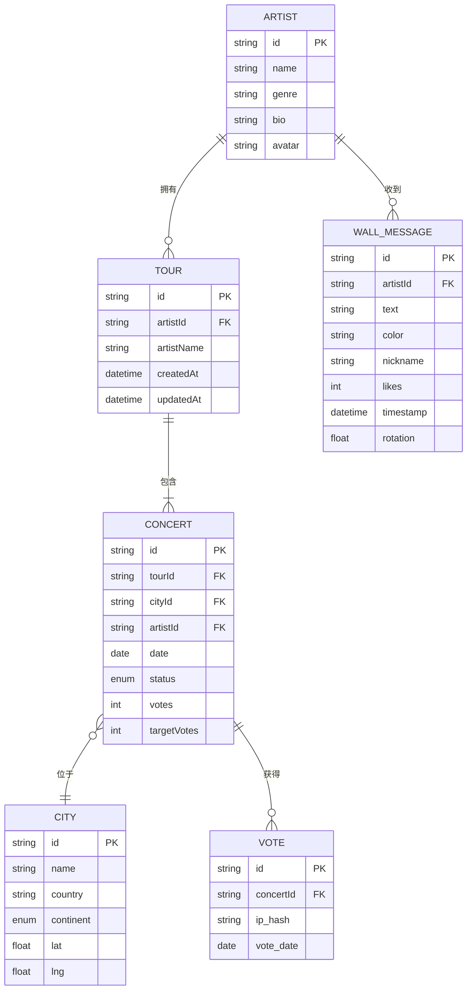

## 1. 架构设计



## 2. 技术描述

### 2.1 前端技术栈
- **框架**: React 18 + React DOM 18
- **语言**: TypeScript 5.x（严格模式）
- **构建工具**: Vite 5.x
- **路由**: React Router DOM 6.x
- **状态管理**: Zustand 4.x
- **HTTP客户端**: Axios 1.x
- **样式**: Sass 1.x
- **图标**: Lucide React
- **目标**: ES 模块（ESNext）

### 2.2 后端技术栈
- **运行时**: Node.js 18+
- **框架**: Express 4.x
- **语言**: TypeScript 5.x
- **执行器**: ts-node
- **中间件**: cors、body-parser
- **工具**: uuid

### 2.3 项目初始化
- 使用 `react-express-ts` 模板初始化全栈项目
- 前后端分离架构，统一 TypeScript 类型定义
- 开发代理：前端5173端口 → 后端3001端口

## 3. 路由定义

### 3.1 前端路由

| 路由路径 | 页面组件 | 功能说明 |
|----------|----------|----------|
| `/` | HomePage | 首页，世界地图展示，搜索，巡演列表 |
| `/maps` | MapPage | 地图页面（同首页主要内容） |
| `/artist/:id` | ArtistPage | 艺人详情页，巡演城市列表，进度统计 |
| `/concert/:city` | ConcertPage | 城市演出详情页，投票，应援墙 |
| `/wall/:id` | WallPage | 应援墙页面 |

### 3.2 后端API路由

| 方法 | 路径 | 功能 |
|------|------|------|
| GET | `/api/tours` | 获取所有巡演路线 |
| POST | `/api/tours` | 创建新巡演 {artistId, cities[]} |
| PUT | `/api/tours/:id` | 更新巡演路线 |
| POST | `/api/votes` | 提交投票 {concertId, cityName} |
| GET | `/api/votes/:concertId` | 获取某城市投票数 |
| GET | `/api/wall/:artistId` | 获取艺人所有应援呐喊 |
| POST | `/api/wall/:artistId` | 发布新呐喊 {text, color, nickname} |

## 4. API 类型定义

```typescript
// 共享类型定义
export interface City {
  id: string;
  name: string;
  country: string;
  continent: 'asia' | 'europe' | 'northAmerica' | 'southAmerica' | 'africa' | 'oceania';
  lat: number;
  lng: number;
}

export interface Concert {
  id: string;
  cityId: string;
  city: City;
  artistId: string;
  artistName: string;
  date: string;
  status: 'pending' | 'confirmed' | 'planned';
  votes: number;
  targetVotes: number;
  thumbnail?: string;
}

export interface Tour {
  id: string;
  artistId: string;
  artistName: string;
  cities: Concert[];
  createdAt: string;
  updatedAt: string;
}

export interface WallMessage {
  id: string;
  artistId: string;
  text: string;
  color: string;
  nickname: string;
  likes: number;
  timestamp: string;
  rotation: number;
}

export interface Artist {
  id: string;
  name: string;
  genre: string;
  avatar?: string;
  bio: string;
}

// 请求/响应类型
export interface CreateTourRequest {
  artistId: string;
  cities: Array<{ cityId: string; date: string; initialVotes?: number }>;
}

export interface VoteRequest {
  concertId: string;
  cityName: string;
}

export interface VoteResponse {
  concertId: string;
  votes: number;
  success: boolean;
  message?: string;
}

export interface WallMessageRequest {
  text: string;
  color: string;
  nickname: string;
}
```

## 5. 服务器架构



### 5.1 文件结构

```
server/
├── index.ts              # Express 主入口
├── routes/
│   ├── tours.ts          # 巡演CRUD路由
│   ├── votes.ts          # 投票路由
│   └── wall.ts           # 应援墙路由
├── store/
│   └── index.ts          # 内存数据存储
├── types/
│   └── index.ts          # 类型定义
└── data/
    └── mockData.ts       # 预置Mock数据
```

## 6. 数据模型

### 6.1 ER 图



### 6.2 大洲颜色映射

```typescript
export const CONTINENT_COLORS: Record<string, string> = {
  asia: '#e74c3c',        // 亚洲红
  europe: '#e67e22',      // 欧洲橙
  northAmerica: '#3498db', // 北美蓝
  southAmerica: '#2ecc71', // 南美绿
  africa: '#f1c40f',      // 非洲黄
  oceania: '#9b59b6',     // 大洋洲紫
};
```

### 6.3 预置艺人列表

```typescript
export const PRESET_ARTISTS: Artist[] = [
  { id: '1', name: '星河乐队', genre: '独立摇滚', bio: '来自上海的四人乐队...' },
  { id: '2', name: '午夜电台', genre: '电子流行', bio: '融合复古与未来的电子音乐人...' },
  { id: '3', name: '迷雾行者', genre: '民谣', bio: '城市民谣创作歌手...' },
  { id: '4', name: '霓虹花园', genre: '后朋克', bio: '重庆独立乐队...' },
];
```

## 7. 性能优化方案

### 7.1 渲染优化
- 四叉树空间索引：城市圆点超过50个时启用
- Canvas渲染地图和连线，DOM仅处理交互
- 虚拟滚动：应援墙消息列表虚拟化
- 节流/防抖：地图移动、搜索输入

### 7.2 性能指标
- 帧率：≥50fps
- API响应：≤200ms（本地）
- 最大同时渲染：50个圆点、100条连线
- 动画：CSS硬件加速（transform、opacity）

### 7.3 动画实现
```typescript
// 票数缓动动画
function animateNumber(from: number, to: number, duration: number, callback: (v: number) => void) {
  const startTime = performance.now();
  const diff = to - from;
  function step(now: number) {
    const progress = Math.min((now - startTime) / duration, 1);
    const eased = 1 - Math.pow(1 - progress, 3); // easeOutCubic
    callback(from + diff * eased);
    if (progress < 1) requestAnimationFrame(step);
  }
  requestAnimationFrame(step);
}

// FLIP动画
function performFLIP(element: HTMLElement, prevRect: DOMRect) {
  const newRect = element.getBoundingClientRect();
  const dx = prevRect.left - newRect.left;
  const dy = prevRect.top - newRect.top;
  element.style.transform = `translate(${dx}px, ${dy}px)`;
  requestAnimationFrame(() => {
    element.style.transition = 'transform 0.5s ease-out';
    element.style.transform = 'translate(0, 0)';
  });
}
```
