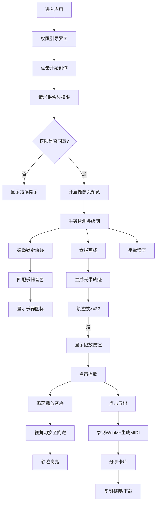

## 1. 产品概述

手势谱·音轨工坊是一款创新的视觉音乐创作Web应用，用户通过摄像头捕捉手部动作，在虚拟3D画布上以手势轨迹绘制音阶图形，每条轨迹自动匹配乐器音色，最终组合成可导出分享的视觉音乐短片。

- **核心价值**：将手势交互、视觉艺术与音乐创作融为一体，让用户以直观自然的方式创作独特的视听作品
- **目标用户**：音乐爱好者、视觉艺术家、创意教育工作者、普通大众用户

## 2. 核心功能

### 2.1 用户角色
| 角色 | 注册方式 | 核心权限 |
|------|----------|----------|
| 普通用户 | 无需注册，直接使用 | 手势绘制、音序播放、导出分享 |

### 2.2 功能模块
1. **手势检测模块**：摄像头权限申请、MediaPipe手势识别、21关键点输出、手势类型判断
2. **3D画布渲染模块**：Three.js场景构建、手势轨迹光带、粒子效果、乐器图标
3. **音序合成模块**：乐器音色匹配、音阶映射、播放控制、循环播放
4. **导出分享模块**：屏幕录制、MIDI导出、分享卡片、下载功能

### 2.3 页面详情
| 页面名称 | 模块名称 | 功能描述 |
|----------|----------|----------|
| 主创作页 | 权限引导层 | 半透明遮罩、圆角卡片、摄像头使用说明、隐私提示、开始创作按钮 |
| 主创作页 | 摄像头预览区 | 640x480镜像显示、手势类型标签 |
| 主创作页 | 3D画布区 | Three.js渲染、轨迹光带、乐器图标、视角切换 |
| 主创作页 | 控件栏 | 播放/暂停、导出、清空画布按钮 |
| 主创作页 | 分享弹窗 | 毛玻璃效果、复制链接、下载选项 |

## 3. 核心流程

用户首次进入应用 → 显示权限引导界面 → 点击开始创作 → 请求摄像头权限 → 开启摄像头预览 → 右手食指绘制轨迹 → 握拳锁定当前轨迹 → 张开手掌开始新轨迹 → 完成3条以上轨迹 → 点击播放按钮 → 按顺序循环播放 → 点击导出 → 录制屏幕+生成MIDI → 显示分享卡片 → 复制链接或下载

## 4. 用户界面设计

### 4.1 设计风格
- **主色调**：深色基调 `#0a0a1a`，前景文字 `#f0f0f0`
- **强调色**：`#4a6fa5`（分隔线）、`#4a9eff`（悬停）
- **渐变色**：蓝紫到橙红的音高渐变色带
- **按钮风格**：圆角按钮，渐变色填充，悬停放大效果
- **字体**：现代无衬线字体，白色带描边的标签文字
- **布局风格**：左右分栏布局，控件栏悬浮底部，毛玻璃效果
- **动效风格**：easeOutCubic缓动函数，0.4秒过渡时长

### 4.2 页面设计概述
| 页面名称 | 模块名称 | UI元素 |
|----------|----------|--------|
| 主创作页 | 权限引导层 | 半透明背景模糊遮罩、圆角白色卡片、说明文字、渐变开始按钮 |
| 主创作页 | 分栏布局 | 左侧40%摄像头、右侧60%画布、中间1px发光分隔线 |
| 主创作页 | 手势标签 | 左上角白色描边文字标签 |
| 主创作页 | 控件栏 | 底部60px高半透明背景、3个按钮间距20px、悬停变色 |
| 主创作页 | 播放按钮 | 右下角圆形60px按钮、背景色随轨迹平均色变化 |
| 主创作页 | 导出按钮 | 右上角常驻按钮 |
| 主创作页 | 分享弹窗 | 毛玻璃效果卡片、复制/下载按钮 |

### 4.3 响应式
- **桌面端**：左右分栏布局，摄像头占40%，画布占60%
- **移动端（<768px）**：上下布局，摄像头在上占35%高度，画布在下
- 触摸优化，按钮最小点击区域44px

### 4.4 3D场景指导
- **环境**：深色星空背景，微弱环境光
- **灯光**：点光源+环境光组合，突出光带发光效果
- **相机**：默认透视视角，播放时切换至60度俯瞰角，过渡1秒
- **构图**：轨迹在画布中央区域展开，乐器图标悬浮于轨迹终点
- **交互**：轨迹随手势实时生成，播放时视角动画切换
- **后处理**：辉光效果（Bloom），光带发光和羽化效果
- **性能**：单轨迹粒子数≤500，保持60FPS渲染

## 5. 性能指标

| 指标 | 目标值 |
|------|--------|
| 手势检测延迟 | < 200ms |
| 画布渲染帧率 | 60 FPS |
| 单轨迹粒子数 | ≤ 500个 |
| 音色播放 | 无卡顿 |
| 导出时间 | ≤ 实际音序时长 |
| 采样率 | 30 FPS |
