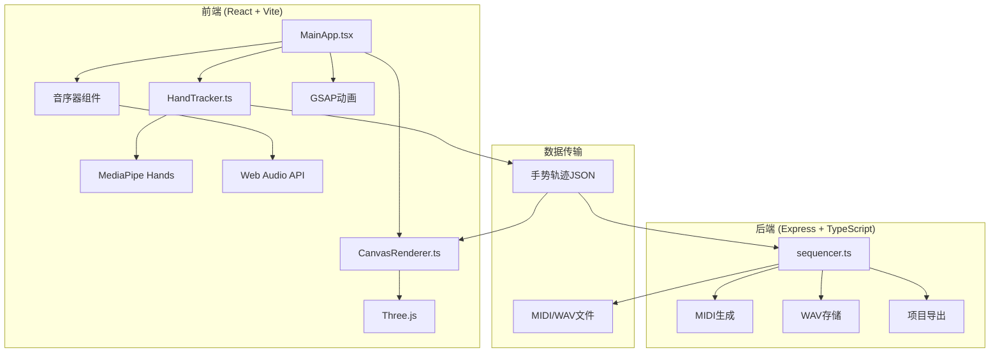
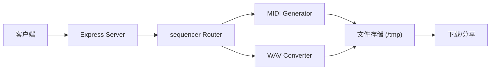

## 1. 架构设计



## 2. 技术描述

### 2.1 前端技术栈
- **框架**: React 18 + TypeScript
- **构建工具**: Vite
- **手势检测**: @mediapipe/hands
- **3D渲染**: three.js
- **动画库**: gsap
- **HTTP客户端**: axios
- **类型定义**: @types/react, @types/react-dom

### 2.2 后端技术栈
- **框架**: Express 4
- **语言**: TypeScript
- **运行时**: ts-node
- **中间件**: cors, multer
- **类型定义**: @types/express

### 2.3 构建与启动
- **开发启动**: `npm run dev` 同时启动前端和后端
- **前端端口**: 5173 (Vite默认)
- **后端端口**: 3001

## 3. 文件结构

```
.
├── package.json              # 前后端依赖和启动脚本
├── vite.config.js            # Vite构建配置
├── tsconfig.json             # TypeScript严格模式配置
├── index.html                # 入口HTML页面
└── src/
    ├── frontend/
    │   ├── MainApp.tsx       # 核心React组件
    │   ├── HandTracker.ts    # MediaPipe手势检测封装
    │   └── CanvasRenderer.ts # Three.js 3D画布渲染
    └── backend/
        └── sequencer.ts      # Express音序器路由
```

## 4. API定义

### 4.1 类型定义

```typescript
// 手势关键点
interface HandLandmark {
  x: number;
  y: number;
  z: number;
}

// 手势数据
interface HandData {
  landmarks: HandLandmark[];
  gestureType: 'index_finger' | 'fist' | 'palm' | 'none';
  timestamp: number;
}

// 轨迹点
interface TrackPoint {
  x: number;
  y: number;
  z: number;
  color: string;
  velocity: number;
  timestamp: number;
}

// 轨迹数据
interface Track {
  id: string;
  points: TrackPoint[];
  instrument: 'piano' | 'violin' | 'flute' | 'harp';
  color: string;
  locked: boolean;
}

// 音序数据
interface SequenceData {
  tracks: Track[];
  bpm: number;
  duration: number;
}

// 导出请求
interface ExportRequest {
  sequence: SequenceData;
  format: 'midi' | 'wav' | 'webm';
}

// 导出响应
interface ExportResponse {
  success: boolean;
  downloadUrl: string;
  shareId: string;
  fileSize: number;
}
```

### 4.2 后端API接口

| 方法 | 路径 | 说明 | 请求体 | 响应 |
|------|------|------|--------|------|
| POST | /api/sequencer/generate | 生成MIDI音序 | `SequenceData` | `ExportResponse` |
| POST | /api/sequencer/export | 导出项目文件 | `ExportRequest` | 文件流 |
| GET | /api/sequencer/share/:id | 获取分享项目 | - | `SequenceData` |

## 5. 服务器架构



## 6. 核心模块说明

### 6.1 HandTracker 模块
- 封装MediaPipe Hands SDK
- 输出21个手部关键点3D坐标
- 手势类型识别：食指画线、握拳锁定、手掌清空
- 30FPS采样率
- 事件回调机制传递手势数据

### 6.2 CanvasRenderer 模块
- Three.js场景管理
- 轨迹光带生成（TubeGeometry + 发光材质）
- 粒子系统（速度驱动粒子数量）
- 颜色映射：Y轴位置 → 蓝紫到橙红渐变
- 乐器图标（Sprite + SVG纹理，始终面向相机）
- 视角动画切换
- 60FPS渲染循环

### 6.3 MainApp 组件
- 摄像头权限请求界面
- 布局管理（响应式左右/上下布局）
- 手势数据分发
- 播放控制逻辑
- 导出功能集成（MediaRecorder + 后端API）
- 分享卡片UI

### 6.4 sequencer 后端
- 轨迹数据转MIDI音序
- 四象限乐器映射逻辑
- WAV文件生成（可选）
- 项目文件存储
- 分享链接生成

## 7. 性能优化策略

- **手势检测**: WebWorker中运行MediaPipe，避免阻塞主线程
- **渲染优化**: 轨迹点简化（Douglas-Peucker算法），粒子数上限500
- **内存管理**: 轨迹对象池，及时释放Three.js资源
- **音频优化**: Web Audio API预加载音色，按需播放
- **导出优化**: WebWorker处理视频编码

## 8. 响应式断点

| 断点 | 布局模式 | 摄像头 | 画布 |
|------|----------|--------|------|
| ≥768px | 左右分栏 | 40%宽度 | 60%宽度 |
| <768px | 上下布局 | 35%高度 | 剩余高度 |
