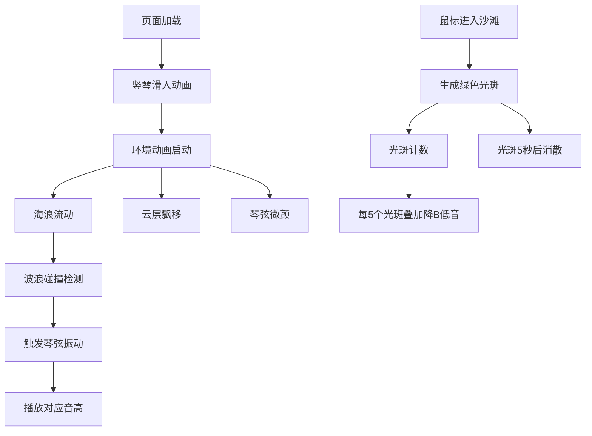

## 1. 产品概述

"潮汐琴弦·海风韵律"是一个沉浸式浏览器互动艺术体验，模拟一架矗立在3D海面上的巨型激光竖琴，通过海浪拍打和用户足迹触发音乐与视觉效果，营造诗意的视听氛围。

- 核心价值：将自然元素（海风、海浪、沙滩）转化为可交互的视听艺术，让用户在虚拟海边体验即兴音乐创作的乐趣
- 目标用户：喜爱互动艺术、音乐可视化和自然美学的互联网用户

## 2. 核心功能

### 2.1 用户角色

| 角色 | 注册方式 | 核心权限 |
|------|----------|----------|
| 访客用户 | 无需注册 | 浏览画面、移动鼠标与沙滩互动、聆听实时生成的音乐 |

### 2.2 功能模块

1. **主视觉画面**：古铜色竖琴、动态海浪网格、沙滩区域、飘移云层
2. **竖琴交互系统**：12根激光琴弦、风致振动、光尾效果、音高映射
3. **海浪物理系统**：50x50波浪网格、波峰运动、碰撞检测、琴弦触发
4. **沙滩互动系统**：鼠标足迹光斑、脉动效果、低频和弦生成
5. **音效系统**：Web Audio API实时合成、音高映射、和弦叠加

### 2.3 页面详情

| 页面名称 | 模块名称 | 功能描述 |
|---------|----------|----------|
| 主画面 | 竖琴渲染 | 绘制古铜色竖琴框架，12根从深蓝到天蓝渐变的激光琴弦，无风时微颤，海风时振动增强并产生彩色光尾 |
| 主画面 | 海浪系统 | 动态网格波浪，颜色随深度从浅蓝到深蓝渐变，波浪拍打竖琴底座触发对应琴弦振动发声 |
| 主画面 | 沙滩互动 | 画布底部10%区域为沙滩，鼠标移动产生绿色渐变光斑，光斑密度触发降B调低音叠加 |
| 主画面 | 背景氛围 | 半透明白色云层缓慢飘移，沙滩边缘泡沫纹理，页面加载时竖琴从底部滑入动画 |

## 3. 核心流程

用户打开页面 → 竖琴从底部滑入动画 → 海浪开始流动、云层缓慢飘移、琴弦微微颤动 → 波浪拍打竖琴底座触发琴弦振动发声 → 用户移动鼠标到沙滩区域产生绿色光斑 → 光斑累积触发低频和弦叠加 → 用户离开沙滩停止光斑生成 → 光斑5秒后逐渐消散

## 4. 用户界面设计

### 4.1 设计风格

- **主色调**：海蓝色系，从浅蓝(RGB:135,206,235)到深蓝(RGB:25,25,112)渐变
- **辅助色**：古铜色竖琴框架、天蓝激光琴弦、绿色光斑、白色泡沫和云层
- **字体**：优雅的衬线字体用于标题，无衬线字体用于说明文字
- **视觉层次**：竖琴居中为视觉焦点，海浪动态为中景，云层和沙滩为背景/前景
- **动画风格**：流畅自然的物理模拟，缓出效果，避免突兀动作

### 4.2 页面设计概述

| 页面名称 | 模块名称 | UI元素 |
|---------|----------|--------|
| 主画面 | 竖琴 | 高占屏幕60%，宽占30%，居中显示，古铜色框架，半透明深蓝琴弓弧线，12根激光琴弦 |
| 主画面 | 海浪 | 50x50网格，波峰高度±20px，速度15px/秒，深度颜色渐变，泡沫纹理边缘 |
| 主画面 | 沙滩 | 画布底部10%，米色到白色渐变，细沙噪点纹理，绿色光斑足迹 |
| 主画面 | 云层 | 半透明白色椭圆，透明度0.2~0.3，缓慢飘移 |
| 主画面 | 动画 | 竖琴从底部滑入1.5秒缓出，琴弦光尾1秒消散，光斑5秒消散 |

### 4.3 响应式设计

- 桌面端优先，Canvas自适应窗口大小
- 保持竖琴比例（高60%，宽30%）
- 触屏设备支持触摸移动替代鼠标

### 4.4 视觉效果指引

- **环境氛围**：黄昏海边的诗意氛围，柔和的光线散射效果
- **光影处理**：琴弦发光效果，海浪高光反射，光斑柔和边缘
- **相机视角**：固定透视视角，略微仰视竖琴，营造宏伟感
- **构图原则**：竖琴为黄金分割点，海浪引导线指向竖琴，云层增加空间深度
- **后处理效果**：全局轻微辉光效果，琴弦发光，光斑柔化
- **性能目标**：帧率稳定50fps以上，优化Canvas绘制和物理计算
