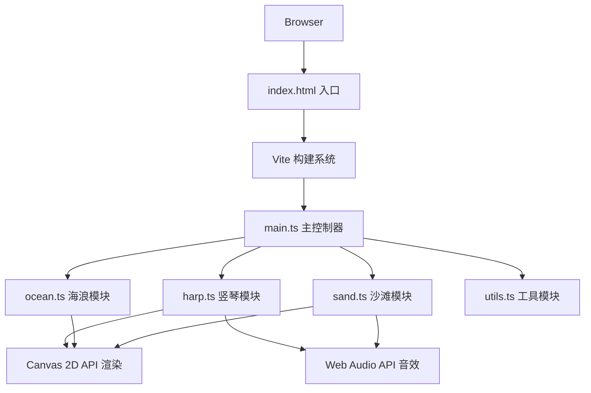

## 1. 架构设计



## 2. 技术描述

- **前端框架**：原生 TypeScript + HTML5 Canvas 2D
- **构建工具**：Vite 5.x
- **语言标准**：TypeScript 5.x（严格模式，ESNext）
- **音频引擎**：Web Audio API（OscillatorNode + GainNode）
- **图形渲染**：Canvas 2D Context（requestAnimationFrame 驱动）
- **无后端、无数据库**：纯前端交互式体验

## 3. 项目结构

```
.
├── index.html              # 入口HTML
├── package.json            # 项目配置与依赖
├── tsconfig.json           # TypeScript配置
├── vite.config.js          # Vite构建配置
└── src/
    ├── main.ts             # 主入口：游戏循环、事件监听、模块协调
    ├── harp.ts             # 竖琴：绘制、琴弦物理、音高生成
    ├── ocean.ts            # 海浪：网格生成、碰撞检测、触发逻辑
    ├── sand.ts             # 沙滩：光斑管理、低频音效
    └── utils.ts            # 工具函数：颜色、缓动、随机、位置计算
```

## 4. 模块接口定义

### 4.1 类型定义

```typescript
// utils.ts - 通用类型
interface RGB { r: number; g: number; b: number; }
interface Vec2 { x: number; y: number; }
type EasingFn = (t: number) => number;

// harp.ts - 竖琴相关
interface StringState {
  id: number;
  baseX: number;
  baseY: number;
  length: number;
  amplitude: number;
  targetAmplitude: number;
  frequency: number;
  phase: number;
  color: RGB;
  trail: Vec2[];
  note: string;
  midiNote: number;
}

interface HarpState {
  x: number;
  y: number;
  width: number;
  height: number;
  strings: StringState[];
  slideProgress: number;
  slideDuration: number;
}

// ocean.ts - 海浪相关
interface WavePoint {
  x: number;
  y: number;
  baseY: number;
  height: number;
  speed: number;
  phase: number;
}

interface OceanState {
  gridSize: number;
  points: WavePoint[][];
  waveSpeed: number;
  maxHeight: number;
  minHeight: number;
}

// sand.ts - 沙滩相关
interface Footprint {
  id: number;
  x: number;
  y: number;
  radius: number;
  opacity: number;
  createdAt: number;
  lifetime: number;
  pulsePhase: number;
}

interface SandState {
  footprints: Footprint[];
  maxFootprints: number;
  bassLayers: number;
  maxBassLayers: number;
  footprintPerLayer: number;
}
```

### 4.2 核心类接口

```typescript
// utils.ts
export function lerp(a: number, b: number, t: number): number;
export function clamp(value: number, min: number, max: number): number;
export function easeOutCubic(t: number): number;
export function easeInOutSine(t: number): number;
export function rgbToString(rgb: RGB, alpha?: number): string;
export function gradientColor(start: RGB, end: RGB, t: number): RGB;
export function randomRange(min: number, max: number): number;
export function noise1D(x: number, seed?: number): number;

// harp.ts
export class Harp {
  constructor(ctx: CanvasRenderingContext2D, width: number, height: number);
  update(deltaTime: number, oceanTriggers: number[]): void;
  render(): void;
  triggerString(index: number, amplitude: number): void;
  getBasePosition(): Vec2;
  getSlideProgress(): number;
}

// ocean.ts
export class Ocean {
  constructor(ctx: CanvasRenderingContext2D, width: number, height: number);
  update(deltaTime: number): number[];
  render(): void;
  getWaveHeightAt(x: number): number;
  checkCollision(harpX: number, harpWidth: number): number[];
}

// sand.ts
export class Sand {
  constructor(ctx: CanvasRenderingContext2D, width: number, height: number);
  update(deltaTime: number): void;
  render(): void;
  addFootprint(x: number, y: number): void;
  isInSandArea(y: number): boolean;
}

// main.ts
class App {
  constructor();
  init(): void;
  gameLoop(timestamp: number): void;
  handleResize(): void;
  handleMouseMove(e: MouseEvent): void;
  handleTouchMove(e: TouchEvent): void;
}
```

## 5. 性能优化策略

### 5.1 渲染优化
- 使用 `requestAnimationFrame` 驱动游戏循环
- 分层绘制：背景→云层→海浪→竖琴→沙滩→光斑
- 琴弦光尾使用轨迹点队列，限制最大长度
- 光斑对象池复用，避免频繁GC

### 5.2 计算优化
- 波浪网格使用正弦函数叠加预计算
- 碰撞检测仅在竖琴底座区域进行
- 音频振荡器复用，避免重复创建
- 限制最大光斑数量（30个）

### 5.3 内存优化
- 轨迹点数组定长循环覆盖
- 光斑对象移除后立即释放引用
- 避免在动画循环中创建新对象

## 6. 音频设计

### 6.1 竖琴音高映射
- 12根琴弦对应 C4 到 B4 半音阶
- 振动幅度决定音量（GainNode.gain）
- 音色：正弦波 + 轻微三角波混合
- 包络：快速起音(0.01s) + 指数衰减(1.5s)

### 6.2 低频和弦
- 降B调低音（B♭2 ~ B♭1）
- 每5个光斑叠加一层，最多3层
- 音色：正弦波，音量较低
- 包络：缓慢起音(0.5s) + 缓慢衰减(3s)

## 7. 配置常量

```typescript
// 竖琴配置
const HARP_WIDTH_RATIO = 0.3;
const HARP_HEIGHT_RATIO = 0.6;
const STRING_COUNT = 12;
const STRING_WIDTH = 2;
const IDLE_AMPLITUDE = 2;
const IDLE_FREQUENCY = 0.5;
const MAX_TRIGGER_AMPLITUDE = 15;
const TRAIL_LENGTH = 30;
const TRAIL_OPACITY = 0.6;
const TRAIL_FADE_TIME = 1000;
const SLIDE_DURATION = 1500;

// 海浪配置
const GRID_SIZE = 50;
const WAVE_SPEED = 15;
const WAVE_MIN_HEIGHT = -20;
const WAVE_MAX_HEIGHT = 20;
const OCEAN_SHALLOW: RGB = { r: 135, g: 206, b: 235 };
const OCEAN_DEEP: RGB = { r: 25, g: 25, b: 112 };

// 沙滩配置
const SAND_HEIGHT_RATIO = 0.1;
const FOOTPRINT_RADIUS = 20;
const FOOTPRINT_OPACITY = 0.4;
const FOOTPRINT_LIFETIME = 5000;
const FOOTPRINT_PULSE_PERIOD = 1200;
const MAX_FOOTPRINTS = 30;
const FOOTPRINTS_PER_BASS = 5;
const MAX_BASS_LAYERS = 3;

// 云层配置
const CLOUD_COUNT = 5;
const CLOUD_MIN_OPACITY = 0.2;
const CLOUD_MAX_OPACITY = 0.3;
const CLOUD_SPEED = 8;
```
