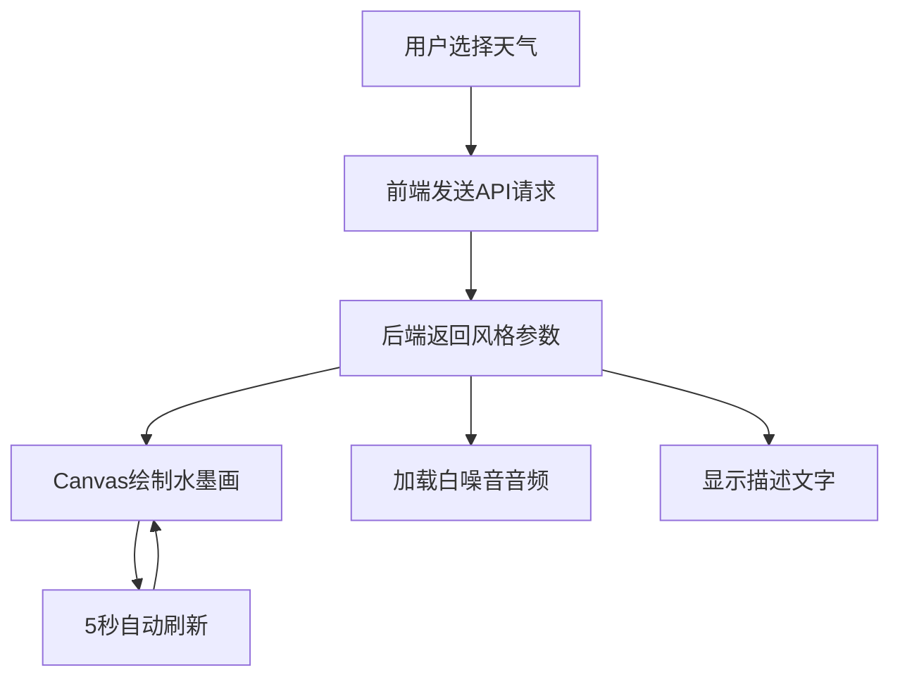

## 1. 产品概述
墨迹·气象站是一款融合中国传统水墨画艺术与气象数据可视化的全栈Web应用。用户通过选择天气状况（晴天、多云、雨、雪、雾），即时生成一幅对应气象主题的动态水墨画，并配以与环境匹配的白噪音背景音效，营造沉浸式视听体验。
- 目标用户：艺术爱好者、冥想/白噪音用户、中国文化爱好者
- 核心价值：将天气数据转化为东方美学体验，提供视觉与听觉的双重沉浸

## 2. 核心功能

### 2.1 用户角色
| 角色 | 注册方式 | 核心权限 |
|------|----------|----------|
| 访客 | 无需注册 | 浏览和体验全部功能 |

### 2.2 功能模块
1. **主页面**：天气选择栏、水墨画布、音效播放器、描述文字

### 2.3 页面详情
| 页面名称 | 模块名称 | 功能描述 |
|----------|----------|----------|
| 主页面 | 天气选择栏 | 5个圆形天气图标（晴天/多云/雨/雪/雾），点击选中高亮，触发API请求 |
| 主页面 | 水墨画布 | 16:9画布，根据天气动态生成水墨画，每5秒自动刷新，宣纸纹理背景 |
| 主页面 | 音效播放器 | 圆形播放/暂停按钮，声音波形进度条，音量可调 |
| 主页面 | 描述文字 | 从后端获取天气描述，毛笔字体，淡入动画 |

## 3. 核心流程

用户打开页面 → 看到天气选择栏和空白画布 → 点击选择天气 → 前端向后端API请求风格数据 → 后端返回笔触密度/颜色/速度等参数 → 前端Canvas根据参数绘制水墨画 → 音效播放器加载对应白噪音 → 描述文字淡入显示 → 每5秒画布自动刷新

## 4. 界面设计

### 4.1 设计风格
- 主色：墨色（#2c2c2c），白色（#ffffff）
- 辅色：天气主题色（晴天橙#e8a838、多云灰#8c8c8c、雨蓝#4a7fb5、雪白#d4e5f7、雾灰#a0a0a0），透明度0.6-0.8
- 按钮风格：圆角8px，阴影rgba(0,0,0,0.1)，悬停放大scale(1.05)
- 字体：毛笔字体（楷体/行书），正文18px
- 布局：竖直单列，居中对齐，各区域间隔20px

### 4.2 页面设计概览
| 页面名称 | 模块名称 | UI元素 |
|----------|----------|--------|
| 主页面 | 天气选择栏 | 5个圆形图标直径50px，圆角背景，悬停浅灰渐变，选中深蓝边框2px，弹性缩放动画 |
| 主页面 | 水墨画布 | 16:9宽高比，宽度70%，宣纸纹理背景，颗粒噪点，墨笔扩散入场动画 |
| 主页面 | 音效播放器 | 圆形按钮40px，主题色，播放时波纹扩散，波形进度条高10px宽80% |
| 主页面 | 描述文字 | 毛笔字体18px，深墨色，居中，淡入动画0.5s |

### 4.3 响应式适配
- 桌面优先设计
- 屏幕宽度<768px：画布宽度100%，天气图标缩小至40px，描述文字16px
