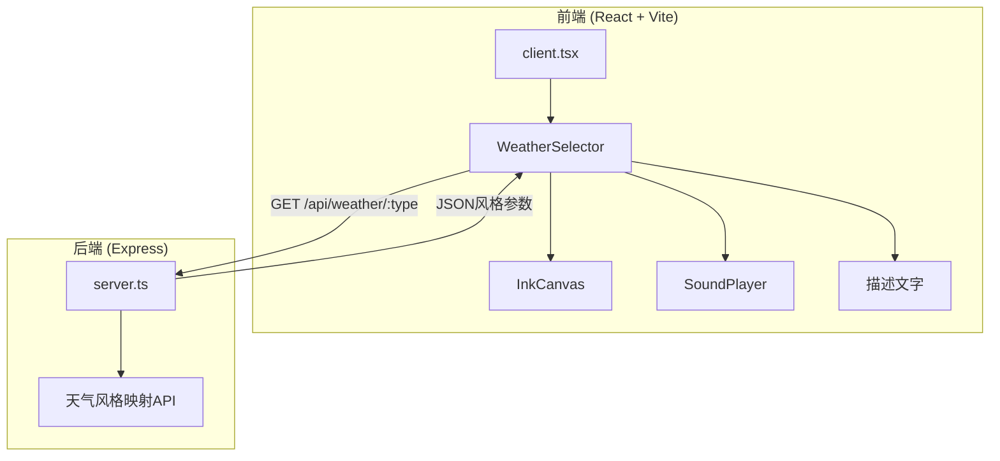

## 1. 架构设计



## 2. 技术说明
- 前端：React@18 + TypeScript + Vite@5
- 初始化工具：vite-init（react-express-ts模板）
- 后端：Express + TypeScript（ts-node运行）
- 数据库：无（风格数据内置于后端）
- 音频：Web Audio API + 前端白噪音生成（无需外部音频文件）
- 画布：HTML5 Canvas API
- 状态管理：React useState/useEffect

## 3. 路由定义
| 路由 | 用途 |
|------|------|
| / | 主页面，天气选择与水墨画展示 |

## 4. API定义

### GET /api/weather/:type
请求参数：
- `type`: 天气类型，枚举值 `sunny | cloudy | rain | snow | fog`

响应体：
```typescript
interface WeatherStyleResponse {
  type: string;
  description: string;
  brush: {
    density: number;
    color: string;
    speed: number;
    opacity: number;
    trailLength: number;
    blur: number;
  };
  particles: {
    count: number;
    size: number;
    speed: number;
    color: string;
    opacity: number;
  };
  scene: {
    elements: string[];
    backgroundTexture: string;
  };
  sound: {
    themeColor: string;
  };
}
```

各天气类型风格参数：

| 参数 | 晴天 | 多云 | 雨 | 雪 | 雾 |
|------|------|------|-----|-----|-----|
| brush.density | 0.3 | 0.5 | 0.7 | 0.2 | 0.4 |
| brush.color | #3a3a3a | #6a6a6a | #2a3a5a | #8a8a8a | #b0b0b0 |
| brush.speed | 0.5 | 1.0 | 2.0 | 0.3 | 0.2 |
| brush.opacity | 0.8 | 0.6 | 0.9 | 0.5 | 0.3 |
| brush.trailLength | 0 | 10 | 20 | 0 | 5 |
| brush.blur | 0 | 2 | 1 | 0 | 5 |
| particles.count | 5 | 0 | 80 | 50 | 0 |
| scene.elements | 远山+飞鸟 | 层叠云海 | 斜雨+溪流 | 雪松+飘雪 | 朦胧树林 |
| sound.themeColor | #e8a838 | #8c8c8c | #4a7fb5 | #d4e5f7 | #a0a0a0 |

## 5. 服务器架构


## 6. 数据模型
本项目无数据库，所有风格数据内置于后端代码中。
