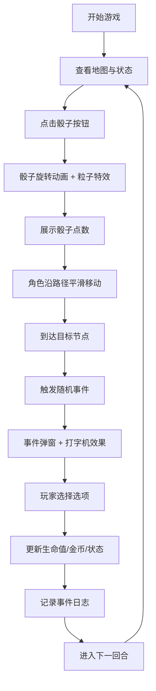

## 1. 产品概述
基于地理位置的骰子冒险游戏看板，用户在复古羊皮纸风格地图上掷骰子移动角色并触发随机事件，体验奇幻冒险乐趣。
- 核心玩法：掷骰子 → 角色移动 → 触发事件 → 获取奖励/战斗 → 继续冒险
- 目标用户：喜欢轻量休闲冒险游戏的玩家，适配桌面端和移动端

## 2. 核心功能

### 2.1 用户角色
| 角色 | 注册方式 | 核心权限 |
|------|----------|----------|
| 玩家 | 无需注册，直接进入 | 掷骰子、移动角色、触发事件、查看日志 |

### 2.2 功能模块
1. **游戏地图**：节点渲染、路径绘制、角色移动动画、拖拽平移
2. **骰子系统**：掷骰子动画、粒子特效、结果展示
3. **事件系统**：事件弹窗、打字机效果、选项按钮、事件日志
4. **状态面板**：生命值、金币、回合数展示
5. **背景效果**：动态星空粒子、羊皮纸纹理

### 2.3 页面详情
| 页面名称 | 模块名称 | 功能描述 |
|----------|----------|----------|
| 游戏主界面 | 顶部状态栏 | 展示生命值❤️、金币💰、当前回合数🔄 |
| 游戏主界面 | 中央地图区 | 羊皮纸风格地图，节点和角色SVG，支持拖拽平移 |
| 游戏主界面 | 左下角日志 | 事件日志浮窗，滚动渐变遮罩，记录冒险历程 |
| 游戏主界面 | 右下角骰子 | 掷骰子按钮，按压缩放+光晕动画，点击触发掷骰 |
| 游戏主界面 | 事件弹窗 | 打字机文字效果，选项按钮，触发事件时弹出 |

## 3. 核心流程
玩家进入游戏 → 查看地图和当前状态 → 点击骰子按钮 → 骰子动画展示点数 → 角色沿路径平滑移动 → 到达节点触发事件 → 弹窗显示事件内容（打字机效果）→ 选择选项 → 更新状态和日志 → 进入下一回合

## 4. 用户界面设计

### 4.1 设计风格
- **主色调**：深紫 `#2d1b4e`、暗金 `#c9a227`、墨绿 `#1a3a2a`
- **辅助色**：羊皮纸米黄 `#f4e4bc`、猩红 `#8b2635`、银白 `#e8e8e8`
- **按钮风格**：圆角矩形，暗金边，按压时有缩放和光晕效果
- **字体**：标题使用 Cinzel（复古衬线），正文使用 Crimson Text（优雅衬线）
- **布局风格**：全屏游戏界面，地图居中，四角浮窗式UI
- **图标风格**：手绘风格SVG，线条略带不规则感，模拟羊皮纸手绘效果

### 4.2 页面设计概述
| 页面名称 | 模块名称 | UI元素 |
|----------|----------|--------|
| 游戏主界面 | 顶部状态栏 | 深紫渐变背景，暗金边框，生命值/金币/回合图标+数字，悬停微动画 |
| 游戏主界面 | 中央地图 | 羊皮纸纹理背景，手绘节点SVG，路径连线，角色精灵，拖拽时惯性滑动 |
| 游戏主界面 | 事件日志 | 半透明深紫浮窗，渐变遮罩底部，滚动时淡入淡出，新消息高亮 |
| 游戏主界面 | 骰子按钮 | 圆形立体按钮，暗金纹理，按压缩放+光晕扩散，悬停上浮 |
| 游戏主界面 | 事件弹窗 | 羊皮纸风格卡片，装饰边框，打字机光标，选项按钮悬停发光 |

### 4.3 响应式
- **桌面优先**：1920px 基准设计，地图区域占满屏幕
- **平板适配**：768px-1024px，调整按钮尺寸和日志窗口大小
- **手机适配**：375px-767px，顶部状态栏简化，骰子按钮放大便于触控，日志可折叠
- **触控优化**：按钮最小触控区域 44x44px，支持滑动手势操作地图

### 4.4 动效与性能
- **角色移动**：CSS transform + transition，缓动曲线 `cubic-bezier(0.25, 0.46, 0.45, 0.94)`
- **骰子动画**：CSS 3D rotate + 粒子 canvas 特效
- **打字机效果**：requestAnimationFrame 逐字显示
- **星空背景**：Canvas 粒子系统，requestAnimationFrame 驱动
- **性能目标**：动画稳定 60fps，丢帧率低于 5%
- **日志滚动**：虚拟滚动或 CSS 优化，避免重排
