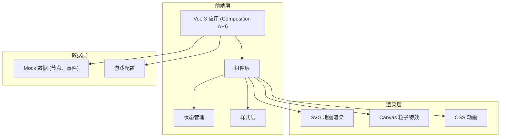

## 1. 架构设计


## 2. 技术描述
- **前端框架**：Vue 3 (Composition API) + TypeScript
- **构建工具**：Vite 5.x
- **路由**：Vue Router 4.x
- **样式方案**：原生 CSS + CSS 变量，不使用 Tailwind（保持自定义主题控制力）
- **状态管理**：Vue 3 响应式 API (reactive/ref)，单组件内管理
- **图标/图形**：手绘风格 SVG，内联在组件中
- **动画方案**：CSS transition/animation + Canvas 粒子系统 + requestAnimationFrame
- **后端**：无后端，纯前端游戏，Mock 数据驱动

## 3. 路由定义
| 路由 | 用途 |
|------|------|
| / | 游戏主界面 |

## 4. 项目结构
```
src/
├── main.ts              # 应用入口
├── App.vue              # 根组件，全局状态
├── components/
│   ├── GameMap.vue      # 地图组件（节点、角色、路径）
│   ├── DiceRoller.vue   # 骰子组件（动画、粒子）
│   ├── EventDialog.vue  # 事件弹窗（打字机、选项）
│   ├── StatusBar.vue    # 顶部状态栏
│   ├── EventLog.vue     # 事件日志
│   └── StarBackground.vue # 星空背景
├── composables/
│   ├── useGameState.ts  # 游戏状态逻辑
│   └── useDice.ts       # 骰子逻辑
├── data/
│   ├── nodes.ts         # 地图节点数据
│   └── events.ts        # 事件数据
├── types/
│   └── game.ts          # 类型定义
└── styles/
    ├── variables.css    # CSS 变量
    └── global.css       # 全局样式
```

## 5. 核心数据模型

### 5.1 类型定义

```typescript
// 节点类型
type NodeType = 'town' | 'monster' | 'treasure' | 'start' | 'boss';

interface MapNode {
  id: number;
  type: NodeType;
  x: number;
  y: number;
  name: string;
  connectedTo: number[];
}

// 事件类型
interface GameEvent {
  id: string;
  title: string;
  description: string;
  type: 'combat' | 'treasure' | 'story' | 'shop';
  options: EventOption[];
}

interface EventOption {
  id: string;
  text: string;
  effect: {
    health?: number;
    gold?: number;
    message: string;
  };
}

// 游戏状态
interface GameState {
  health: number;
  maxHealth: number;
  gold: number;
  turn: number;
  currentNodeId: number;
  isMoving: boolean;
  isRolling: boolean;
  eventLog: LogEntry[];
}

interface LogEntry {
  id: number;
  message: string;
  type: 'info' | 'success' | 'danger' | 'gold';
  timestamp: number;
}
```

### 5.2 组件通信
- 父传子：Props 传递数据
- 子传父：Emits 触发事件
- 全局状态：App.vue 中使用 reactive 管理，通过 Provide/Inject 或 Props 传递
- 游戏主循环：事件驱动，无固定 game loop

## 6. 性能优化策略

### 6.1 渲染性能
- SVG 地图使用 `transform` 定位而非 top/left，避免重排
- 角色移动使用 CSS transition，GPU 加速
- 事件日志使用 `will-change: transform` 优化滚动
- 星空粒子使用 Canvas 绘制，requestAnimationFrame 驱动

### 6.2 动画优化
- 优先使用 CSS transform 和 opacity 动画
- 避免在动画中修改 layout 相关属性
- 使用 `will-change` 提示浏览器提前优化
- Canvas 粒子数量控制在 100-150 个

### 6.3 响应式
- 使用 CSS 变量和 rem/em 单位
- 媒体查询适配不同屏幕尺寸
- 触控设备手势优化（touch 事件）
