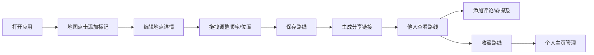

## 1. 产品概述

旅行地图路线分享应用是一个全栈Web工具，帮助旅行者直观地规划、编辑和分享旅行路线。通过交互式地图和手账风格的界面设计，解决旅行计划中路线整理混乱、分享协作缺乏直观交互的痛点。

- 核心价值：将抽象的旅行计划转化为可视化的地图路线，支持富文本笔记和社交分享
- 目标用户：热爱旅行、喜欢记录和分享行程的用户群体

## 2. 核心功能

### 2.1 用户角色
| 角色 | 注册方式 | 核心权限 |
|------|----------|----------|
| 普通用户 | 无需注册（本地存储） | 创建路线、编辑路线、查看分享路线、添加评论、收藏路线 |

### 2.2 功能模块
1. **地图视图**：交互式地图、地点标记、路线绘制、拖拽调整
2. **左侧面板**：路线列表、详情编辑、标签筛选
3. **路线编辑**：地点详情、富文本笔记、日期设置、彩色标签
4. **分享协作**：链接分享、只读查看、评论系统、@提及功能
5. **个人中心**：创建的路线、收藏的路线、卡片式展示

### 2.3 页面详情
| 页面名称 | 模块名称 | 功能描述 |
|----------|----------|----------|
| 主应用页 | 地图视图 | Leaflet互动地图，点击添加标记，拖拽调整位置，路线自动连接绘制，流动光点动画 |
| 主应用页 | 左侧面板 | 路线列表展示，详情编辑表单，富文本笔记编辑器，标签管理 |
| 主应用页 | 顶部导航 | 路线标题、分享按钮、收藏按钮、保存状态指示 |
| 分享查看页 | 只读地图 | 他人分享路线的只读查看模式 |
| 分享查看页 | 评论区 | 评论列表、头像展示、发布时间、@提及功能、自适应输入框 |
| 个人主页 | 路线卡片 | 创建的路线与收藏的路线，卡片式布局，地图缩略图封面，悬停显示概要 |

## 3. 核心流程

用户打开应用 → 在地图上点击添加旅行地点 → 编辑每个地点的详情（标题、日期、笔记、标签）→ 拖拽调整标记位置或顺序 → 保存路线 → 生成分享链接 → 他人通过链接查看路线 → 查看者可添加评论 → 用户可收藏他人路线到个人收藏夹

## 4. 用户界面设计

### 4.1 设计风格
- **设计主题**：旅行手账风格，温暖治愈感
- **主色调**：米白 (#F5F0E6) 作为背景基底，棕褐 (#8B6914) 作为主色，草绿 (#6B8E23) 作为点缀
- **辅助色**：暖橙 (#CD853F)、砖红 (#A0522D)、墨绿 (#556B2F)
- **按钮风格**：圆角胶囊按钮，带微阴影，悬停时平滑颜色过渡
- **字体**：标题使用衬线字体（如 Playfair Display），正文使用无衬线字体，营造手账质感
- **布局风格**：左右分栏布局，左侧仿纸质纹理面板，右侧全屏地图
- **图标风格**：线性图标，配合暖色填充

### 4.2 页面设计概述
| 页面名称 | 模块名称 | UI 元素 |
|----------|----------|---------|
| 主应用页 | 地图视图 | 全屏Leaflet地图，标记点带弹性缩放气泡，路线沿路径流动光点，加载进度圆环动画 |
| 主应用页 | 左侧面板 | 仿纸质纹理背景，卡片式地点列表，彩色标签胶囊，富文本编辑器 |
| 分享查看页 | 评论区 | 头像圆形展示，时间戳，@提及高亮，输入框高度自适应展开 |
| 个人主页 | 路线卡片 | 卡片式网格布局，地图缩略图封面，悬停上浮效果，路线概要渐显 |

### 4.3 响应式
- 桌面端：左右分栏布局（左侧380px固定宽度，右侧自适应地图）
- 平板端：左侧面板可折叠收起，地图占满屏幕
- 手机端：上下布局，面板可滑动切换，地图触控优化

### 4.4 动效设计
- 标记气泡弹出：弹性缩放动画 (spring)
- 路线绘制：沿路径流动光点动画
- 按钮悬停：背景色平滑过渡 + 轻微上浮
- 页面加载：进度圆环旋转动画
- 卡片悬停：微上浮 + 阴影加深
- 评论输入：高度自适应平滑展开
