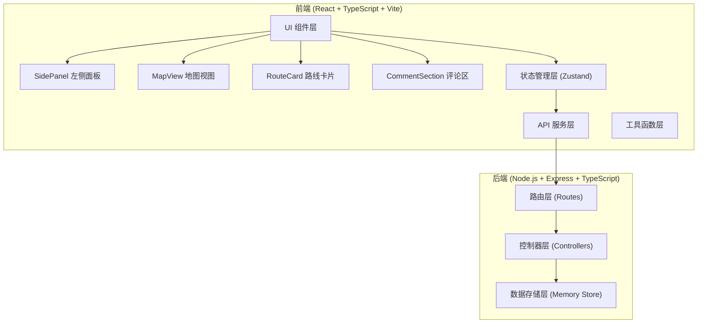
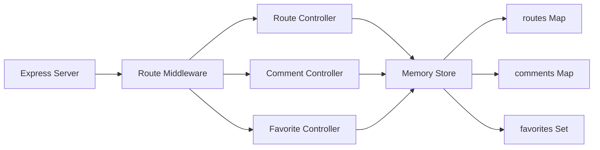
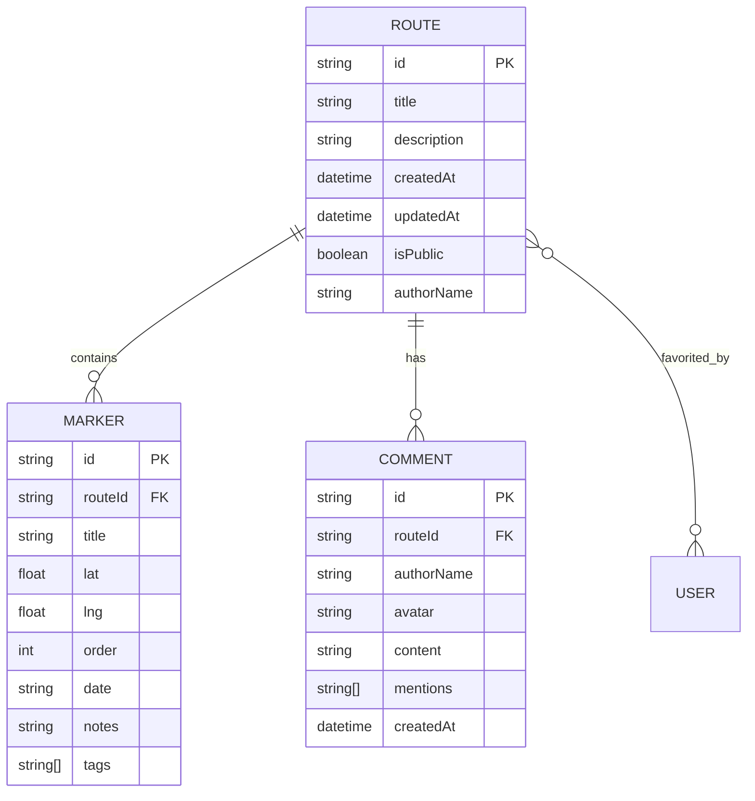

## 1. 架构设计



## 2. 技术描述

- **前端框架**：React@18 + TypeScript
- **构建工具**：Vite@5
- **地图库**：Leaflet@1.9 + react-leaflet@4
- **状态管理**：Zustand
- **样式方案**：原生CSS + CSS变量（手账风格定制）
- **后端框架**：Express@4 + TypeScript
- **数据存储**：内存存储（开发阶段），支持后续扩展数据库
- **唯一ID**：uuid
- **开发服务器端口**：3000（前端），后端端口4000

## 3. 路由定义

| 路由 | 用途 |
|------|------|
| / | 主应用页面 - 路线编辑与地图视图 |
| /route/:id | 分享路线查看页面（只读模式） |
| /profile | 个人主页 - 创建与收藏的路线 |

## 4. API 定义

### 4.1 TypeScript 类型定义

```typescript
// 地点标记
interface MarkerPoint {
  id: string;
  title: string;
  lat: number;
  lng: number;
  order: number;
  date?: string;
  notes?: string;
  tags: string[];
}

// 路线
interface Route {
  id: string;
  title: string;
  description?: string;
  markers: MarkerPoint[];
  createdAt: string;
  updatedAt: string;
  isPublic: boolean;
  authorName?: string;
}

// 评论
interface Comment {
  id: string;
  routeId: string;
  authorName: string;
  avatar?: string;
  content: string;
  mentions: string[];
  createdAt: string;
}

// 收藏
interface Favorite {
  routeId: string;
  favoritedAt: string;
}
```

### 4.2 API 接口列表

| 方法 | 路径 | 描述 | 请求体 | 响应 |
|------|------|------|--------|------|
| POST | /api/routes | 创建新路线 | `{ title, markers, description }` | `Route` |
| GET | /api/routes/:id | 获取单条路线 | - | `Route` |
| PUT | /api/routes/:id | 更新路线 | `{ title, markers, description }` | `Route` |
| GET | /api/routes | 获取路线列表 | `?page=&limit=` | `{ routes: Route[], total: number }` |
| POST | /api/routes/:id/comments | 添加评论 | `{ authorName, content, avatar }` | `Comment` |
| GET | /api/routes/:id/comments | 获取评论列表 | - | `Comment[]` |
| POST | /api/favorites | 收藏路线 | `{ routeId }` | `Favorite` |
| DELETE | /api/favorites/:routeId | 取消收藏 | - | `{ success: boolean }` |
| GET | /api/favorites | 获取收藏列表 | - | `Route[]` |

## 5. 服务器架构图



## 6. 数据模型

### 6.1 数据模型 ER 图



### 6.2 文件结构

```
.
├── package.json
├── vite.config.js
├── tsconfig.json
├── index.html
├── src/
│   ├── main.tsx
│   ├── App.tsx
│   ├── map/
│   │   └── MapView.tsx
│   ├── panel/
│   │   └── SidePanel.tsx
│   ├── api/
│   │   └── routeService.ts
│   ├── store/
│   │   └── useRouteStore.ts
│   ├── types/
│   │   └── index.ts
│   ├── styles/
│   │   └── global.css
│   └── utils/
│       └── helpers.ts
└── server/
    └── index.ts
```

## 7. 性能优化策略

1. **地图性能**：使用 Canvas 渲染路线，标记点按需渲染，保持 50FPS+
2. **数据加载**：API 响应时间 < 600ms，使用内存缓存热门路线
3. **懒加载**：评论区和路线详情按需加载
4. **防抖优化**：地点搜索和自动保存使用防抖处理
5. **CSS 动画**：优先使用 transform 和 opacity 动画，避免重排
