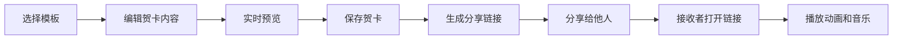

# 个性化电子贺卡定制平台 PRD

## 1. 产品概述

本平台是一个在线定制与分享个性化电子贺卡的Web应用，用户可以从头设计带有动画和音乐的动态贺卡，并通过分享链接发送给他人。

- **核心价值**：让用户轻松创作独一无二的动态贺卡，传递温暖与祝福
- **目标用户**：所有需要在特殊场合（生日、节日、纪念日等）发送个性化祝福的用户
- **产品定位**：轻量级、创意性、即时分享的在线贺卡制作工具

## 2. 核心功能

### 2.1 用户角色

| 角色 | 注册方式 | 核心权限 |
|------|----------|----------|
| 普通用户 | 无需注册 | 浏览模板、编辑贺卡、保存与分享 |

### 2.2 功能模块

1. **模板库模块**：预置多种风格贺卡模板，用户可一键加载
2. **贺卡编辑器模块**：文字编辑、背景设置、装饰元素拖拽、音符序列编辑
3. **实时预览模块**：动态效果预览、动画播放、音乐试听
4. **保存与分享模块**：生成唯一ID和分享链接
5. **贺卡查看模块**：通过分享链接查看贺卡，自动播放动画和音乐

### 2.3 页面详情

| 页面名称 | 模块名称 | 功能描述 |
|-----------|-------------|---------------------|
| 主页（编辑器） | 左侧模板库 | 展示贺卡模板缩略图，点击加载对应配置 |
| 主页（编辑器） | 中间设计区 | 文字编辑、装饰元素拖拽缩放、背景色选择 |
| 主页（编辑器） | 右侧预览区 | 实时预览贺卡效果，播放动画和音乐 |
| 主页（编辑器） | 音符编辑器 | 6x8网格编辑音符序列，支持试听 |
| 分享查看页 | 贺卡展示 | 自动播放动画、音乐和撒花特效 |

## 3. 核心流程

### 3.1 贺卡制作流程

用户选择模板 → 编辑贺卡内容（文字/装饰/背景/音乐）→ 实时预览效果 → 保存贺卡 → 生成分享链接 → 分享给他人

### 3.2 贺卡查看流程

访问分享链接 → 加载贺卡数据 → 播放开启动画 → 装饰元素依次出现 → 播放背景音乐 → 触发撒花特效

### 3.3 流程图

## 4. 用户界面设计

### 4.1 设计风格

- **主色调**：暖色渐变主题（淡粉 #FFE4EC 到淡紫 #E8DAEF 渐变）
- **辅助色**：白色、浅灰、金色点缀
- **按钮风格**：圆角按钮，悬停时背景色从半透明白变为半透明灰，过渡0.2s
- **字体**：使用优雅的衬线字体配合现代无衬线字体
- **布局风格**：三栏布局（模板库-设计区-预览区），毛玻璃效果卡片
- **装饰元素**：气球、星星、花瓣等可爱元素

### 4.2 页面设计概览

| 页面名称 | 模块名称 | UI元素 |
|-----------|-------------|-------------|
| 主页 | 模板库 | 毛玻璃效果卡片，12px背景模糊，16px圆角，1px半透明白色边框 |
| 主页 | 设计区 | 纯白背景，浅灰点阵网格（20px，透明度0.3） |
| 主页 | 预览区 | 3:4比例卡片，细腻阴影，微圆角 |
| 主页 | 工具栏 | 渐变按钮，图标+文字，悬停微动画 |
| 分享页 | 贺卡展示 | 居中展示，开启动画，背景音乐自动播放 |

### 4.3 响应式设计

- **桌面端（>768px）**：三栏并排布局
- **移动端（≤768px）**：上下布局，模板库在上，设计区和预览区在下

### 4.4 动画效果

- **开启动画**：信封展开效果，0.8秒，贝塞尔曲线缓动
- **装饰元素出现**：弹性弹跳效果，每个间隔0.2秒
- **撒花特效**：canvas-confetti，≤200个粒子，60FPS
- **交互反馈**：按钮悬停0.2s过渡，拖拽元素有视觉反馈

## 5. 性能要求

- 撒花特效粒子数量 ≤ 200个
- 动画播放流畅度 ≥ 60FPS
- 预览区所有动画总时长 ≤ 3秒
- 页面加载时间 ≤ 2秒
