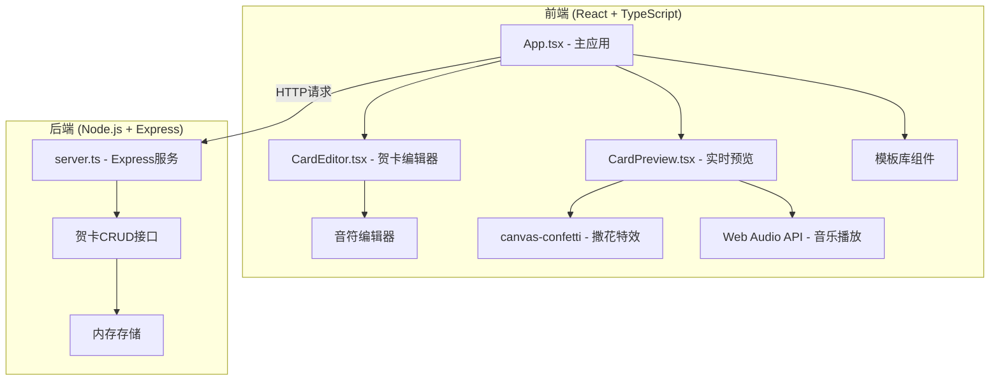
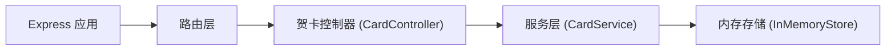
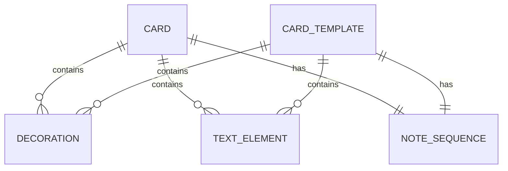

# 个性化电子贺卡定制平台 技术架构文档

## 1. 架构设计



## 2. 技术描述

- **前端**：React 18 + TypeScript + Vite
- **样式**：CSS Modules / 内联样式（根据需求实现）
- **构建工具**：Vite 5
- **后端**：Express 4 + TypeScript
- **数据存储**：内存存储（使用 Map 数据结构）
- **动画特效**：canvas-confetti + CSS 动画
- **音频**：Web Audio API
- **HTTP客户端**：axios
- **工具库**：lodash, uuid

## 3. 路由定义

| 路由 | 说明 |
|-------|---------|
| `/` | 贺卡编辑器主页 |
| `/card/:id` | 贺卡分享查看页 |
| `/api/cards` | POST - 创建贺卡 |
| `/api/cards/:id` | GET - 获取贺卡详情 |
| `/api/cards/:id` | PUT - 更新贺卡 |
| `/api/cards/:id` | DELETE - 删除贺卡 |

## 4. API 定义

### 4.1 数据类型

```typescript
// 装饰元素
interface Decoration {
  id: string;
  type: 'balloon' | 'star' | 'heart' | 'flower' | 'confetti';
  x: number;
  y: number;
  scale: number;
  rotation: number;
  color: string;
}

// 文字元素
interface TextElement {
  id: string;
  content: string;
  x: number;
  y: number;
  fontSize: number;
  fontFamily: string;
  color: string;
  bold: boolean;
  italic: boolean;
}

// 音符序列 (6行8列网格)
interface NoteSequence {
  notes: boolean[][]; // 6行8列
  beats: 4 | 8 | 16;
  tempo: number; // BPM
}

// 贺卡数据
interface CardData {
  id?: string;
  templateId: string;
  backgroundColor: string;
  backgroundGradient?: {
    start: string;
    end: string;
    direction: string;
  };
  decorations: Decoration[];
  textElements: TextElement[];
  noteSequence: NoteSequence;
  createdAt?: number;
}

// 模板
interface CardTemplate {
  id: string;
  name: string;
  category: 'birthday' | 'holiday' | 'thanks';
  thumbnail: string;
  backgroundColor: string;
  decorations: Decoration[];
  textElements: TextElement[];
  noteSequence: NoteSequence;
}
```

### 4.2 API 接口

#### 创建贺卡
- **POST** `/api/cards`
- 请求体：`CardData`
- 响应：`{ id: string, shareUrl: string, ...CardData }`

#### 获取贺卡
- **GET** `/api/cards/:id`
- 响应：`CardData`

#### 更新贺卡
- **PUT** `/api/cards/:id`
- 请求体：`Partial<CardData>`
- 响应：`CardData`

#### 删除贺卡
- **DELETE** `/api/cards/:id`
- 响应：`{ success: boolean }`

## 5. 服务器架构图



## 6. 数据模型

### 6.1 实体关系



### 6.2 数据说明

- **贺卡 (Card)**：用户创建的贺卡实例，包含完整的设计数据
- **模板 (CardTemplate)**：预置的贺卡模板，用于快速开始设计
- **装饰元素 (Decoration)**：可拖拽的装饰图形（气球、星星等）
- **文字元素 (TextElement)**：可编辑的文本内容
- **音符序列 (NoteSequence)**：6x8网格的音符数据，用于生成背景音乐

## 7. 项目结构

```
.
├── package.json
├── index.html
├── vite.config.js
├── tsconfig.json
├── src/
│   ├── server.ts          # Express 后端服务
│   ├── App.tsx            # 主应用组件
│   ├── main.tsx           # React 入口
│   ├── components/
│   │   ├── CardEditor.tsx    # 贺卡编辑器
│   │   ├── CardPreview.tsx   # 贺卡预览
│   │   ├── TemplateLibrary.tsx  # 模板库
│   │   ├── NoteEditor.tsx    # 音符编辑器
│   │   └── CardViewer.tsx    # 贺卡查看页
│   ├── types/
│   │   └── card.ts           # 类型定义
│   ├── data/
│   │   └── templates.ts      # 预置模板数据
│   ├── hooks/
│   │   ├── useAudio.ts       # 音频播放 Hook
│   │   └── useDrag.ts        # 拖拽 Hook
│   └── utils/
│       └── audio.ts          # 音频工具函数
```

## 8. 关键技术实现

### 8.1 动画系统
- 开启动画：CSS transform + 贝塞尔曲线
- 装饰元素出现：CSS animation + stagger delay
- 撒花特效：canvas-confetti 库，限制200粒子

### 8.2 音频系统
- 使用 Web Audio API 的 OscillatorNode
- 8-bit 风格音效（方波/锯齿波）
- 音符时长：0.15秒
- 音高映射：6行网格对应不同音高

### 8.3 拖拽系统
- 原生鼠标事件实现
- 支持拖拽移动、缩放、旋转
- 控制点显示（选中时显示）

### 8.4 响应式布局
- CSS Grid + Flexbox
- 媒体查询：768px 断点
- 移动端：上下布局
