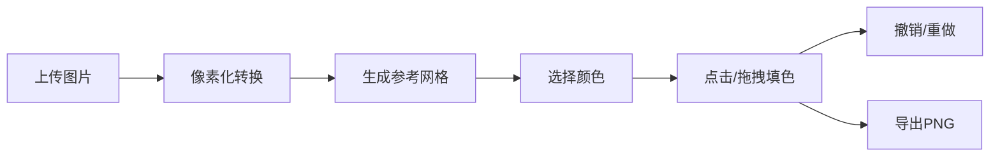

## 1. 产品概述

像素艺术拼图生成与编辑工具是一款基于浏览器的交互式创意应用，用户可导入任意图片自动转化为像素风格拼图，通过点击或拖拽填充颜色完成创作，并导出最终作品。

- **核心价值**：将数字图像转化为可交互的像素填色游戏，降低像素艺术创作门槛，兼具娱乐性与艺术性
- **目标用户**：像素艺术爱好者、创意工作者、休闲游戏玩家、教育场景使用者

## 2. 核心功能

### 2.1 功能模块

1. **图片导入与像素化转换**：支持JPG/PNG上传，自动转化为像素网格
2. **交互式填色**：点击/拖拽填充颜色，带弹性动画和音效反馈
3. **撤销/重做系统**：无限次历史操作，差量存储，逐格动画回放
4. **视图操作**：缩放、平移、双击聚焦查看像素信息
5. **作品导出**：PNG格式导出，进度条动画，成功提示
6. **主题与响应式**：深浅色主题切换，移动端适配

### 2.2 页面详情

| 页面名称 | 模块名称 | 功能描述 |
|---------|---------|---------|
| 主应用 | 顶部工具栏 | 撤销/重做、导出、清除、缩放滑块、主题切换 |
| 主应用 | 左侧拼图面板 | 可交互像素网格，支持缩放平移 |
| 主应用 | 右侧工具面板 | 颜色选择器、图片上传、网格尺寸设置 |
| 主应用 | 全局状态栏 | 显示当前坐标、颜色、操作状态 |

## 3. 核心流程

用户上传图片 → 系统自动像素化处理 → 生成参考网格 → 用户选择颜色 → 点击/拖拽填色 → 可撤销重做 → 完成后导出PNG

## 4. 用户界面设计

### 4.1 设计风格

- **主色调**：冷色系深蓝灰 `#2C3E50`，亮蓝强调色 `#3498DB`
- **卡片设计**：圆角12px，柔和阴影 `box-shadow: 0 4px 12px rgba(0,0,0,0.1)`
- **背景质感**：白色区域使用CSS渐变模拟纸张纹理
- **工具栏**：半透明毛玻璃效果 `backdrop-filter: blur(10px)`
- **色板样式**：32x32px正方形，1px白色边框，选中态2px蓝色同心圆环+1.1倍放大
- **网格背景**：纯白棋盘格纹理区分已填色和空白区域

### 4.2 页面设计概述

| 页面名称 | 模块名称 | UI元素 |
|---------|---------|-------|
| 主应用 | 工具栏 | 毛玻璃背景、图标+文字按钮、均匀间距、点击下沉弹起动画 |
| 主应用 | 拼图网格 | 棋盘格背景、浅灰网格线、填色弹性动画、1px恒定线宽 |
| 主应用 | 颜色面板 | 两列色板布局、HEX输入框、自定义颜色添加 |
| 主应用 | 状态栏 | 底部固定、显示坐标和颜色信息 |

### 4.3 动画与交互

- **填色动画**：弹性缩放，200ms，填充瞬间弹起再落下
- **撤销动画**：逐格回退，50ms间隔，逆序恢复
- **主题切换**：0.3秒平滑渐变过渡
- **按钮交互**：悬停高亮、点击下沉弹起、阴影变化
- **滑块交互**：拖动时轨道颜色渐变动画
- **导出进度**：进度条动画 + 成功提示

### 4.4 响应式设计

- **桌面端（>768px）**：左右三栏布局（工具栏+拼图+工具面板）
- **移动端（≤768px）**：上下布局，工具栏垂直排列，色板四列紧凑布局
- **触摸优化**：增大点击区域，支持触摸拖拽填色

## 5. 性能要求

- **最大网格**：64x64 = 4096格
- **拖拽填色延迟**：≤50ms
- **撤销/重做响应**：≤200ms（含动画）
- **导出PNG耗时**：≤2秒（生成数据URL）
- **动画帧率**：60fps流畅度
