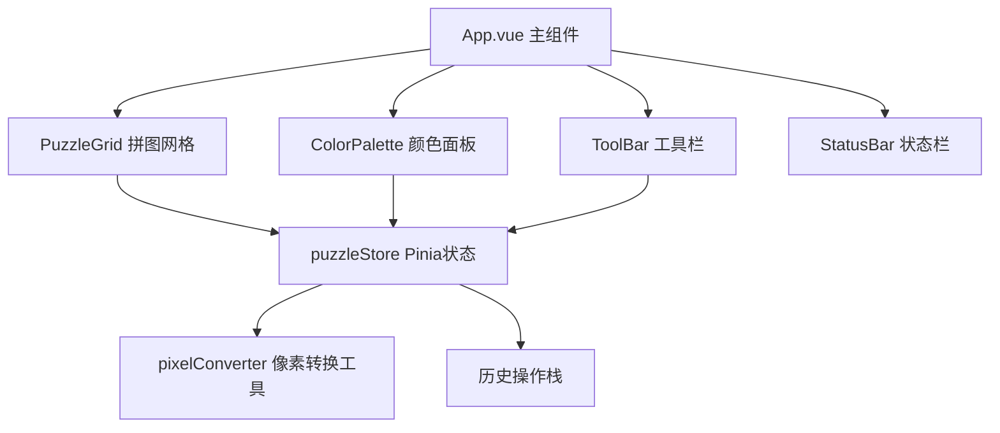

## 1. 架构设计



## 2. 技术描述

- **前端框架**：Vue 3 + TypeScript + Composition API
- **构建工具**：Vite 5 + @vitejs/plugin-vue
- **状态管理**：Pinia
- **路由**：vue-router（单页应用，主路由）
- **样式方案**：原生CSS + CSS变量主题系统
- **图标**：内联SVG图标

## 3. 项目结构

```
src/
├── App.vue                 # 主应用组件
├── main.ts                 # 入口文件
├── components/
│   ├── PuzzleGrid.vue      # 拼图网格组件
│   ├── ColorPalette.vue    # 颜色选择面板
│   └── ToolBar.vue         # 工具栏组件
├── stores/
│   └── puzzleStore.ts      # Pinia状态管理
├── utils/
│   └── pixelConverter.ts   # 图像像素化算法
└── styles/
    └── theme.css           # 全局主题变量
```

## 4. 核心数据模型

### 4.1 像素网格数据

```typescript
interface PixelCell {
  x: number;
  y: number;
  referenceColor: string;  // 参考色（原始像素颜色）
  filledColor: string | null; // 已填充颜色
  isFilled: boolean;
}

type GridData = PixelCell[][];
```

### 4.2 历史操作栈

```typescript
interface HistoryAction {
  type: 'fill' | 'clear';
  cells: { x: number; y: number; prevColor: string | null; newColor: string | null }[];
  timestamp: number;
}

interface HistoryState {
  past: HistoryAction[];
  future: HistoryAction[];
}
```

### 4.3 Store 状态

```typescript
interface PuzzleState {
  grid: GridData;
  gridSize: number;         // 8-64，步长2
  selectedColor: string | null;
  palette: string[];        // 提取的调色板
  zoom: number;             // 0.5-4x，步进0.1
  panX: number;             // 平移X
  panY: number;             // 平移Y
  theme: 'light' | 'dark';
  isExporting: boolean;
  exportProgress: number;
}
```

## 5. 核心算法

### 5.1 中值切割颜色量化算法

- 将图像像素按颜色空间划分
- 递归切割最大色彩范围
- 最终得到N个主色调色板
- 每个颜色取区间中值

### 5.2 差量历史存储

- 每次操作只存储变化的格子
- 使用坐标+前后颜色的精简结构
- 避免全网格深拷贝的内存开销

### 5.3 图像缩放映射

- 使用Canvas将原图缩放到目标网格尺寸
- 逐像素读取颜色值
- 映射到对应网格单元

## 6. 性能优化策略

- **Canvas渲染**：使用Canvas而非DOM元素渲染网格，提升性能
- **requestAnimationFrame**：动画统一使用RAF调度
- **差量更新**：只重绘变化的格子，避免全屏重绘
- **事件节流**：鼠标移动事件节流处理
- **对象池**：复用Canvas上下文，避免重复创建

## 7. 路由定义

| 路由 | 用途 |
|-----|------|
| / | 主应用页面，包含所有功能 |

## 8. 配置文件

### vite.config.js
- 开发端口：3000
- 插件：@vitejs/plugin-vue
- 路径别名：@ -> src

### tsconfig.json
- 严格模式：true
- 目标：ES2020
- 模块：ES2020
- 模块解析：bundler
