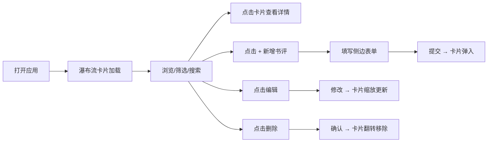

## 1. 产品概述

书籍阅读笔记墙是一款面向独立书评人和阅读爱好者的可视化笔记工具，将传统读后感以瀑布流卡片墙的形式呈现，提供沉浸式视觉浏览体验。用户可以像翻阅海报一样浏览书评卡片，通过标签筛选、搜索快速定位内容，并支持完整的增删改查操作。

- 目标用户：独立书评人、阅读爱好者、书籍收藏家
- 核心价值：将文字笔记转化为视觉化、可交互的海报式卡片墙
- 解决问题：传统博客工具无法提供沉浸式视觉体验，笔记展示单调

## 2. 核心功能

### 2.1 用户角色

| 角色 | 注册方式 | 核心权限 |
|------|----------|----------|
| 普通用户 | 无需注册 | 浏览、搜索、筛选书评卡片 |
| 管理员/作者 | 无需登录（本地使用） | 新增、编辑、删除书评，管理所有内容 |

### 2.2 功能模块

1. **笔记墙主页**：瀑布流卡片展示、标签筛选、搜索框、统计面板
2. **书评卡片**：封面色块、星级评分、书籍信息、短评预览、详情弹窗
3. **侧边表单**：新增/编辑书评表单、Markdown 实时预览
4. **卡片操作**：编辑、删除、星级编辑
5. **统计面板**：总书评数、平均星级、类别分布

### 2.3 页面详情

| 页面名称 | 模块名称 | 功能描述 |
|----------|----------|----------|
| 笔记墙主页 | 顶部导航区 | 搜索框、标签筛选栏、统计面板入口 |
| 笔记墙主页 | 卡片瀑布流 | 三列瀑布流布局、懒加载、入场动画 |
| 笔记墙主页 | 浮动添加按钮 | 右下角圆形 + 按钮，点击展开侧边表单 |
| 笔记墙主页 | 统计面板 | 总数量、平均星级、类别分布堆叠条形图 |
| 侧边表单 | 表单区域 | 书名、作者、类别、星级、笔记内容输入 |
| 侧边表单 | Markdown 预览 | 实时渲染 Markdown 笔记内容 |
| 卡片详情弹窗 | 详情展示 | 完整书评内容、书籍信息展示 |

## 3. 核心流程

用户打开应用 → 瀑布流卡片滑入展示 → 浏览/筛选/搜索书评 → 点击卡片查看详情 → 点击 + 新增书评 → 填写表单并提交 → 新卡片弹入展示 → 点击编辑修改内容 → 点击删除确认移除

## 4. 用户界面设计

### 4.1 设计风格

- **设计主题**：深色模式 + 现代极简 + 毛玻璃质感
- **主色调**：淡紫 (#e94560) 强调色，青色 (#0f3460) 辅助色
- **背景色**：深靛蓝 #1a1a2e（页面背景），#16213e（卡片背景）
- **卡片风格**：圆角 16px，微阴影，悬停上移 5px + 阴影加深
- **按钮风格**：圆角按钮，点击涟漪效果
- **字体**：系统无衬线字体 (system-ui, -apple-system, sans-serif)
- **图标风格**：线性简洁图标 (lucide-react)
- **动画风格**：平滑过渡 + 弹性缓动，卡片入场错位延迟

### 4.2 页面设计概览

| 页面/模块 | 模块名称 | UI 元素 |
|-----------|----------|---------|
| 笔记墙主页 | 顶部筛选栏 | 可横向滑动标签、搜索输入框、毛玻璃背景固定定位 |
| 笔记墙主页 | 卡片网格 | 三列瀑布流、随机高度卡片、渐入滑入动画 |
| 笔记墙主页 | 浮动按钮 | 圆形 + 按钮、右下角固定、悬停放大、点击涟漪 |
| 笔记卡片 | 卡片内容 | 顶部色块、星级评分、标题作者、摘录文字、三点菜单 |
| 侧边表单 | 表单面板 | 右侧滑入、毛玻璃背景、阴影柔化、宽度 400px |
| 统计面板 | 统计展示 | 数字跳动动画、堆叠条形图、渐变色彩 |

### 4.3 响应式设计

- **桌面端 (>768px)**：三列瀑布流，侧边表单宽度 400px 从右侧滑入
- **平板端 (768px-1024px)**：两列瀑布流布局
- **移动端 (<768px)**：两列瀑布流，侧边表单整屏滑入
- 触摸优化：增大点击区域，移除悬停效果，支持滑动操作

### 4.4 动效与交互细节

- 卡片入场：从底部向上滑入 + 渐显，0.4s，相邻卡片 0.05s 随机延迟
- 筛选过渡：非选中卡片透明度 0.2 淡出，0.5s 过渡
- 新增卡片：放大弹入动画 0.3s
- 更新卡片：短暂缩放 1.05 倍再恢复，0.3s
- 删除卡片：翻转收缩 0.4s 后移除，下方卡片下移填补 0.3s
- 星级变化：数字跳动动画 0.2s，ease-out 缓动
- 搜索高亮：黄色背景圆角，0.3s 渐显
- 按钮反馈：涟漪效果从点击位置向外扩散 0.3s
