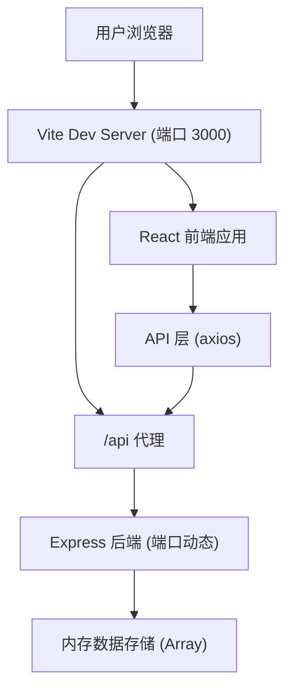
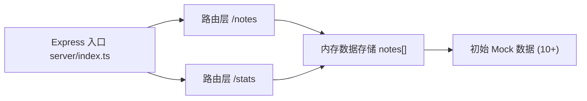
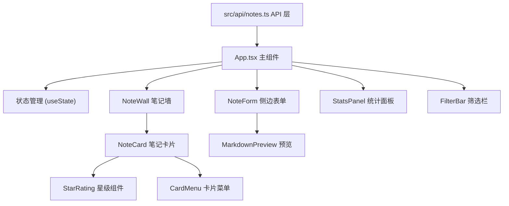

## 1. 架构设计

整体采用前后端分离架构，整合在单一项目中，通过 Vite 开发服务器代理实现前后端联调。前端负责 UI 展示与交互，后端提供 RESTful API 和内存数据存储。



## 2. 技术栈说明

- **前端框架**：React 18 + TypeScript
- **构建工具**：Vite 5 + @vitejs/plugin-react
- **状态管理**：React useState/useReducer（轻量场景，无需额外状态库）
- **HTTP 客户端**：axios
- **样式方案**：CSS Modules / 内联样式（自定义动画）
- **图标库**：lucide-react
- **Markdown 渲染**：marked（轻量 Markdown 解析）
- **后端框架**：Express 4 + TypeScript
- **ID 生成**：uuid
- **数据存储**：内存数组（开发演示用）
- **开发模式**：Vite 代理 + ts-node 运行后端

## 3. 路由定义

| 路由 | 用途 |
|------|------|
| / | 笔记墙主页（单页应用，所有功能在此页面） |

应用为单页应用 (SPA)，所有功能在首页完成，通过组件状态切换不同视图。

## 4. API 接口定义

### 4.1 数据类型定义

```typescript
interface Note {
  id: string;
  title: string;
  author: string;
  category: 'science' | 'history' | 'literature' | 'philosophy' | 'art';
  rating: number; // 1-5
  content: string; // Markdown 格式
  excerpt: string; // 自动生成的短摘录
  createdAt: number;
  updatedAt: number;
}
```

### 4.2 接口列表

| 方法 | 路径 | 描述 | 请求体 | 响应 |
|------|------|------|--------|------|
| GET | /api/notes | 获取笔记列表（支持分页、筛选、搜索） | - | `{ notes: Note[], total: number }` |
| GET | /api/notes/:id | 获取单条笔记详情 | - | `Note` |
| POST | /api/notes | 创建新笔记 | `{ title, author, category, rating, content }` | `Note` |
| PUT | /api/notes/:id | 更新笔记 | `{ title?, author?, category?, rating?, content? }` | `Note` |
| DELETE | /api/notes/:id | 删除笔记 | - | `{ success: boolean }` |
| GET | /api/stats | 获取统计数据 | - | `{ total: number, avgRating: number, categoryCounts: Record<string, number> }` |

### 4.3 查询参数

- `page`: 页码，默认 1
- `limit`: 每页数量，默认 12
- `category`: 按类别筛选
- `search`: 搜索关键词（匹配书名和作者）

## 5. 服务端架构



- **入口文件**：`server/index.ts` - Express 应用实例化、中间件配置、路由注册
- **数据层**：内存数组存储，提供 CRUD 操作函数
- **Mock 数据**：启动时自动注入 10+ 条示例数据

## 6. 前端模块结构



### 6.1 组件职责

| 组件 | 职责 | Props |
|------|------|-------|
| App.tsx | 全局状态管理、组件编排、数据协调 | - |
| NoteWall.tsx | 瀑布流布局、懒加载、入场动画 | notes, filter, searchTerm |
| NoteCard.tsx | 卡片展示、星级编辑、菜单操作 | note, onEdit, onDelete, onRatingChange |
| NoteForm.tsx | 新增/编辑表单、Markdown 预览 | note?, onSubmit, onClose |
| FilterBar.tsx | 标签筛选、搜索输入 | categories, activeCategory, searchTerm, onFilterChange, onSearchChange |
| StatsPanel.tsx | 统计数据展示 | stats |

### 6.2 数据流向

```
后端数据 → src/api/notes.ts → App.tsx (state)
                                  ↓
                ┌─────────────────┼─────────────────┐
                ↓                 ↓                 ↓
           FilterBar          NoteWall         StatsPanel
                                  ↓
                               NoteCard
                                  ↓
                           StarRating / CardMenu
```

## 7. 性能优化策略

- **分页懒加载**：每批加载 12 张卡片，滚动到底部自动加载下一批
- **Skeleton 骨架屏**：加载时显示占位骨架屏，提升感知速度
- **CSS will-change**：动画元素添加 will-change 优化，保证 50fps+
- **内存操作**：新增/编辑/删除直接操作前端状态，200ms 内完成更新
- **Intersection Observer**：卡片入场动画使用 IntersectionObserver 检测视口
- **虚拟滚动**：（可选优化）大量卡片时考虑虚拟列表

## 8. 项目文件结构

```
auto35/
├── package.json
├── vite.config.js
├── tsconfig.json
├── index.html
├── server/
│   └── index.ts          # Express 后端入口
└── src/
    ├── App.tsx           # 主应用组件
    ├── main.tsx          # 入口文件
    ├── api/
    │   └── notes.ts      # API 接口层
    ├── components/
    │   ├── NoteWall.tsx      # 笔记墙组件
    │   ├── NoteCard.tsx      # 笔记卡片组件
    │   ├── NoteForm.tsx      # 侧边表单组件
    │   ├── FilterBar.tsx     # 筛选栏组件
    │   ├── StatsPanel.tsx    # 统计面板组件
    │   ├── StarRating.tsx    # 星级评分组件
    │   └── SkeletonCard.tsx  # 骨架屏组件
    ├── types/
    │   └── index.ts      # 类型定义
    ├── utils/
    │   ├── markdown.ts   # Markdown 工具
    │   └── colors.ts     # 颜色映射工具
    └── styles/
        └── globals.css   # 全局样式
```
