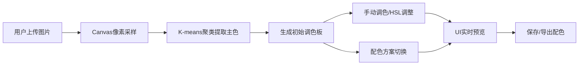

## 1. 产品概述

智能配色板是一款面向数字艺术家和设计师的浏览器端交互式配色工具，支持从自然风景图片中提取和谐配色方案，并实时预览在UI组件上的效果。

- **核心价值**：帮助设计师快速从自然图像中获取灵感，生成专业级配色方案
- **目标用户**：UI设计师、数字艺术家、前端开发者
- **产品定位**：轻量级、高性能的在线配色工具

## 2. 核心功能

### 2.1 用户角色
| 角色 | 注册方式 | 核心权限 |
|------|----------|----------|
| 普通用户 | 无需注册 | 使用所有取色、调色、预览功能，本地保存配色方案 |

### 2.2 功能模块
1. **智能取色模块**：图片上传、Canvas像素采样、K-means聚类提取主色
2. **手动调色模块**：HSL滑条微调、色彩和谐自动调整
3. **配色方案模块**：5种预设配色规则切换
4. **调色板管理模块**：保存、加载、删除、排序、导出JSON
5. **UI预览模块**：实时组件预览、深浅主题切换

### 2.3 页面详情
| 页面名称 | 模块名称 | 功能描述 |
|----------|----------|----------|
| 主页面 | 顶部工具栏 | 保存、导出、加载按钮，主题切换 |
| 主页面 | 左侧图片上传区 | 拖拽上传、图片预览、历史调色板列表 |
| 主页面 | 中央调色板区 | 5个色块显示、锁定功能、配色规则切换 |
| 主页面 | 右侧UI预览区 | 按钮、卡片、输入框、导航栏实时预览 |

## 3. 核心流程

用户上传风景图片 → 系统通过Canvas采样像素 → K-means聚类提取5个主色 → 生成初始调色板 → 用户可手动微调HSL或切换配色规则 → 实时预览UI组件效果 → 保存/导出配色方案

## 4. 用户界面设计

### 4.1 设计风格
- **整体风格**：极简扁平设计，干净清爽
- **背景色**：浅灰 #F5F5F5
- **主色调**：随调色板动态变化
- **按钮风格**：胶囊形状（圆角20px），悬停上移效果
- **字体**：现代无衬线字体，清晰易读
- **布局**：三栏式布局（左：图片上传，中：调色板，右：UI预览）

### 4.2 页面设计概述
| 页面名称 | 模块名称 | UI元素 |
|----------|----------|--------|
| 主页面 | 顶部工具栏 | 保存/导出/加载按钮，主题切换开关 |
| 主页面 | 左侧上传区 | 虚线拖拽框、图片预览、历史列表 |
| 主页面 | 中央调色板 | 5个色块（80x80px，圆角8px）、悬停放大、配色规则按钮组 |
| 主页面 | 右侧预览区 | 按钮、卡片、输入框、导航栏组件演示 |

### 4.3 响应式设计
- 桌面端（≥1024px）：三栏横向布局
- 移动端（<1024px）：纵向单栏布局，顺序为图片上传 → 调色板 → UI预览

### 4.4 动效设计
- 色块悬停：放大1.1倍，0.2秒过渡
- 颜色切换：0.5秒渐变色过渡
- UI组件颜色变化：0.3秒 ease-in-out 过渡
- 调色面板展开：0.2秒缩放动画
- 按钮悬停：颜色加深 + translateY(-2px)
