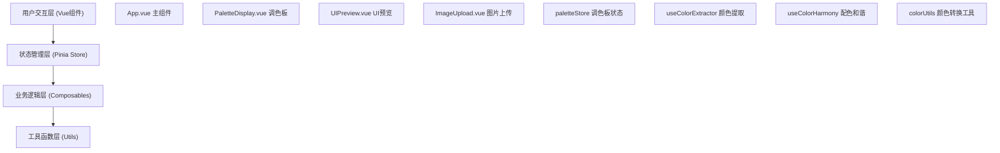

## 1. 架构设计



## 2. 技术描述

- **前端框架**：Vue 3 + TypeScript + Composition API
- **构建工具**：Vite 5.x
- **状态管理**：Pinia 2.x
- **开发服务器端口**：3000
- **模块标准**：ES2020
- **TypeScript模式**：严格模式

### 依赖清单
| 包名 | 版本 | 用途 |
|------|------|------|
| vue | ^3.4.x | 前端框架 |
| pinia | ^2.1.x | 状态管理 |
| typescript | ^5.3.x | 类型系统 |
| vite | ^5.0.x | 构建工具 |
| @vitejs/plugin-vue | ^5.0.x | Vue插件 |

## 3. 目录结构

```
src/
├── App.vue              # 主应用组件
├── main.ts              # 入口文件
├── components/
│   ├── PaletteDisplay.vue   # 调色板显示组件
│   ├── UIPreview.vue        # UI预览组件
│   └── ImageUpload.vue      # 图片上传组件
├── composables/
│   ├── useColorExtractor.ts # 颜色提取逻辑
│   └── useColorHarmony.ts   # 配色和谐算法
├── stores/
│   └── paletteStore.ts      # Pinia状态管理
├── types/
│   └── index.ts             # TypeScript类型定义
└── utils/
    └── colorUtils.ts        # 颜色转换工具函数
```

## 4. 数据模型

### 4.1 颜色对象
```typescript
interface ColorItem {
  id: string;
  hex: string;
  name: string;
  locked: boolean;
  hsl: { h: number; s: number; l: number };
}
```

### 4.2 调色板
```typescript
interface Palette {
  id: string;
  name: string;
  colors: ColorItem[];
  tags: string[];
  createdAt: number;
}
```

### 4.3 配色规则类型
```typescript
type HarmonyRule = 'monochromatic' | 'complementary' | 'split-complementary' | 'triadic' | 'tetradic';
```

## 5. 核心算法

### 5.1 K-means颜色聚类
- 图片缩放至200x200px
- 逐像素采样RGB值
- K=5个聚类中心
- 收敛误差小于5%
- 性能目标：200ms内完成

### 5.2 配色和谐算法
- 单色：同色相不同亮度/饱和度
- 互补：色环对面180°
- 分裂互补：色环对面±30°
- 三色：色环上等距120°
- 四色：色环上等距90°

### 5.3 对比度计算
- 使用WCAG 2.1标准
- 确保文字与背景对比度 ≥ 4.5:1
- 深色主题自动反转文字颜色

## 6. 状态管理 (Pinia Store)

### 6.1 State
- `colors: ColorItem[]` - 当前调色板5个颜色
- `currentRule: HarmonyRule` - 当前配色规则
- `isDarkTheme: boolean` - 是否深色主题
- `savedPalettes: Palette[]` - 保存的调色板列表
- `isExtracting: boolean` - 是否正在提取颜色
- `extractionProgress: number` - 提取进度0-100

### 6.2 Actions
- `extractColors(imageFile)` - 从图片提取颜色
- `updateColor(index, hsl)` - 更新单个颜色
- `applyHarmonyRule(rule)` - 应用配色规则
- `lockColor(index)` - 锁定/解锁颜色
- `savePalette(name, tags)` - 保存调色板
- `loadPalette(paletteId)` - 加载调色板
- `deletePalette(paletteId)` - 删除调色板
- `exportPalette()` - 导出为JSON
- `toggleTheme()` - 切换深浅主题

## 7. 性能优化

- Canvas像素采样使用离屏Canvas
- K-means迭代使用TypedArray优化
- UI更新使用CSS变量实现60fps过渡
- 颜色转换函数缓存计算结果
- 使用requestAnimationFrame优化动画
