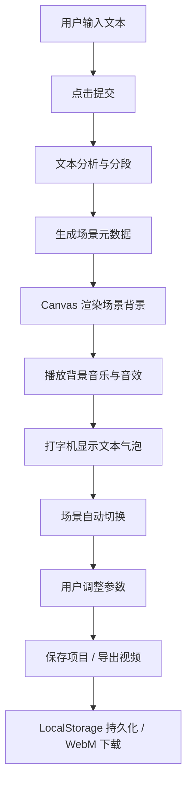

## 1. 产品概述

StoryToon 是一款文本转动画短片的创作工具，用户输入500字以内的简单文本故事（童话、寓言、新闻片段等），系统自动将其转化为带有配音、背景音乐和场景切换的动画短片。主要解决非专业创作者难以快速制作短视频故事的问题。

- **目标用户**：内容创作者、教育工作者、自媒体运营者
- **核心价值**：低门槛、高效率地将文字故事可视化
- **市场定位**：面向普通用户的 AI 辅助动画生成工具

## 2. 核心功能

### 2.1 用户角色

| 角色 | 注册方式 | 核心权限 |
|------|----------|----------|
| 普通用户 | 无需注册，本地存储 | 创建、编辑、保存、导出动画项目 |

### 2.2 功能模块

1. **故事输入区**：文本输入框、字数统计、提交按钮、场景分段预览
2. **动画预览区**：Canvas 渲染画布、播放控制条、场景切换动画、文本气泡
3. **场景设置面板**：背景颜色选择器、文字速度滑条、音量滑条
4. **项目管理**：保存项目、加载项目、LocalStorage 持久化
5. **视频导出**：MediaRecorder 录制、进度显示、WebM 下载

### 2.3 页面详情

| 页面名称 | 模块名称 | 功能描述 |
|----------|----------|----------|
| 主页面 | 故事输入模块 | 500字文本输入、字数统计、自适应高度输入框、提交按钮（非空时渐变激活） |
| 主页面 | 动画预览模块 | 16:9 Canvas 视口、场景淡入淡出切换、文本气泡打字机效果、播放/暂停/进度控制 |
| 主页面 | 场景设置模块 | 12色色环调色板、打字速度滑条（50-200ms）、音量滑条（0-100%） |
| 主页面 | 导出模块 | 一键导出 WebM、进度条显示、完成提示音、自动命名下载 |
| 主页面 | 项目管理模块 | 保存到 LocalStorage、从 LocalStorage 恢复、后端 API 持久化 |

## 3. 核心流程

用户在输入框中输入故事文本 → 点击提交按钮 → 系统自动分析文本并拆分为 5-8 个场景 → 每个场景匹配风格化背景并生成缩略图 → 自动播放动画（背景音乐、环境音效、打字机文字）→ 用户可手动调整场景参数 → 保存项目或导出为 WebM 视频。

## 4. 用户界面设计

### 4.1 设计风格

- **设计理念**：低饱和度莫兰迪色系，精致克制的视觉语言
- **主色调**：#7A8B99（莫兰迪蓝灰）
- **辅助色**：#B8C4C8（浅灰蓝）
- **强调色**：#E68A6E（暖珊瑚色）
- **背景色**：输入区白色，预览区深灰色
- **按钮风格**：圆角矩形，悬停时背景色微变 + translateY(-2px) 上浮，点击时 scale(0.95) 反馈
- **字体**：优雅的无衬线字体，标题稍粗，正文常规
- **布局风格**：上下分栏布局，16:9 预览视口居中
- **动效风格**：缓动曲线 ease-in-out，过渡时长 0.3-0.8s

### 4.2 页面设计概览

| 页面名称 | 模块名称 | UI 元素 |
|----------|----------|----------|
| 主页面 | 故事输入区 | 白色背景、浅灰色圆角边框、自适应输入框、字数统计、渐变激活提交按钮 |
| 主页面 | 动画预览区 | 深灰背景、16:9 圆角视口、Canvas 画布、底部播放控制条（圆形播放按钮居中、圆角滑块进度条、mm:ss 时间显示） |
| 主页面 | 场景设置区 | 12色圆形色块调色板（点击放大动画）、两个滑条控件、重置按钮 |
| 主页面 | 导出区 | 导出按钮、进度条（蓝色渐变填充动画）、百分比数字 |

### 4.3 响应式设计

- **设计策略**：桌面端优先，移动端适配
- **断点**：768px
- **桌面端（≥768px）**：上下分栏布局，控制条在预览区底部
- **移动端（<768px）**：垂直时序布局，输入区在上、预览区在中、控制条底部固定悬浮
- **触控优化**：按钮最小 44px 触控区域，滑条增大触控热区

### 4.4 Canvas 场景视觉指引

- **画面比例**：16:9 横屏
- **风格**：扁平水彩风，柔和渐变，简洁几何形状
- **场景类型**：森林、城堡、沙漠、海洋、山脉、城市、星空、花园
- **情感配色**：快乐（暖黄色调）、悲伤（蓝紫色调）、平静（青绿色调）、紧张（暗红色调）
- **过渡效果**：淡入淡出（0.8秒，ease-in-out）
- **文本气泡**：半透明白色圆角矩形，模糊阴影，打字机效果逐字显示
