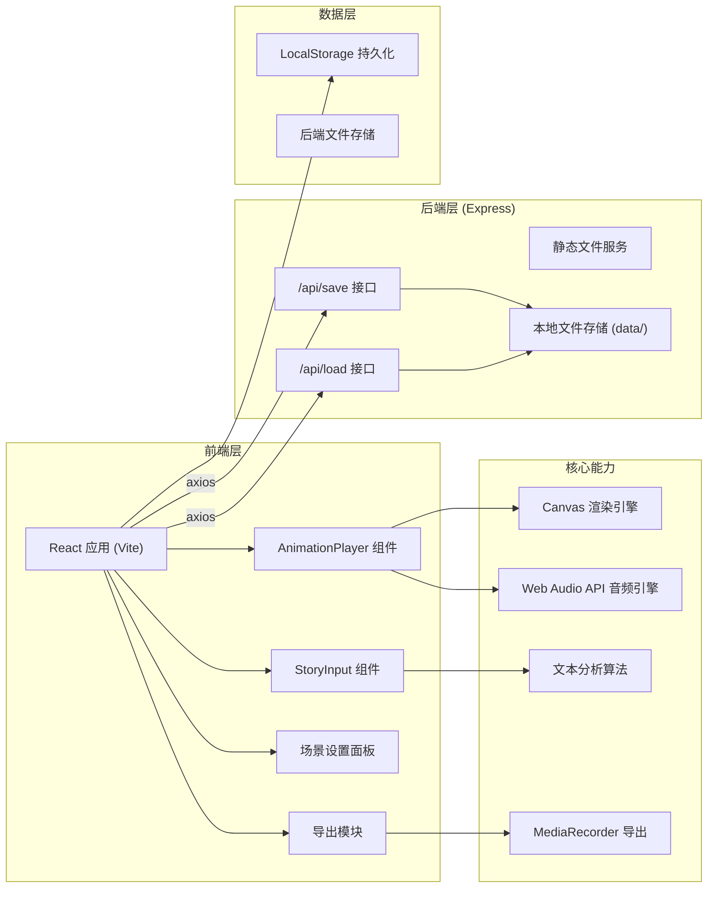
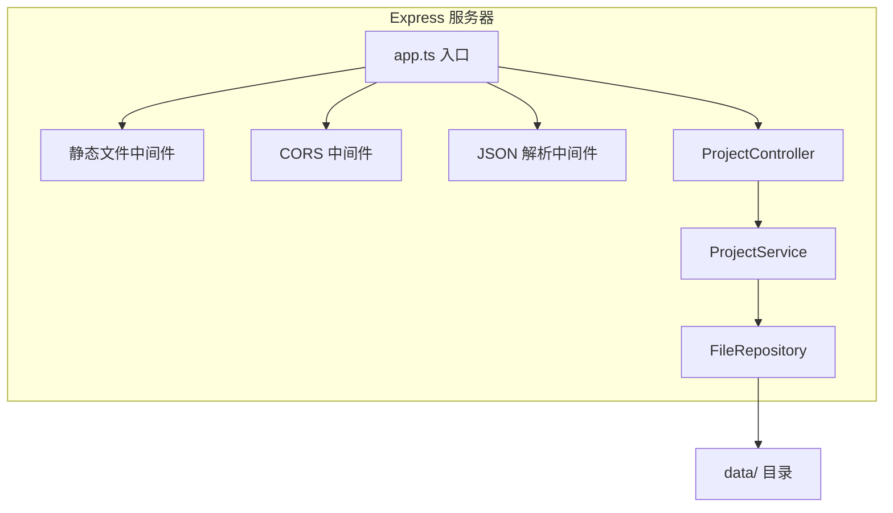
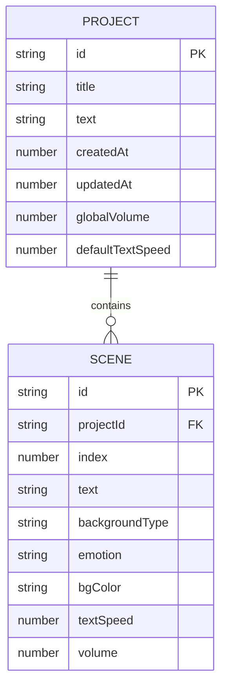

## 1. 架构设计



## 2. 技术描述

- **前端框架**：React 18 + TypeScript
- **构建工具**：Vite 5
- **后端框架**：Express 4
- **编程语言**：TypeScript（前后端统一）
- **状态管理**：React Hooks (useState, useEffect, useRef) + LocalStorage
- **样式方案**：原生 CSS + CSS Modules（莫兰迪色系设计系统）
- **Canvas 渲染**：HTML5 Canvas 2D API
- **音频引擎**：Web Audio API
- **视频导出**：MediaRecorder API (WebM 格式)
- **HTTP 客户端**：Axios
- **唯一 ID**：uuid
- **开发服务器端口**：前端 3000，后端 3001
- **代理配置**：Vite 代理 /api 到后端 3001 端口

## 3. 路由定义

| 路由 | 用途 |
|------|------|
| / | 主页面（输入区 + 预览区 + 设置面板） |

本应用为单页应用，无多页面路由，主要通过组件状态管理不同视图。

## 4. API 定义

### 4.1 保存项目

**POST** `/api/save`

请求体：
```typescript
interface SaveProjectRequest {
  id: string;
  title: string;
  text: string;
  scenes: Scene[];
  settings: ProjectSettings;
  createdAt: number;
  updatedAt: number;
}

interface Scene {
  id: string;
  index: number;
  text: string;
  backgroundType: string;
  emotion: 'happy' | 'sad' | 'calm' | 'tense';
  bgColor: string;
  textSpeed: number;
  volume: number;
}

interface ProjectSettings {
  globalVolume: number;
  defaultTextSpeed: number;
}
```

响应：
```typescript
interface SaveProjectResponse {
  success: boolean;
  id: string;
  message: string;
}
```

### 4.2 加载项目

**GET** `/api/load/:id`

响应：
```typescript
interface LoadProjectResponse {
  success: boolean;
  project?: SaveProjectRequest;
  message: string;
}
```

### 4.3 错误响应

```typescript
interface ErrorResponse {
  success: false;
  message: string;
  code: number;
}
```

## 5. 服务器架构图



## 6. 数据模型

### 6.1 数据模型定义



### 6.2 存储方式

项目数据以 JSON 文件形式存储在后端 `data/` 目录下，文件名为 `{projectId}.json`。LocalStorage 中也会缓存最近的项目数据以实现快速恢复。

### 6.3 文件存储结构

```
data/
├── {projectId1}.json
├── {projectId2}.json
└── ...
```

## 7. 前端组件结构

```
src/
├── App.tsx                    # 主应用组件
├── components/
│   ├── StoryInput.tsx         # 文本输入与分段处理
│   ├── AnimationPlayer.tsx    # 动画播放与Canvas渲染
│   ├── SceneSettings.tsx      # 场景设置面板
│   ├── PlaybackControls.tsx   # 播放控制条
│   └── ExportPanel.tsx        # 导出面板
├── hooks/
│   ├── useAudioEngine.ts      # Web Audio API 音频引擎
│   ├── useCanvasRenderer.ts   # Canvas 渲染器
│   └── useTextAnalyzer.ts     # 文本分析器
├── utils/
│   ├── sceneGenerator.ts      # 场景生成算法
│   ├── colorUtils.ts          # 颜色工具函数
│   └── storage.ts             # LocalStorage 工具
├── types/
│   └── index.ts               # 类型定义
└── styles/
    ├── App.css                # 全局样式
    └── variables.css          # CSS 变量
```
