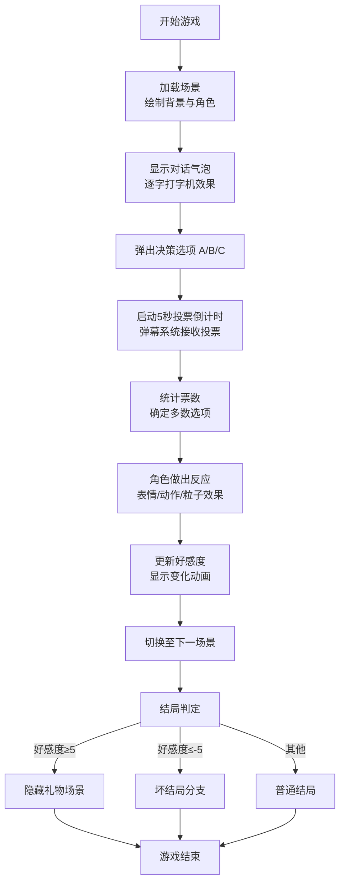

## 1. 产品概述

一款基于浏览器的弹幕驱动互动剧情游戏，面向游戏主播和直播观众。观众通过发送弹幕投票来决定角色的选择和剧情走向，增强直播的参与感和娱乐性。

- 目标用户：游戏主播及直播观众
- 核心价值：将单向观看转化为双向互动，提升直播间活跃度
- 使用场景：直播时主播运行游戏，观众通过弹幕参与剧情决策

## 2. 核心功能

### 2.1 用户角色

| 角色 | 参与方式 | 核心权限 |
|------|----------|----------|
| 主播 | 运行游戏、控制流程 | 启动游戏、跳过对话、重置进度 |
| 观众 | 发送弹幕投票 | 发送A/B/C选项弹幕参与投票、观看剧情发展 |

### 2.2 功能模块

1. **剧情场景系统**：城堡大厅、密林小径、地下洞穴等手绘风格场景，Canvas实时渲染
2. **角色对话系统**：逐字显示的对话气泡，打字机效果，支持跳过
3. **弹幕投票系统**：模拟弹幕输入，A/B/C三选项投票，5秒倒计时，实时票数统计
4. **好感度系统**：角色好感度-10到10，影响剧情分支和结局
5. **UI界面层**：深色主题，弹幕流动展示，票数柱状图，投票进度条

### 2.3 页面详情

| 页面名称 | 模块名称 | 功能描述 |
|----------|----------|----------|
| 游戏主界面 | Canvas渲染区 | 占75vh高度，绘制场景、角色、对话、选项 |
| 游戏主界面 | 弹幕投票区 | 占25vh高度，实时弹幕流、票数柱状图、投票按钮 |
| 游戏主界面 | 好感度指示条 | 屏幕边缘半透明浮动条，显示好感度变化 |

## 3. 核心流程

观众通过发送弹幕（如"A"、"B"、"C"）参与投票，每轮投票持续5秒。投票结束后，系统统计票数，按多数选项推进剧情（平局随机选择）。角色根据选择做出不同表情和动作反应，好感度随之变化，最终影响后续剧情分支。

## 4. 用户界面设计

### 4.1 设计风格

- **主色调**：深色背景 `#1a1a2e`，文字 `#e0e0e0`
- **选项按钮色**：A-红色 `#e74c3c`、B-蓝色 `#3498db`、C-绿色 `#2ecc71`
- **按钮风格**：圆角12px，悬停变色，点击缩放0.95倍
- **字体**：中文无衬线字体，对话气泡使用等宽字体增强打字机效果
- **布局风格**：上下分层，Canvas主体 + 底部固定弹幕投票区
- **视觉效果**：毛玻璃半透明背景、渐入渐出过渡、粒子特效

### 4.2 页面设计概览

| 页面名称 | 模块名称 | UI元素 |
|----------|----------|--------|
| 游戏主界面 | Canvas场景区 | 手绘风格背景、卡通角色、对话气泡、选项按钮、粒子特效 |
| 游戏主界面 | 弹幕投票区 | 横向滚动弹幕、票数柱状图、投票进度条、选项按钮 |
| 游戏主界面 | 好感度条 | 屏幕侧边半透明条、宽度变化动画、颜色渐变 |

### 4.3 响应式

- 桌面端：Canvas占主体（宽100%，高75vh），底部固定弹幕投票区（高25vh）
- 移动端：自动堆叠为上下布局，Canvas在上、投票区在下
- 触摸优化：按钮增大点击区域，支持触摸交互

## 5. 性能要求

- 弹幕系统每帧更新不超过5ms
- 投票统计响应延迟低于100ms
- Canvas渲染保持30FPS以上
- 最多同时显示10条弹幕
