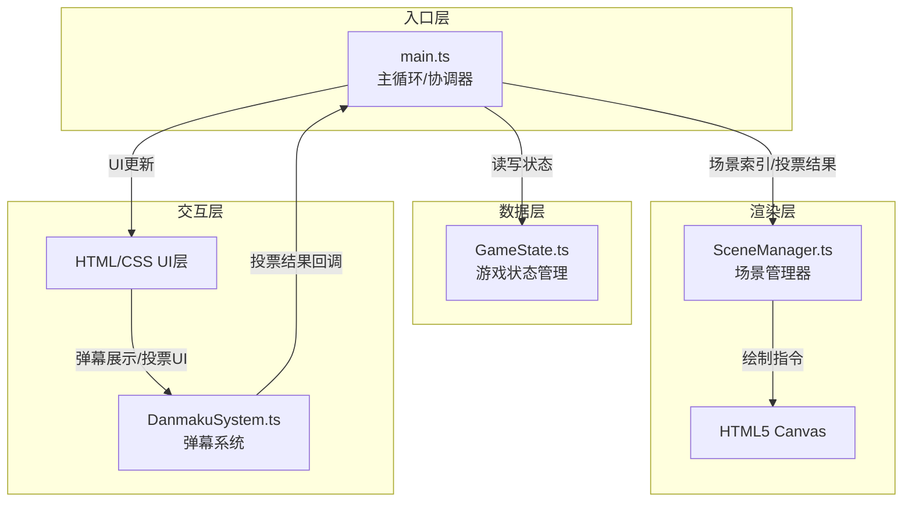

## 1. 架构设计

采用模块化架构，基于 TypeScript + Vite + HTML5 Canvas 构建。各模块职责分明，通过明确的接口和回调进行数据交互。



**数据流向说明：**
1. `main.ts` 作为核心协调器，初始化所有模块
2. `DanmakuSystem.ts` 接收模拟弹幕，解析投票，通过回调通知 `main.ts`
3. `main.ts` 更新 `GameState.ts` 中的游戏状态
4. `main.ts` 将当前场景索引和状态传递给 `SceneManager.ts`
5. `SceneManager.ts` 在 Canvas 上绘制场景、角色、对话
6. UI层（HTML/CSS）展示弹幕流和投票界面

## 2. 技术描述

- **前端框架**：原生 TypeScript（无React/Vue），轻量级Canvas游戏
- **构建工具**：Vite 5.x
- **渲染引擎**：HTML5 Canvas 2D API
- **编程语言**：TypeScript 5.x（严格模式，ES2020）
- **样式方案**：原生 CSS（深色主题，毛玻璃效果）
- **弹幕模拟**：模拟 WebSocket 输入，使用定时器生成随机弹幕

## 3. 文件结构

```
├── package.json          # 项目依赖与脚本
├── vite.config.js        # Vite构建配置
├── tsconfig.json         # TypeScript配置
├── index.html            # 入口页面
└── src/
    ├── main.ts           # 主循环，模块协调
    ├── SceneManager.ts   # 场景管理器（Canvas绘制）
    ├── DanmakuSystem.ts  # 弹幕系统（投票解析）
    └── GameState.ts      # 游戏状态管理
```

### 3.1 模块职责与调用关系

| 文件 | 职责 | 输入 | 输出 | 被谁调用 | 调用谁 |
|------|------|------|------|----------|--------|
| main.ts | 主循环、协调各模块、游戏逻辑控制 | 投票结果回调 | 场景索引、状态更新 | - | SceneManager、DanmakuSystem、GameState |
| SceneManager.ts | Canvas场景绘制（背景、角色、对话、选项） | 场景索引、角色状态、对话内容 | Canvas绘制指令 | main.ts | - |
| DanmakuSystem.ts | 弹幕生成、投票解析、票数统计 | 弹幕字符串 | 投票结果回调 | main.ts | - |
| GameState.ts | 存储游戏状态（场景、好感度、分支） | 状态更新请求 | 状态读取结果 | main.ts | - |

## 4. 数据模型

### 4.1 游戏状态

```typescript
interface GameState {
  currentSceneIndex: number;
  affection: number; // -10 ~ 10
  currentDialogIndex: number;
  isVoting: boolean;
  voteStartTime: number;
  voteResults: { A: number; B: number; C: number };
  selectedOption: 'A' | 'B' | 'C' | null;
  characterMood: 'happy' | 'angry' | 'sad' | 'neutral';
  sceneTransition: { active: boolean; progress: number; direction: 'in' | 'out' };
}
```

### 4.2 场景数据

```typescript
interface Scene {
  id: string;
  name: string;
  background: {
    type: 'castle' | 'forest' | 'cave';
    colorScheme: { primary: string; secondary: string; accent: string };
  };
  character: {
    position: { x: number; y: number };
    initialMood: string;
  };
  dialogs: Dialog[];
  options: VoteOption[];
  nextScenes: { A: string; B: string; C: string };
  affectionChange: { A: number; B: number; C: number };
}

interface Dialog {
  speaker: string;
  text: string;
  mood?: string;
}

interface VoteOption {
  key: 'A' | 'B' | 'C';
  text: string;
  color: string;
}
```

### 4.3 弹幕数据

```typescript
interface Danmaku {
  id: number;
  text: string;
  y: number;
  x: number;
  speed: number;
  color: string;
  isVote: boolean;
  voteOption?: 'A' | 'B' | 'C';
}
```

## 5. 核心算法

### 5.1 投票统计
- 弹幕到达后立即解析，识别A/B/C选项
- 使用对象累加票数，O(1) 时间复杂度
- 投票结束后取最大值对应的选项，平局时随机选择

### 5.2 Canvas渲染循环
- 使用 `requestAnimationFrame` 实现主循环
- 每帧更新：弹幕位置、粒子效果、场景过渡
- 状态机管理场景切换和对话流程

### 5.3 打字机效果
- 使用定时器逐字显示，每字间隔0.05秒
- 支持跳过功能，立即显示完整文本

## 6. 性能优化

- **弹幕池**：对象池复用弹幕DOM，避免频繁创建销毁
- **渲染优化**：离屏Canvas缓存静态背景，仅重绘动态元素
- **节流控制**：弹幕生成频率限制，最多同时10条
- **帧率控制**：Canvas渲染目标30FPS，使用时间差计算动画

## 7. 动画与过渡

| 动画 | 时长 | 缓动函数 | 说明 |
|------|------|----------|------|
| 场景切换 | 0.8s | ease-in-out | 渐入渐出 |
| 好感度变化 | 0.5s | ease-out | 宽度变化+颜色渐变 |
| 票数柱状图 | 0.3s | ease-out | 高度变化 |
| 按钮点击 | 0.1s | ease-in-out | 缩放0.95倍 |
| 粒子效果 | 1.0s | ease-out | 闪光/泪滴/感叹号 |
| 角色Sprite | 12fps | - | 表情动画每帧0.08s |
