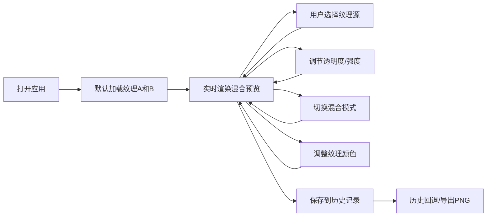

## 1. 产品概述

交互式笔触纹理混合器是一款面向数字插画师的在线工具，让用户像调配颜料一样混合不同的虚拟画笔笔触纹理，生成独一无二的数字画刷纹理，并可直接导出为PNG图案。

- **目标用户**：数字插画师、平面设计师、数字艺术爱好者
- **核心价值**：快速探索和生成独特的画笔纹理效果，提升创作效率与创意可能性
- **使用场景**：数字绘画前的纹理定制、设计素材生成、艺术创作实验

## 2. 核心功能

### 2.1 功能模块
1. **纹理混合引擎**：6种基础笔触纹理 + 3种混合模式 + 透明度/强度调节
2. **纹理选择器**：横向缩略图库、颜色调节、混合模式切换
3. **纹理预览画布**：实时渲染混合效果、混合公式提示、过渡动画
4. **历史记录面板**：20次快照存储、状态回退、单张导出PNG
5. **导出功能**：将当前纹理导出为PNG图片

### 2.2 页面详情
| 页面名称 | 模块名称 | 功能描述 |
|---------|---------|----------|
| 主页面 | 顶部控制栏 | 混合模式下拉菜单、透明度滑块、强度滑块 |
| 主页面 | 左侧纹理选择区 | 6种纹理缩略图横向排列、名称和颜色标签、调色盘弹窗 |
| 主页面 | 中央预览画布 | 实时混合渲染、混合公式文字提示、过渡动画效果 |
| 主页面 | 右侧历史面板 | 历史缩略图列表、序号和时间戳、清除/导出按钮 |

## 3. 核心流程

用户打开应用 → 默认加载两种纹理 → 调节混合参数实时预览 → 选择不同纹理/颜色 → 切换混合模式 → 满意结果保存到历史 → 点击历史回退或导出PNG

## 4. 用户界面设计

### 4.1 设计风格
- **主题**：深色专业创作工具风格
- **主色调**：背景 `#1a1a2e`，控件 `#16213e`，文字 `#e0e0e0`
- **强调色**：金色渐变边框（选中状态）、微发光阴影
- **字体**：现代无衬线字体，标题加粗，正文清晰易读
- **控件风格**：圆角8px、微弱发光阴影、悬停渐变发光效果
- **动效**：弹性回弹滑块、粒子散开点击效果、溶解过渡动画

### 4.2 页面布局
- **整体**：三栏布局，左侧纹理选择(240px) + 中央预览(60%宽度) + 右侧历史(200px)
- **顶部**：混合模式下拉 + 透明度滑块 + 强度滑块
- **响应式**：<768px时左右面板折叠为滑出式侧边栏

### 4.3 关键UI元素
| 元素 | 样式特征 |
|-----|---------|
| 纹理缩略图 | 圆角8px、微弱发光阴影、选中时金色渐变边框+1.1倍放大 |
| 滑块 | 拖拽时0.2秒弹性回弹动画 |
| 历史记录 | 60x60px缩略图、序号+时间戳、垂直滚动自定义样式 |
| 颜色标签 | 点击弹出调色盘（纯色/渐变色） |

### 4.4 响应式设计
- 桌面端（>768px）：三栏固定布局
- 移动端（≤768px）：左右面板折叠为抽屉式侧边栏，主画布占满宽度
- 触摸优化：增大点击热区，支持触摸滑动

### 4.5 动效设计
- 纹理缩略图点击：10个粒子散开效果，颜色与纹理主色一致
- 混合模式切换：1秒溶解过渡动画
- 历史恢复：0.4秒向左擦除过渡动画
- 控件悬停：微妙发光效果（box-shadow颜色渐变）
- 滑块拖拽：0.2秒弹性回弹
