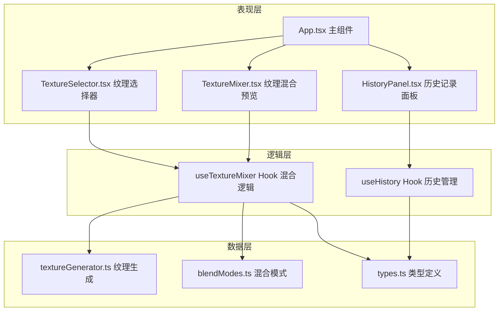

## 1. 架构设计



## 2. 技术说明

- **前端框架**：React@18 + TypeScript
- **构建工具**：Vite@5
- **样式方案**：CSS Modules + 原生 CSS 动画
- **状态管理**：React useState/useReducer（组件内状态）+ 自定义 Hooks
- **图形渲染**：Canvas 2D API
- **工具库**：lodash

## 3. 文件结构

```
src/
├── App.tsx                 # 主组件，整体状态管理
├── TextureMixer.tsx        # 核心纹理混合与预览组件
├── TextureSelector.tsx     # 纹理源选择与混合参数调节
├── HistoryPanel.tsx        # 历史记录面板组件
├── hooks/
│   ├── useTextureMixer.ts  # 纹理混合逻辑 Hook
│   └── useHistory.ts       # 历史记录管理 Hook
├── utils/
│   ├── textureGenerator.ts # 6种基础纹理生成器
│   ├── blendModes.ts       # 混合模式实现
│   └── canvasUtils.ts      # Canvas 工具函数
├── types/
│   └── index.ts            # TypeScript 类型定义
└── styles/
    ├── App.css             # 全局样式
    ├── TextureSelector.css # 纹理选择器样式
    ├── TextureMixer.css    # 混合预览样式
    └── HistoryPanel.css    # 历史面板样式
```

## 4. 数据模型

### 4.1 类型定义

```typescript
// 纹理类型
type TextureType = 'pencil' | 'watercolor' | 'oil' | 'charcoal' | 'marker' | 'airbrush';

// 混合模式
type BlendMode = 'multiply' | 'screen' | 'overlay';

// 纹理数据
interface TextureData {
  id: TextureType;
  name: string;
  color: string;
  canvas: HTMLCanvasElement;
}

// 混合状态
interface MixState {
  textureA: TextureType;
  textureB: TextureType;
  colorA: string;
  colorB: string;
  blendMode: BlendMode;
  opacityA: number;
  opacityB: number;
  intensity: number;
}

// 历史记录项
interface HistoryItem {
  id: number;
  timestamp: Date;
  state: MixState;
  thumbnail: string; // base64
}
```

### 4.2 数据流向

1. 用户在 `TextureSelector` 操作 → 更新 `App.tsx` 中的 `mixState`
2. `mixState` 变化 → 传入 `TextureMixer` → 触发 Canvas 重绘
3. 保存操作 → `useHistory` Hook 添加快照 → 更新历史列表
4. 点击历史项 → 恢复 `mixState` → 触发 `TextureMixer` 更新

## 5. 性能优化

- **离屏 Canvas**：6种基础纹理预渲染到离屏 Canvas，内存中缓存
- **requestAnimationFrame 节流**：历史缩略图生成使用 rAF 避免阻塞主线程
- **Canvas 分层渲染**：底色层 + 纹理A层 + 纹理B层 + 文字层
- **防抖处理**：滑块拖动时使用 lodash.debounce 优化渲染频率（目标45+ FPS）

## 6. 核心算法

### 6.1 纹理生成
- 铅笔排线：等距直线 + 随机偏移 + 透明度变化
- 水彩晕染：多层渐变圆形 + 模糊 + 边缘羽化
- 油画堆叠：不规则色块 + 厚涂质感 + 高光点
- 炭笔擦痕：随机颗粒 + 涂抹效果 + 边缘粗糙
- 马克笔平涂：均匀色块 + 边缘渗出 + 纸张纹理
- 喷枪渐变：径向渐变 + 柔边 + 颗粒噪点

### 6.2 混合模式
- 正片叠底 (Multiply)：result = base × blend
- 滤色 (Screen)：result = 1 - (1-base) × (1-blend)
- 叠加 (Overlay)：base < 0.5 ? 2×base×blend : 1 - 2×(1-base)×(1-blend)
